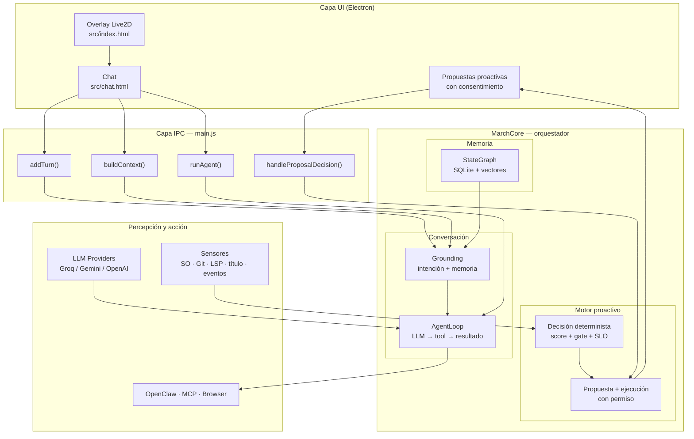
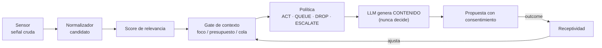

# March 7th — Asistente de Escritorio Autónomo

**Un compañero de escritorio con IA que observa el sistema operativo, recuerda con contexto, y actúa solo cuando tiene permiso — con un motor de decisión determinista y auditable.**

March 7th es una plataforma de asistencia personal que vive en el escritorio del usuario. Combina un avatar Live2D, un modelo de lenguaje conversacional, memoria semántica persistente con decaimiento temporal, percepción en tiempo real del sistema operativo, y un motor de proactividad que decide *cuándo* hablar, *cuándo* callar y *cómo* entregar su ayuda — sin depender de un chatbot reactivo ni de temporizadores ciegos.

---

## 1. Propuesta de valor

### ¿Qué problema resuelve?

Los asistentes de escritorio tradicionales son **reactivos**: esperan a que el usuario escriba. March 7th está diseñado para ser **proactivo de forma responsable**:

- **Observa en silencio.** Detecta contexto real del sistema operativo: aplicación activa, tiempo de enfoque, inactividad, señales de riesgo en el repositorio (`.env` sin ignorar, conflictos de merge, commits sin push), errores del editor (LSP) y eventos próximos del calendario.
- **Habla cuando aporta.** Cada mensaje proactivo está justificado por un **score de relevancia determinista** (no por corazonadas del modelo), pasa por un *gate de contexto* que respeta el momento del usuario (foco, inactividad, presupuesto diario), y se entrega como **propuesta con consentimiento**: March propone, el usuario decide.
- **Recuerda con contexto.** Mantiene un grafo de conocimiento persistente sobre el usuario (proyectos, preferencias, hechos) con búsqueda semántica local y decaimiento temporal — lo de ayer pesa más que lo de hace tres semanas, sin descartar lo importante.
- **Ejecuta con defensa en profundidad.** Las acciones de alto impacto (edición de archivos, comandos de shell, navegación web, herramientas externas) requieren aprobación explícita, están confinadas al proyecto del usuario y se verifican post-ejecución con rollback automático si algo sale mal.

### Segmentos objetivo

| Segmento | Valor entregado |
|---|---|
| **Desarrolladores** | Asistente de código proactivo: detecta errores LSP en el editor, propone parches con diff y verificación real, cuida la higiene del repo (`.env`, conflictos, commits) y ejecuta tareas vía MCP/OpenClaw con control total. |
| **Usuarios de escritorio** | Compañero persistente con memoria: retoma hilos pendientes, recuerda lo que importa, ofrece ayuda contextual en el momento adecuado y respeta la privacidad (todo local). |
| **Creadores y streamers** | Overlay Live2D en tiempo real con voz sintetizada (Edge TTS), reconocimiento de voz offline (Vosk) y personalidad consistente. |

### Diferenciadores

1. **Decisión auditable.** El motor proactivo usa un núcleo determinista (`DecisionCore`) con *reason codes* en cada decisión: cualquier mensaje proactivo puede rastrearse hasta su puntuación, sus pesos y su política. El LLM **produce contenido, nunca decide** cuándo hablar.
2. **Privacidad por diseño.** Memoria, embeddings, telemetría y preferencias viven en la máquina del usuario (SQLite + modelos locales ONNX). No se sube nada por defecto.
3. **Soberanía de proveedores.** Soporta Groq, Google Gemini y OpenAI con fallback automático y reintento exponencial. Sin vendor lock-in.
4. **Extensible por MCP.** Cliente Model Context Protocol propio: cualquier servidor de herramientas del ecosistema se conecta sin tocar el núcleo.
5. **Autonomía calibrada por datos.** Un slider de autonomía (`observe | suggest | act`) más un modelo de receptividad que ajusta la frecuencia y el presupuesto según la respuesta real del usuario.

---

## 2. Arquitectura del sistema



### Flujo conversacional

1. El usuario escribe un mensaje → `MarchCore.buildContext()` ensambla identidad, contexto del SO, memoria recuperada e intención.
2. `IntentDetector` (embeddings locales) y `TaskDetector` clasifican si hay intención de acción y en qué dominio.
3. `AgentLoop` (modo agente) ejecuta el bucle **LLM → herramienta → resultado → LLM** con un tope de iteraciones; o `complete()`/`completeWithTools()` para respuestas directas.
4. La respuesta se renderiza en el chat (markdown sanitizado) y se persiste la sesión incrementalmente.

### Flujo proactivo (motor de decisión Fase F)



Todo mensaje proactivo es una **propuesta** con botones de aceptar/descartar; las mutaciones se ejecutan solo tras la confirmación, con preview, verificación post-acción y rollback.

---

## 3. Capacidades técnicas

### Memoria semántica con decaimiento temporal
Grafo de conocimiento en SQLite + `sqlite-vec`, embeddings locales (`all-MiniLM-L6-v2` vía ONNX), búsqueda por similitud coseno ponderada por recencia, decaimiento automático de nodos viejos y resolución de contradicciones (sobrescribir / acumular / archivar).

### Proactividad responsable
Motor de iniciativa en dos niveles: heurística barata + núcleo determinista de decisión (score, gate de contexto, presupuesto dinámico, cola de diferidos) y **el LLM como generador de contenido**. El modelo de receptividad calibra frecuencia y presupuesto con datos reales de aceptación/descartes.

### Agente de código profundo
Detección de errores del editor vía **LSP real** (typescript-language-server): sensor de errores, índice de símbolos, propuestas de parche con diff, verificación post-ejecución con el LSP y `node --check`, y rollback automático si el parche rompe el archivo.

### Ejecución de acciones gobernada
Ninguna acción de alto impacto se ejecuta sin aprobación explícita. Combina: whitelist de herramientas, confinamiento de rutas al proyecto, bloqueo de rutas sensibles (credenciales, `.env`, cookies), idempotencia por `proposalId` y verificación real post-acción.

### Multi-proveedor de LLM
Groq · Google Gemini · OpenAI con cadena de fallback, reintento exponencial con jitter, límite de fallas consecutivas por proveedor y modo de "rate-limit" con mensajes accionables.

### Model Context Protocol (MCP)
Cliente MCP propio (stdio), reconexión automática con backoff, namespacing de herramientas por servidor y catálogo dinámico inyectado al prompt del LLM.

### Automatización de navegador
`BrowserBridge` con Playwright headless: navegación, lectura de páginas, capturas y búsqueda web — separado del navegador personal del usuario.

### Telemetría local
`TelemetryStore`: turnos, sesiones, silencios, tiempos de respuesta y reporte mensual con deltas — para responder "¿estamos mejor que el mes pasado?" con datos locales.

---

## 4. Stack tecnológico

| Capa | Tecnología |
|---|---|
| Runtime de escritorio | Electron 28 |
| Modelo de personaje | Live2D Cubism 5 (Pixi.js + live2d-display) |
| Persistencia | SQLite (`better-sqlite3`) + `sqlite-vec` |
| Embeddings locales | `@xenova/transformers` (ONNX Runtime, `all-MiniLM-L6-v2`) |
| Reconocimiento de voz | Vosk (offline) |
| Síntesis de voz | Edge TTS (streaming vía Python) |
| Automatización de navegador | Playwright |
| Modelos de lenguaje | Groq (Llama 3.3 70B) · Google Gemini · OpenAI |
| Protocolo de herramientas | Model Context Protocol (`@modelcontextprotocol/sdk`) |
| Renderizado de chat | `marked` + `DOMPurify` |

---

## 5. Estructura del proyecto

```
├── core/                      # Núcleo de inteligencia y orquestación
│   ├── MarchCore.js           #   Orquestador central (init, sesiones, contexto)
│   ├── agents/                #   Definiciones de agentes especializados
│   ├── behavior/              #   Comportamiento + motor de proactividad
│   ├── commands/              #   Registro de comandos (/comando)
│   ├── decision/              #   Núcleo determinista de decisión proactiva
│   ├── grounding/             #   Pipeline de contexto (intención, memoria, serializers)
│   ├── identity/              #   Personalidad de March 7th (identity.json)
│   ├── llm/                   #   Abstracción de proveedores de LLM
│   ├── lsp/                   #   Cliente LSP + índice de símbolos
│   ├── mcp/                   #   Cliente Model Context Protocol
│   ├── planner/               #   Agente: parsing, loop de ejecución, bridges
│   ├── skills/                #   Sistema de skills (inyección contextual)
│   ├── state-graph/           #   Grafo de conocimiento persistente
│   ├── task/                  #   Detección de tareas + registro de herramientas
│   └── telemetry/             #   Telemetría local (métricas de uso)
├── infrastructure/            # # Capa de bajo nivel
│   ├── database/              #   Inicialización de índices vectoriales
│   ├── event-bus/             #   Bus de eventos interno (pub/sub)
│   ├── keychain/              #   Llavero del SO (credenciales seguras)
│   └── sensors/               #   Sensores de señales (git, LSP, sistema, etc.)
├── src/                       # Interfaz (overlay Live2D + ventana de chat)
├── models/                    # Asset Live2D de March 7th (fan work, no comercial)
├── skills/                    # Skills del proyecto (code-review, git-workflow, testing)
├── tests/                     # Suite de pruebas (unitarias + integración)
└── docs/                      # Documentación técnica y de arquitectura
```

---

## 6. Inicio rápido

### Requisitos
- Node.js ≥ 18 y npm
- Python 3 con `edge-tts` (solo si se usa síntesis de voz)
- Sistema operativo: Windows (sensor nativo) o Linux/Hyprland (sensor Wayland)

### Instalación

```bash
npm install            # instala dependencias y electron (postinstall)
npm run rebuild        # reconstruye módulos nativos (better-sqlite3)
cp config.example.json ~/.config/vtuber-overlay/config.json   # Linux
# o: %APPDATA%/vtuber-overlay/config.json                      # Windows
```

### Configuración

En `config.json` (fuente de claves) o `.env` (alternativa):

```json
{
  "llm": {
    "primary": "groq",
    "apiKeys": { "groq": "", "gemini": "", "openai": "" },
    "fallback": ["gemini", "openai"]
  },
  "autonomy": "suggest",
  "sensors": { "git": true, "system": true, "title": true, "clipboard": false, "events": true, "lsp": true },
  "mcp": { "servers": [] }
}
```

| Clave | Descripción |
|---|---|
| `llm.primary` | Proveedor principal (`groq` / `gemini` / `openai`) |
| `llm.apiKeys` | Claves API por proveedor (o `LLM_KEY_*` en `.env`) |
| `llm.fallback` | Cadena de fallback entre proveedores |
| `autonomy` | `observe` (solo observa) · `suggest` (propone, default) · `act` (actúa con confirmación) |
| `sensors.*` | Activa/desactiva sensores de señales (git, sistema, título, portapapeles, eventos, LSP) |
| `mcp.servers` | Servidores MCP a conectar al arrancar |

### Ejecutar

```bash
npm start
```

También expone una **Control API** de diagnóstico en `http://localhost:3131` (token en el log de arranque): `/help`, `/stats`, `/telemetry/report`, `/debug/lsp-scan`.

### Probar

```bash
# Suite de pruebas (cada archivo es ejecutable independientemente)
node tests/test_agent_loop.js
node tests/test_proactive.js
node tests/test_lsp_errors.js
# ... (ver tests/README.md para la matriz completa)
```

---

## 7. Estado del proyecto

| Componente | Estado |
|---|---|
| Overlay Live2D + chat | ✅ Operativo |
| Memoria semántica persistente | ✅ Operativo |
| Sensor de SO (Windows/Linux) | ✅ Operativo |
| Ejecución de acciones con consentimiento | ✅ Operativo |
| MCP + agentes + skills | ✅ Operativo |
| Motor de decisión proactiva (Fase F) | ✅ Operativo |
| Telemetría local | ✅ Operativo |
| Agente de código profundo (LSP) | ✅ Operativo |

El proyecto se desarrolla por fases — ver [`ROADMAP.md`](./ROADMAP.md) para la estrategia completa y las siguientes entregas.

---

## 8. Documentación

| Documento | Contenido |
|---|---|
| [`ROADMAP.md`](./ROADMAP.md) | Visión, estrategia y hoja de ruta |
| [`docs/arquitectura.md`](./docs/arquitectura.md) | Diagrama de arquitectura detallado |
| [`core/`](./core/README.md) | Núcleo de inteligencia y orquestación |
| [`infrastructure/`](./infrastructure/README.md) | Capa de bajo nivel |
| [`src/`](./src/README.md) | Interfaz de usuario |
| [`tests/`](./tests/README.md) | Estrategia de pruebas |

---

## 9. Licencia y atribuciones

El código fuente se distribuye bajo licencia **MIT** — ver [`LICENSE`](./LICENSE).

**Los assets del modelo Live2D (`models/`)** son propiedad de Cognosphere Pte. Ltd. / HoYoverse (personaje *March 7th* de *Honkai: Star Rail*) y se usan aquí como contenido de fan sin fines comerciales. Cualquier reutilización de este proyecto debe proveer su propio modelo o excluir esa carpeta.

Este proyecto es un trabajo de fan **no oficial**, sin afiliación con Cognosphere Pte. Ltd. ni con HoYoverse.
