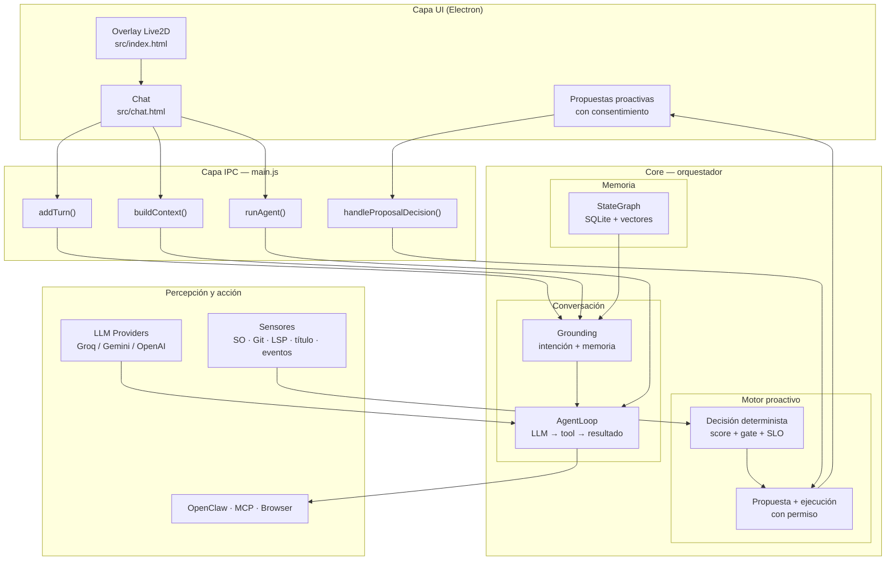
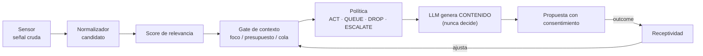
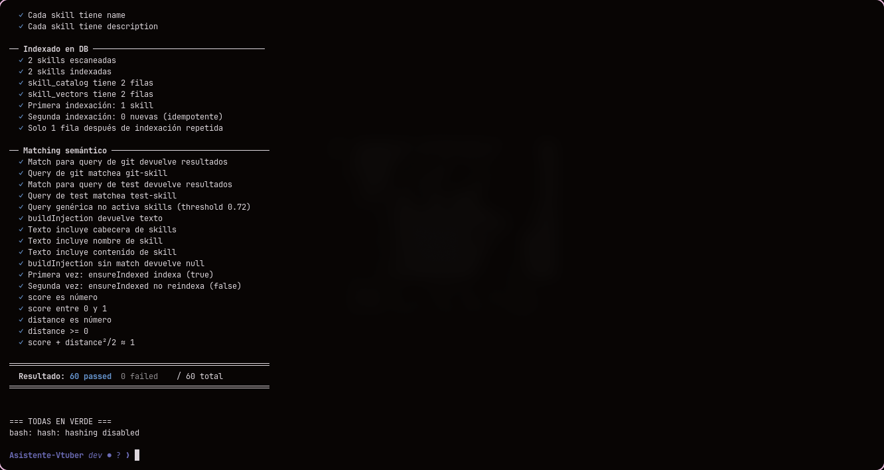
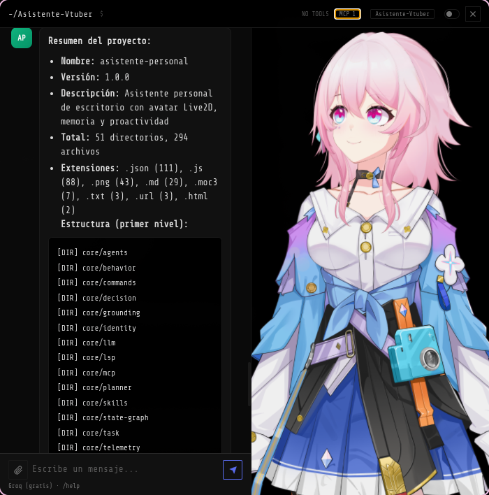
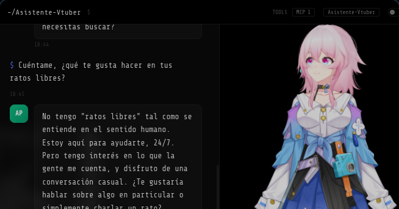
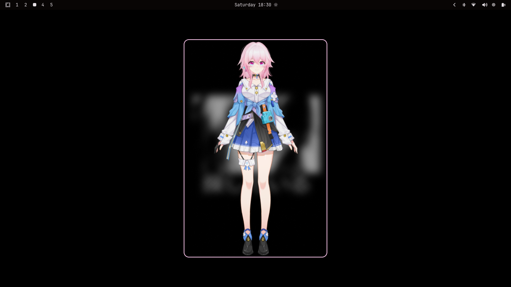
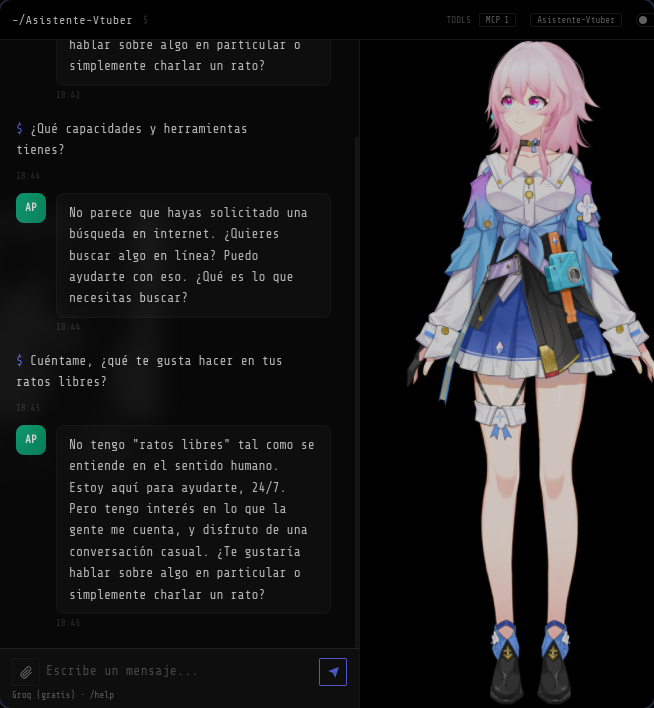
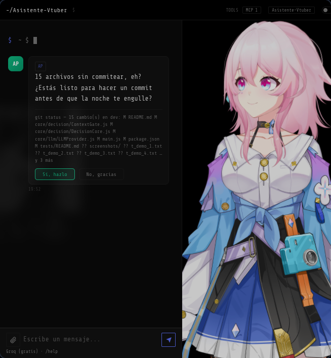
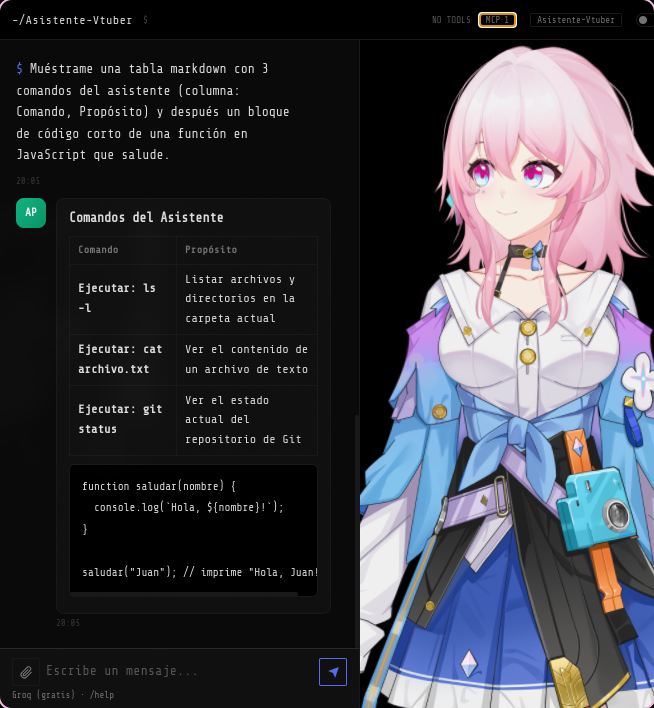

## ASISTENTE PERSONAL

[](https://github.com/Dregxmoon/Asistente-Vtuber/actions/workflows/ci.yml)
[](./LICENSE)
[](https://nodejs.org)

**Un compañero de escritorio con IA que observa el sistema operativo, recuerda con contexto, y actúa solo cuando tiene permiso — con un motor de decisión determinista y auditable.**

Una plataforma de asistencia personal que vive en el escritorio del usuario. Combina un avatar Live2D, un modelo de lenguaje conversacional, memoria semántica persistente con decaimiento temporal, percepción en tiempo real del sistema operativo, y un motor de proactividad que decide _cuándo_ hablar, _cuándo_ callar y _cómo_ entregar su ayuda — sin depender de un chatbot reactivo ni de temporizadores ciegos.

### Índice

1. [Propuesta de valor](#1-propuesta-de-valor)
2. [Arquitectura del sistema](#2-arquitectura-del-sistema)
3. [Capacidades técnicas](#3-capacidades-técnicas)
4. [Stack tecnológico](#4-stack-tecnológico)
5. [Estructura del proyecto](#5-estructura-del-proyecto)
6. [Inicio rápido](#6-inicio-rápido)
7. [Estado del proyecto](#7-estado-del-proyecto)
8. [Documentación](#8-documentación)
9. [Pruebas y capturas](#9-pruebas-y-capturas)
10. [Licencia y atribuciones](#10-licencia-y-atribuciones)

---

## 1. Propuesta de valor

### ¿Qué problema resuelve?

Los asistentes de escritorio tradicionales son **reactivos**: esperan a que el usuario escriba. Este asistente está diseñado para ser **proactivo de forma responsable**:

- **Observa en silencio.** Detecta contexto real del sistema operativo: aplicación activa, tiempo de enfoque, inactividad, señales de riesgo en el repositorio (`.env` sin ignorar, conflictos de merge, commits sin push), errores del editor (LSP) y eventos próximos del calendario.
- **Habla cuando aporta.** Cada mensaje proactivo está justificado por un **score de relevancia determinista** (no por corazonadas del modelo), pasa por un _gate de contexto_ que respeta el momento del usuario (foco, inactividad, presupuesto diario), y se entrega como **propuesta con consentimiento**: el asistente propone, el usuario decide.
- **Recuerda con contexto.** Mantiene un grafo de conocimiento persistente sobre el usuario (proyectos, preferencias, hechos) con búsqueda semántica local y decaimiento temporal — lo de ayer pesa más que lo de hace tres semanas, sin descartar lo importante.
- **Ejecuta con defensa en profundidad.** Las acciones de alto impacto (edición de archivos, comandos de shell, navegación web, herramientas externas) requieren aprobación explícita, están confinadas al proyecto del usuario y se verifican post-ejecución con rollback automático si algo sale mal.

### Segmentos objetivo

| Segmento                   | Valor entregado                                                                                                                                                                                                             |
| -------------------------- | --------------------------------------------------------------------------------------------------------------------------------------------------------------------------------------------------------------------------- |
| **Desarrolladores**        | Asistente de código proactivo: detecta errores LSP en el editor, propone parches con diff y verificación real, cuida la higiene del repo (`.env`, conflictos, commits) y ejecuta tareas vía MCP/OpenClaw con control total. |
| **Usuarios de escritorio** | Compañero persistente con memoria: retoma hilos pendientes, recuerda lo que importa, ofrece ayuda contextual en el momento adecuado y respeta la privacidad (todo local).                                                   |
| **Creadores y streamers**  | Overlay Live2D en tiempo real con voz sintetizada (Edge TTS), reconocimiento de voz offline (Vosk) y personalidad consistente.                                                                                              |

### Diferenciadores

1. **Decisión auditable.** El motor proactivo usa un núcleo determinista (`DecisionCore`) con _reason codes_ en cada decisión: cualquier mensaje proactivo puede rastrearse hasta su puntuación, sus pesos y su política. El LLM **produce contenido, nunca decide** cuándo hablar.
2. **Privacidad por diseño.** Memoria, embeddings, telemetría y preferencias viven en la máquina del usuario (SQLite + modelos locales ONNX). No se sube nada por defecto.
3. **Soberanía de proveedores.** Soporta Groq, Google Gemini y OpenAI con fallback automático y reintento exponencial. Sin vendor lock-in.
4. **Extensible por MCP.** Cliente Model Context Protocol propio: cualquier servidor de herramientas del ecosistema se conecta sin tocar el núcleo.
5. **Autonomía calibrada por datos.** Un slider de autonomía (`observe | suggest | act`) más un modelo de receptividad que ajusta la frecuencia y el presupuesto según la respuesta real del usuario.

---

## 2. Arquitectura del sistema



### Flujo conversacional

1. El usuario escribe un mensaje → `Core.buildContext()` ensambla identidad, contexto del SO, memoria recuperada e intención.
2. `IntentDetector` (embeddings locales) y `TaskDetector` clasifican si hay intención de acción y en qué dominio.
3. `AgentLoop` (modo agente) ejecuta el bucle **LLM → herramienta → resultado → LLM** con un tope de iteraciones; o `complete()`/`completeWithTools()` para respuestas directas.
4. La respuesta se renderiza en el chat (markdown sanitizado) y se persiste la sesión incrementalmente.

### Flujo proactivo (motor de decisión Fase F)



Todo mensaje proactivo es una **propuesta** con botones de aceptar/descartar; las mutaciones se ejecutan solo tras la confirmación, con preview, verificación post-acción y rollback.

---

## 3. Capacidades técnicas

Cada bloque está colapsado por default — hacé clic en el título para expandirlo.

<details>
<summary><strong>Memoria semántica con decaimiento temporal</strong></summary>

Grafo de conocimiento en SQLite + `sqlite-vec`, embeddings locales (`all-MiniLM-L6-v2` vía ONNX), búsqueda por similitud coseno ponderada por recencia, decaimiento automático de nodos viejos y resolución de contradicciones (sobrescribir / acumular / archivar).

</details>

<details>
<summary><strong>Proactividad responsable</strong></summary>

Motor de iniciativa en dos niveles: pre-filtros baratos (cooldowns, gap global, chat reciente, AFK) +
**núcleo determinista de decisión** (`core/decision/`: score, gate de contexto, presupuesto dinámico,
cola de diferidos, señal crítica _ESCALATE_) y **el LLM como generador de contenido**. Cada outcome
(aceptar/descartar/ignorar) realimenta la receptividad, el presupuesto y — vía `core/learning` —
los pesos de scoring del gate: el asistente aprende cuándo y cuánto proponer.

</details>

<details>
<summary><strong>Agente de código profundo</strong></summary>

Detección de errores del editor vía **LSP real** (typescript-language-server): sensor de errores, índice de símbolos, propuestas de parche con diff, verificación post-ejecución con el LSP y `node --check`, y rollback automático si el parche rompe el archivo.

</details>

<details open>
<summary><strong>Ejecución de acciones gobernada</strong> — sandbox de proceso, verificación forzada, checkpoint/revert, anti-prompt-injection</summary>

Ninguna acción de alto impacto se ejecuta sin aprobación explícita. Combina: permisos granulares `allow`/`ask`/`deny` por herramienta y ruta, confinamiento de rutas al workspace activo (resuelto por `realpath`, no por comparación de strings — resistente a symlinks y `../`), bloqueo de rutas sensibles (`.ssh`, `.env`, credenciales, `.aws`, `.npmrc`) e idempotencia por `proposalId`.

| Mecanismo | Qué hace | Dónde se ve |
| --- | --- | --- |
| **Sandbox de proceso** (`bwrap`) | En Linux con `bubblewrap`, cada comando aprobado corre en namespaces propios de mount/pid/ipc/uts: filesystem read-only salvo workspace activo + `/tmp`, `.ssh`/`$HOME` fuera de alcance. Sin `bwrap`, degrada de forma transparente (nunca rompe el server). | `GET /health` y el canal IPC `openclaw-status` reportan si está activo y, si no, por qué. |
| **Verificación forzada post-mutación** | Tras editar archivos: `typecheck → lint → test → build` (autodetectado de `package.json` o configurable), por el **mismo camino** que cualquier `exec` — hereda sandbox y entorno saneado. Sin comando configurado pero con JS tocado: `node --check` como piso mínimo. | Resultado (`passed`/`failed`/`skipped`) siempre visible en la respuesta — nunca un cierre silencioso. |
| **Checkpoint y revert** | `WorkspaceCheckpoint` captura una línea base antes de la primera mutación de una tarea (diff+estado con git; snapshot de archivos sin git). | `/revertir-tarea [id]` deshace solo lo que hizo el agente, preserva cambios previos sin commitear del usuario. |
| **Límite de confianza (anti-prompt-injection)** | Contenido de terceros (`webfetch`/`websearch`, páginas navegadas, issues/PRs/comentarios de GitHub, resultados de servidores MCP) se delimita y se le neutralizan patrones clásicos de inyección antes de entrar al prompt. | Aplica a web, GitHub y MCP por igual. |

</details>

<details>
<summary><strong>Multi-proveedor de LLM</strong></summary>

Groq · Google Gemini · OpenAI con cadena de fallback, reintento exponencial con jitter, límite de fallas consecutivas por proveedor y modo de "rate-limit" con mensajes accionables.

</details>

<details>
<summary><strong>Model Context Protocol (MCP)</strong></summary>

Cliente MCP propio (stdio), reconexión automática con backoff, namespacing de herramientas por servidor y catálogo dinámico inyectado al prompt del LLM.

</details>

<details>
<summary><strong>Automatización de navegador</strong></summary>

`BrowserBridge` con Playwright headless: navegación, lectura de páginas, capturas y búsqueda web — separado del navegador personal del usuario.

</details>

<details>
<summary><strong>Masa de herramientas</strong></summary>

`grep` (búsqueda regex por contenido), `glob` (patrones de archivos) y `subagent` (sub-agente anidado) se suman a la whitelist de `AgentLoop`: el asistente explora el proyecto sin volcar todo al contexto, con límites de resultados y profundidad.

**Subagentes por perfil** (patrón opencode/Claude Code): la tool `subagent` acepta un `agent` para elegir perfil — `general` (default, herramientas completas), `explorador` (solo lectura: investiga el codebase sin tocar nada) e `investigador` (búsqueda web + lectura). Cada perfil puede declarar en markdown (`description`, `mode: smart|fast`, `temperature`, `max_iterations`, `read_only`, `tools_allow`/`tools_deny`) qué puede hacer; los perfiles se cargan de `.kaoru/subagents/*.md` (proyecto) y `~/.config/vtuber-overlay/subagents/` (global). Los perfiles `fast` usan el modelo barato del mismo provider, y el gate de herramientas bloquea en runtime cualquier tool fuera de lo permitido. El trabajo delegado se ve en el chat como un bloque colapsable `subagent: <perfil>`. Se apaga con `agent.subagent.enabled: false` en `config.json`.

</details>

<details>
<summary><strong>Sandbox de renderers</strong> (Electron)</summary>

Ambas ventanas (overlay Live2D y chat) corren con `nodeIntegration:false` + `contextIsolation:true` + `webSecurity:true` y `sandbox:true` de Electron (renderer de Chromium sin Node). La página del chat carga scripts locales (marked/DOMPurify desde `node_modules`) y solo ve el puente `window.assistant` del preload. **La lógica Node vive en el proceso main**: el preload del chat (`src/chat/preload.js`) es fino (solo `contextBridge` + `ipcRenderer` con allowlists locales y cachés) y los handlers reales viven en `ipc/chat-handlers.js` (comandos, LLM con abort, core-sources, fs, TTS, `FileResolver`, `AgentManager`). La página nunca recibe `fs`/`path`/`child_process` crudos; el render de Markdown (`marked`) y la sanitización (`DOMPurify`) corren **en el renderer**. `GestureEngine` (clase ES que recibe el objeto Live2D real) se ejecuta en la página vía un loader mínimo que solo resuelve fuentes whitelisteadas.

> **Nota:** este hardening es sobre el **sandbox del renderer de Electron** (`webPreferences.sandbox`), no sobre `contextIsolation` (que sigue siendo `true` en ambas ventanas). Son mecanismos distintos: `contextIsolation` separa el mundo del preload del mundo de la página; `sandbox` desactiva Node en el renderer. El overlay Live2D conserva `webSecurity:false` como tradeoff documentado por sus CDNs; el chat corre con `webSecurity:true`.

</details>

<details>
<summary><strong>Contexto largo con memoria</strong></summary>

Al compactar la historia, `AgentLoop` persiste el resumen como episodio en el grafo semántico y al inicio de cada run inyecta el recall de episodios relevantes al objetivo actual — reconstruye contexto en tareas largas o retomadas.

</details>

<details>
<summary><strong>Streaming de respuesta</strong></summary>

El LLM responde con `stream: true`; cada fragmento viaja por IPC (`agent-token`) hasta la ventana de chat y se pinta **en vivo** en la burbuja del asistente con **render de Markdown incremental** (patrón opencode), y el HTML crudo se aísla en un frame `sandbox`. Cubre tool-calling nativo y fallback textual, en OpenAI-compatible y Gemini.

</details>

<details>
<summary><strong>Ejecución no bloqueante</strong></summary>

`exec`/`code_execution` usan `spawn` asíncrono (no `spawnSync`): un comando largo ya no congela el proceso main. Mismo contrato de salida `{ stdout, stderr, exitCode, signal, error }`, `maxBuffer` y timeout por `SIGKILL`.

</details>

<details>
<summary><strong>Sesiones multi-turno</strong></summary>

Conversación persistente por sesión (hasta 40 turnos) con reanudación tras crash. El contexto inyectado al LLM es **incremental**: presupuesto de 8000 caracteres — turnos recientes completos, el excedente se condensa en un resumen `system` al inicio.

</details>

<details>
<summary><strong>Tipado con JSDoc estricto</strong></summary>

`npm run typecheck` valida los módulos marcados con `// @ts-check` (`tsconfig.json`, `strict` + `noImplicitAny` + `strictNullChecks`). El pipeline de contexto/grounding está tipado con 0 errores.

</details>

<details>
<summary><strong>CI y releases</strong></summary>

CI de GitHub Actions con jobs de **calidad** (ESLint + typecheck + Prettier), **tests** con Electron,
**E2E de la UI** (Electron + Playwright) y **build multiplataforma** (Windows/macOS/Linux portable,
con `continue-on-error`); un tag `v*` dispara la **release automática** (`.exe`/`.dmg`/`.AppImage` +
notas). El postinstall `fix-electron.js` reconstruye los módulos nativos invocando el binario local
de `@electron/rebuild` (sin depender de `npx` en el PATH). Localmente: `bash scripts/release.sh [patch|minor|major]`.

</details>

<details>
<summary><strong>Telemetría local</strong></summary>

`TelemetryStore`: turnos, sesiones, silencios, tiempos de respuesta y reporte mensual con deltas — para responder "¿estamos mejor que el mes pasado?" con datos locales.

</details>

---

## 4. Stack tecnológico

| Capa                        | Tecnología                                                         |
| --------------------------- | ------------------------------------------------------------------ |
| Runtime de escritorio       | Electron 28                                                        |
| Modelo de personaje         | Live2D Cubism 5 (Pixi.js + live2d-display)                         |
| Persistencia                | SQLite (`better-sqlite3`) + `sqlite-vec`                           |
| Embeddings locales          | `@xenova/transformers` (ONNX Runtime, `all-MiniLM-L6-v2`)          |
| Reconocimiento de voz       | Vosk (offline)                                                     |
| Síntesis de voz             | Edge TTS (streaming vía Python)                                    |
| Automatización de navegador | Playwright                                                         |
| Modelos de lenguaje         | Groq (Llama 3.3 70B / 3.1 8B) · Google Gemini (2.5 Flash) · OpenAI |
| Protocolo de herramientas   | Model Context Protocol (`@modelcontextprotocol/sdk`)               |
| Renderizado de chat         | `marked` + `DOMPurify`                                             |

---

## 5. Estructura del proyecto

```
├── core/                      # Núcleo de inteligencia y orquestación
│   ├── Core.js           #   Orquestador central (init, sesiones, contexto)
│   ├── agents/                #   Definiciones de agentes especializados
│   ├── behavior/              #   Comportamiento + motor de proactividad (proactive/)
│   ├── commands/              #   Registro de comandos (/comando)
│   ├── config/                #   Carga/validación de config.json
│   ├── core/                  #   Orquestación interna (misc, state, agent)
│   ├── decision/              #   Núcleo determinista de decisión proactiva
│   ├── git/                   #   Wrapper nativo de Git (git_status, push, merge…)
│   ├── github/                #   Cliente REST de GitHub (issues, PRs, OAuth device flow)
│   ├── grounding/             #   Pipeline de contexto (intención, memoria, serializers)
│   ├── identity/              #   Personalidad del asistente (identity.json)
│   ├── learning/              #   Aprendizaje por feedback (pesos de proactividad, outcomes)
│   ├── llm/                   #   Abstracción de proveedores de LLM
│   ├── lsp/                   #   Cliente LSP + índice de símbolos
│   ├── mcp/                   #   Cliente Model Context Protocol
│   ├── observability/         #   Logger centralizado y seguimiento de uso (tokens/costos)
│   ├── planner/               #   Agente: parsing, loop de ejecución, bridges
│   ├── plugins/               #   Plugins locales (VM aislada, firma Ed25519)
│   ├── rules/                 #   Reglas de proyecto (AGENTS.md/CLAUDE.md → prompt)
│   ├── security/              #   Permisos granulares allow/ask/deny por tool y path
│   ├── skills/                #   Sistema de skills (inyección contextual)
│   ├── state-graph/           #   Grafo de conocimiento persistente
│   ├── task/                  #   Detección de tareas + registro de herramientas
│   ├── telemetry/             #   Telemetría local (métricas de uso)
│   ├── trust/                 #   Modelo de confianza (costo×éxito) para el modo del agente
│   └── utils/                 #   Helpers compartidos (env de hijos, fs/JSON, ignore dirs)
├── ipc/                       # Capa IPC (puente renderer ↔ núcleo)
│   ├── state.js               #   Estado compartido del proceso principal
│   └── *-handlers.js          #   Handlers por dominio (openclaw, mcp, github, …)
├── infrastructure/            # Capa de bajo nivel
│   ├── database/              #   Inicialización de índices vectoriales
│   ├── event-bus/             #   Bus de eventos interno (pub/sub)
│   ├── keychain/              #   Llavero del SO (credenciales seguras)
│   └── sensors/               #   Sensores de señales (git, LSP, sistema, etc.)
├── src/                       # Interfaz (overlay Live2D + ventana de chat)
│   ├── preload.js         #   Preload del overlay (API sandboxed vía contextBridge)
│   └── chat/preload.js    #   Preload del chat (API sandboxed vía contextBridge)
├── models/                    # Modelos Live2D (solo "March 7th" se versiona; los importados por el usuario no se suben)
├── skills/                    # Skills del proyecto (code-review, git-workflow, testing)
├── tests/                     # Suite de pruebas (unitarias + integración)
└── docs/                      # Documentación técnica y de arquitectura
```

---

## 6. Inicio rápido

### Requisitos

- Node.js ≥ 18 y npm
- Python 3 con `edge-tts` (solo si se usa síntesis de voz)
- Sistema operativo: Windows (sensor nativo) o Linux/Hyprland (sensor Wayland)

### Instalación

```bash
npm install            # instala dependencias y electron (postinstall)
npm run rebuild        # reconstruye módulos nativos (better-sqlite3)
cp config.example.json ~/.config/vtuber-overlay/config.json   # Linux
# o: %APPDATA%/vtuber-overlay/config.json                      # Windows
```

El `postinstall` también instala el comando **`asistente`** en tu PATH global
(symlink `~/.local/bin/asistente` en Linux/macOS, shims `asistente.cmd` en
Windows) — lánzalo desde cualquier carpeta para abrir/retomar el asistente en
ese directorio como workspace. Si por permisos/CI no se pudo enlazar, corré
`npm link` dentro del proyecto.

### Configuración

En `config.json` (fuente de claves) o `.env` (alternativa):

```json
{
  "activeModel": "March 7th",
  "activeWorkspace": "~/mis-proyectos/panel",
  "llm": {
    "primary": "groq",
    "apiKeys": { "groq": "", "gemini": "", "openai": "" },
    "fallback": ["gemini", "openai"]
  },
  "autonomy": "suggest",
  "sensors": {
    "git": true,
    "system": true,
    "title": true,
    "clipboard": false,
    "events": true,
    "lsp": true
  },
  "mcp": { "servers": [] }
}
```

| Clave             | Descripción                                                                              |
| ----------------- | ---------------------------------------------------------------------------------------- |
| `activeModel`     | Modelo Live2D activo (carpeta dentro de `models/`)                                       |
| `activeWorkspace` | Carpeta/proyecto activo sobre el que opera el asistente                                  |
| `llm.primary`     | Proveedor principal (`groq` / `gemini` / `openai`)                                       |
| `llm.apiKeys`     | Claves API por proveedor (o `LLM_KEY_*` en `.env`)                                       |
| `llm.fallback`    | Cadena de fallback entre proveedores                                                     |
| `autonomy`        | `observe` (solo observa) · `suggest` (propone, default) · `act` (actúa con confirmación) |
| `sensors.*`       | Activa/desactiva sensores de señales (git, sistema, título, portapapeles, eventos, LSP)  |
| `mcp.servers`     | Servidores MCP a conectar al arrancar                                                    |

### Cambiar el modelo Live2D

El modelo se elige en tiempo real sin reiniciar:

- **Comando** `/cambio-modelo` en el chat lista los modelos disponibles en `models/`; `/cambio-modelo <nombre>` activa uno (con autocompletado al escribir `/cambio-modelo `).
- **Arrastra y suelta** la carpeta de un modelo sobre la ventana de chat para importarlo y activarlo automáticamente.

Cada modelo es una carpeta dentro de `models/` que contiene al menos un archivo `.model3.json` (Live2D Cubism). El cambio se propaga al instante al overlay y al chat vía IPC, y queda guardado en `config.json` como `activeModel`.

Los modelos que el usuario importa se guardan en `models/`, quedan excluidos del repositorio (`.gitignore` del proyecto y global de git) y no se suben a GitHub; solo el modelo por defecto (`March 7th`) forma parte del repo.

### Gestos del modelo (expresiones y animaciones)

<details>
<summary>Cómo funcionan los gestos automáticos y manuales — hacé clic para expandir</summary>

Muchos modelos traen carpetas con `*.exp3.json` / `*.motion3.json` que su `model3.json` **no referencia**, así que el SDK jamás las carga y el modelo se queda quieto. El asistente los **descubre y los inyecta en memoria** al cargar (`core/behavior/ModelAugmenter.js`) — sin tocar los archivos del modelo — y les asocia estados de ánimo mediante un léxico multilingüe (`core/behavior/GestureLexicon.js` + `GestureHeuristic.js`).

- **Automático (LLM-driven):** `core/behavior/GestureVocabulary.js` genera el vocabulario de gestos
  del modelo y lo inyecta en el system prompt; el LLM responde con marcadores inline `(gesto: x)`
  que el chat parsea y dispara **en vivo** en el mini-avatar y el overlay, tanto en modo chat como
  agente (`gestures.llmDriven` en config). El overlay y el mini-avatar también reaccionan al tono de
  voz (`speak`), a los mensajes del usuario y a los eventos del flujo (iniciativa, propuestas,
  planes, agentes, comandos). Cooldowns y revertido automático los controla `core/behavior/GestureEngine.js`.
- **Manual:** el comando `/gestos` lista los gestos reales del modelo activo y cuáles están mapeados a emociones; `/gestos test <gesto|emoción>` los previsualiza en el mini-avatar (p. ej. `/gestos test angry`, `/gestos test 哭`, `/gestos test zhaiyan`).
- **Configuración:** el bloque `gestures` de `config.json` ajusta `enabled`, `cooldownMs`, `minIntervalMs`, `durationMs`, `ambient` (gestos aleatorios de fondo), `mappings` (mood → gesto explícito por modelo) y `llmDriven` (pipeline de marcadores del LLM).

</details>

### Workspace del proyecto

<details>
<summary>Cómo se selecciona y usa el workspace activo — hacé clic para expandir</summary>

El asistente trabaja sobre un **workspace activo** — la carpeta/proyecto real del usuario, distinta de la carpeta donde corre la app:

- **Seleccionar:** botón del workspace en la barra superior del chat, o variable de entorno `ASISTENTE_WORKSPACE`. Queda persistido en `config.json` como `activeWorkspace`.
- **`/init`**: analiza el proyecto activo (package.json, extensiones, estructura) y lo guarda en memoria persistente.
- **`@archivo`**: al escribir `@` se listan todos los archivos del proyecto y se van filtrando mientras se escribe (Tab/flechas/Enter para insertar). Los comandos de archivo (`/init`, `/open`, …) y las referencias `@` resuelven contra el **workspace activo**, no contra la carpeta de la app.
- Al iniciar, la sesión anterior se retoma en silencio (sin mensaje de "mensajes recuperados").

</details>

### Ejecutar

```bash
npm start
```

También expone una **Control API** de diagnóstico en `http://localhost:3131` (token en el log de arranque): `/help`, `/stats`, `/telemetry/report`, `/debug/lsp-scan`.

### Probar

```bash
# Regresión completa (todas las suites bajo el Node de Electron)
npm test

# O una suite individual (también requiere el ABI de Electron)
ELECTRON_RUN_AS_NODE=1 ./node_modules/electron/dist/electron tests/test_skills.js

# Cobertura del núcleo de agente (core/planner + core/decision) con c8
npm run coverage          # reporte text + lcov
npm run coverage:check    # además valida umbrales (guard de regresión)
```

> `better-sqlite3` y `sqlite-vec` están compilados para el **ABI de Electron**, no para el Node
> del sistema: las suites que tocan memoria/persistencia (indexado en BD y matching semántico)
> deben correr con `ELECTRON_RUN_AS_NODE=1`. `test_intent_detection` exige haber ejecutado antes
> `init_vectors.js` (también bajo Electron) para indexar las intenciones en `data/core.db`.

---

## 7. Estado del proyecto

| Componente                                  | Estado       |
| ------------------------------------------- | ------------ |
| Overlay Live2D + chat                       | ✅ Operativo |
| Modo agente/chat con badge y % de contexto  | ✅ Operativo |
| Gestos LLM-driven (marcadores `(gesto: x)`) | ✅ Operativo |
| Streaming de respuesta con Markdown en vivo | ✅ Operativo |
| Memoria semántica persistente               | ✅ Operativo |
| Sensor de SO (Windows/Linux)                | ✅ Operativo |
| Ejecución de acciones con consentimiento    | ✅ Operativo |
| MCP + agentes + skills                      | ✅ Operativo |
| Motor de decisión proactiva (Fases F–G)     | ✅ Operativo |
| Aprendizaje por feedback (pesos + outcomes) | ✅ Operativo |
| Telemetría local                            | ✅ Operativo |
| Agente de código profundo (LSP)             | ✅ Operativo |
| Plugins y skills                            | ✅ Operativo |
| Modelo de confianza del agente              | ✅ Operativo |

El proyecto se desarrolla por fases — ver [`ROADMAP.md`](./ROADMAP.md) para la estrategia completa y las siguientes entregas.

---

## 8. Documentación

| Documento                                        | Contenido                             |
| ------------------------------------------------ | ------------------------------------- |
| [`ROADMAP.md`](./ROADMAP.md)                     | Visión, estrategia y hoja de ruta     |
| [`docs/arquitectura.md`](./docs/arquitectura.md) | Diagrama de arquitectura detallado    |
| [`core/`](./core/README.md)                      | Núcleo de inteligencia y orquestación |
| [`core/git/`](./core/git/README.md)              | Integración nativa con Git            |
| [`core/github/`](./core/github/README.md)        | Cliente REST de GitHub y OAuth        |
| [`infrastructure/`](./infrastructure/README.md)  | Capa de bajo nivel                    |
| [`ipc/`](./ipc/README.md)                        | Capa IPC (renderer ↔ núcleo)          |
| [`src/`](./src/README.md)                        | Interfaz de usuario                   |
| [`tests/`](./tests/README.md)                    | Estrategia de pruebas                 |

---

## 9. Pruebas y capturas

La suite de pruebas es **ejecutable e independiente por archivo** (`tests/`), con cobertura de comandos, motor de proactividad, detección de intenciones, skills, integraciones LSP, Git/GitHub y seguridad de la Control API. La regresión completa se ejecuta con `npm test` (usando el Node de Electron): **más de 2500 pruebas en verde** (incluyen regresiones del fix LSP G.1, del parser de CONTENIDO multilínea, de la compactación de contexto, del edit determinista, de las tools grep/glob/subagent, de la compactación con memoria, del motor proactivo v2 con mixins + gate, del streaming IPC, del **reintento 413→smart** de tool-calling en `test_tool_calling`, de `WorkspaceCheckpoint` y el hook de verificación forzada del `AgentLoop`).

> El número exacto se desactualiza rápido — es más fiable correr `npm test` localmente o revisar el job de tests en CI que confiar en esta cifra. Antes de correrla, cierra el asistente para que las suites de seguridad puedan levantar su propio servidor en `:18789` (si la app está corriendo, `test_server_security` y `test_integration_stress` fallan por conflicto de puerto).

Calidad de código:

- `npm run lint` — ESLint (0 errores).
- `npm run typecheck` — `tsc` sobre los módulos con `// @ts-check` (JSDoc estricto, 0 errores).
- `npm run format:check` — Prettier.

### Pruebas

La suite de pruebas ejecutándose y el comando `/init`, que analiza el proyecto desde el chat:





### Datos

La Control API de diagnóstico (`http://localhost:3131`, token por sesión — incluye `/help`, `/telemetry/stats`, `/telemetry/report`, `/debug/lsp-scan`, `/workspace` y `/chat`) y la telemetría local que compara el uso mes a mes con `/telemetria`:




### El asistente en acción

El overlay Live2D con el modelo por defecto (**March 7th**) sobre el escritorio, el chat con una conversación real, el panel de comandos `/stats`, el renderizado de Markdown, una propuesta proactiva y las vistas del modelo:

|                                                            |                                                                |
| ---------------------------------------------------------- | -------------------------------------------------------------- |
|  |  |








> Los modelos mostrados en `12-modelos.png` son de terceros y de uso de fan: _hutao_ y _huohuo_ © HoYoverse; _Miku_ Solo **March 7th** se distribuye con el repositorio (ver [Licencia y atribuciones](#10-licencia-y-atribuciones)).

---

## 10. Licencia y atribuciones

El código fuente se distribuye bajo licencia **MIT** — ver [`LICENSE`](./LICENSE).

**Los assets del modelo Live2D de `models/March 7th/`** son propiedad de Cognosphere Pte. Ltd. / HoYoverse (personaje _March 7th_ de _Honkai: Star Rail_) y se usan aquí como contenido de fan sin fines comerciales. Es el único modelo que se distribuye con el repo; los modelos que el usuario importa quedan fuera del control de versiones. Cualquier reutilización de este proyecto debe proveer su propio modelo o excluir esa carpeta.

Este proyecto es un trabajo de fan **no oficial**, sin afiliación con Cognosphere Pte. Ltd. ni con HoYoverse.
