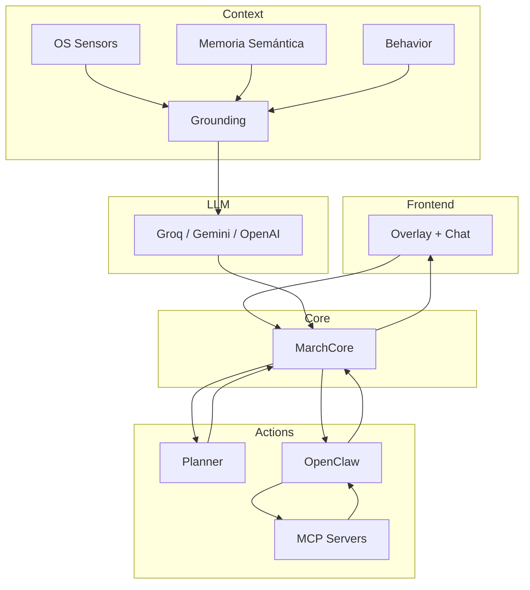

# March 7th

**Compañera de escritorio con IA, memoria persistente y percepción del sistema operativo, construida sobre Electron.**

March 7th es un overlay de escritorio para Windows que combina un avatar Live2D, un modelo de lenguaje conversacional, un sistema de memoria semántica propio y una capa de ejecución de acciones con control de acceso — diseñado para operar de forma autónoma, no solo reactiva.

---

## Visión general

A diferencia de un chatbot de escritorio convencional, March observa el contexto del sistema operativo en tiempo real (aplicación activa, tiempo de enfoque, patrones de uso), mantiene un grafo de conocimiento persistente sobre el usuario a través de sesiones, y puede iniciar conversaciones por sí misma cuando detecta un momento genuinamente relevante — sin que eso dependa de un temporizador fijo ni de plantillas de texto.

El proyecto está estructurado como un sistema multi-capa con responsabilidades claramente separadas: percepción del entorno, recuperación y ensamblado de contexto, planificación de acciones, y ejecución — cada una reemplazable o extensible de forma independiente.

---

## Arquitectura



## Capacidades técnicas

**Memoria semántica con decaimiento temporal**
El grafo de conocimiento (SQLite + `sqlite-vec`) no solo almacena hechos sobre el usuario — los indexa por embeddings locales (`all-MiniLM-L6-v2`, vía `@xenova/transformers`) y los recupera por similitud coseno ponderada por recencia. Un recuerdo de hace tres semanas y uno de ayer no compiten en igualdad de condiciones; el sistema favorece lo reciente sin descartar lo importante.

**Proactividad basada en eventos, no en temporizadores**
El motor de iniciativa propia se suscribe directamente a los eventos del sistema operativo — cambios de aplicación, tiempo de enfoque sostenido, patrones de cambio de contexto, regreso de inactividad — y usa el LLM como árbitro final de si vale la pena decir algo. Toda decisión pasa por una heurística barata como pre-filtro antes de consultar al modelo, el mismo patrón que usa el detector de intenciones.

**Detección de intención semántica**
Un catálogo de frases de referencia, embebido localmente, actúa como pre-filtro antes de pedirle al LLM que decida si el usuario quiere ejecutar una acción concreta — evitando tanto falsos positivos costosos como narrativa ambigua sin estructura.

**Ejecución de acciones con defensa en profundidad**
Ninguna acción de alto impacto (edición de archivos, comandos de shell, navegación web, herramientas de servidores externos) se ejecuta sin aprobación explícita del usuario. El sistema de aprobación combina una lista de patrones de riesgo, confinamiento de rutas al directorio del proyecto, bloqueo incondicional de rutas sensibles (credenciales, llaves SSH, cookies de navegador) y un timeout que falla de forma segura.

**Integración con Model Context Protocol (MCP)**
Cliente MCP propio, independiente del resto del sistema de acciones — permite conectar servidores externos (locales o del registro oficial) que amplían las capacidades de March sin acoplarse a ninguna herramienta específica. Incluye reconexión automática con backoff exponencial si un servidor se cae a mitad de sesión.

**Resiliencia de conexión**
Los tres proveedores de LLM soportados forman una cadena de fallback con reintento exponencial y jitter para fallos transitorios — un timeout puntual no significa perder el proveedor completo. La sesión de conversación se persiste incrementalmente, por lo que un cierre no controlado (falla de energía, cierre forzado) no implica perder el hilo de la conversación al reabrir.

---

## Stack técnico

| Capa | Tecnología |
|---|---|
| Runtime de escritorio | Electron |
| Modelo de personaje | Live2D Cubism |
| Persistencia | SQLite (`better-sqlite3`) + `sqlite-vec` |
| Embeddings locales | `@xenova/transformers` (ONNX Runtime) |
| Automatización de navegador | Playwright |
| Reconocimiento de voz | Vosk (offline) |
| Síntesis de voz | Edge TTS |
| Modelos de lenguaje | Groq · Google Gemini · OpenAI |
| Protocolo de herramientas | Model Context Protocol (MCP) |

---

## Estructura del proyecto

```
core/
  MarchCore.js          Orquestador central
  behavior/              Modelo de comportamiento y motor de proactividad
  grounding/              Detección de intención, recuperación y ensamblado de contexto
  llm/                    Abstracción de proveedores de LLM
  mcp/                    Cliente MCP
  planner/                Parsing y ejecución de acciones
  state-graph/            Grafo de conocimiento, sesiones, resolución de contradicciones

infrastructure/
  sensors/                Percepción del sistema operativo (Windows)
  event-bus/              Bus de eventos interno
  database/               Inicialización de índices vectoriales

src/                      Interfaz (overlay Live2D + ventana de chat)
tests/                    Suite de pruebas
```

---

## Estado del proyecto

En desarrollo activo. La arquitectura ha pasado por varias fases de consolidación — de un prototipo de overlay simple a un sistema con memoria persistente, percepción de contexto y ejecución de acciones gobernada.

---

## Licencia

El código fuente de este proyecto se distribuye bajo licencia MIT — ver [`LICENSE`](./LICENSE).

**Esta licencia no cubre los assets del modelo Live2D de March 7th** (carpeta `models/`). El personaje es propiedad de Cognosphere Pte. Ltd. / HoYoverse, usado aquí como contenido de fan sin fines comerciales. Cualquier reutilización de este proyecto debe proveer su propio modelo o excluir esa carpeta.

---

## Reconocimientos

March 7th es un personaje de *Honkai: Star Rail*, desarrollado por HoYoverse. Este proyecto es un trabajo de fan no oficial, sin afiliación con Cognosphere Pte. Ltd.
