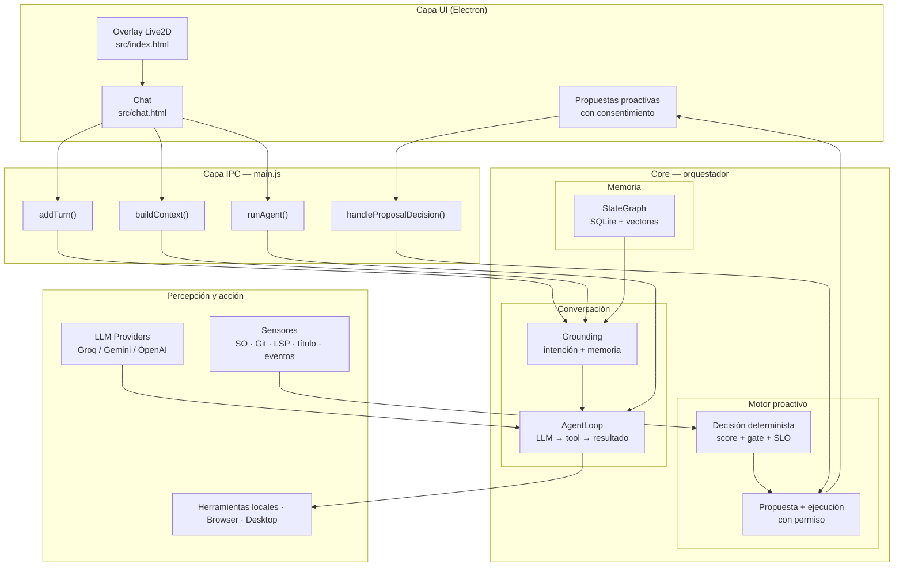
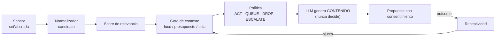
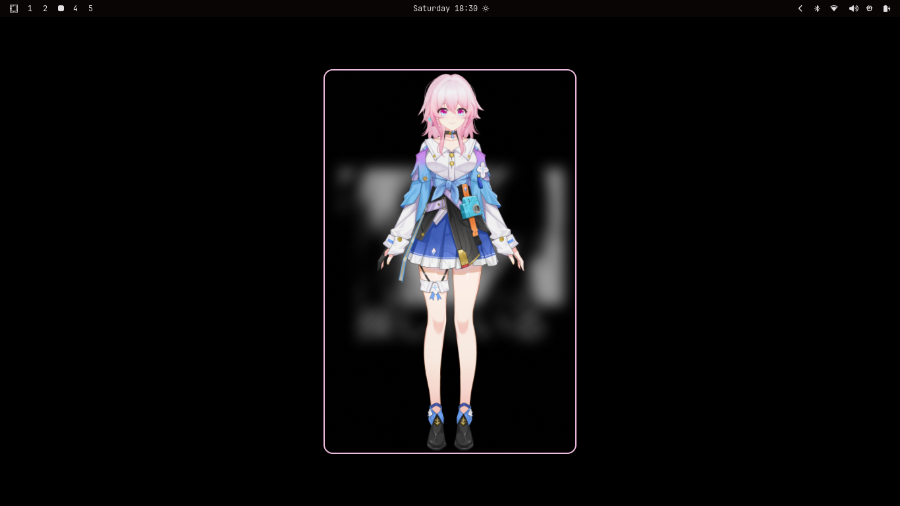
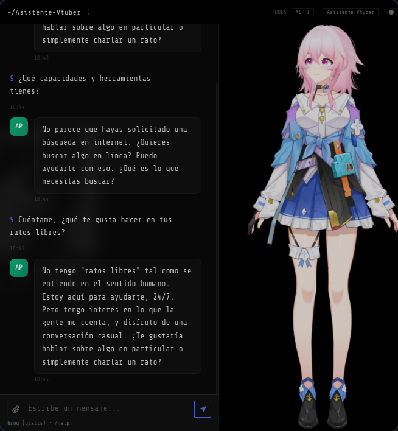
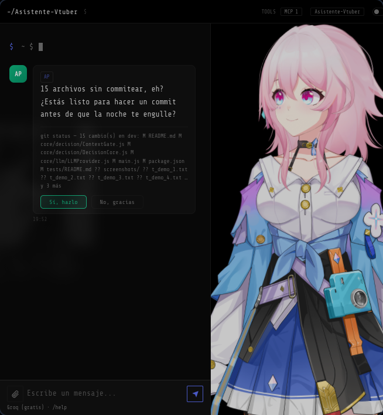
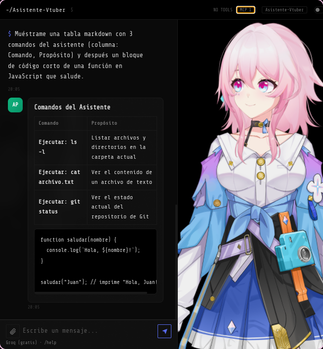
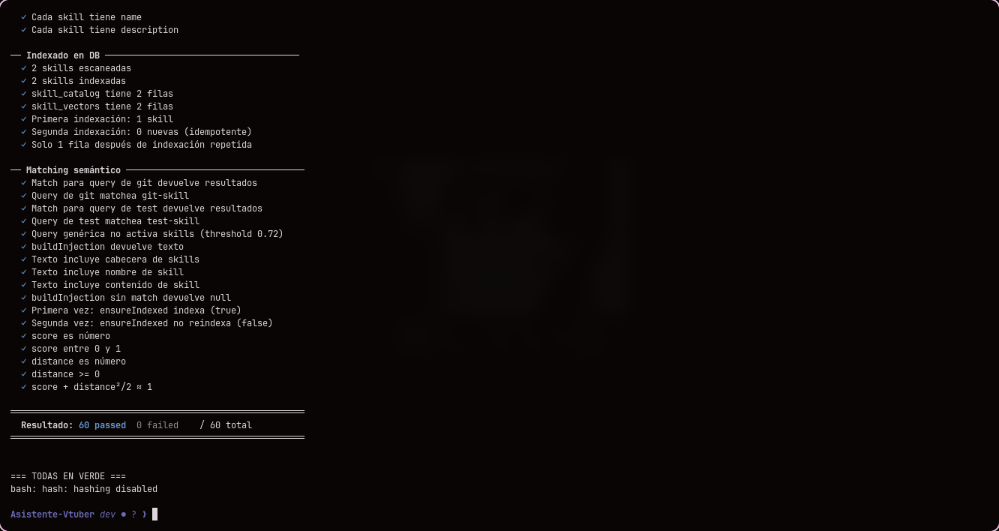
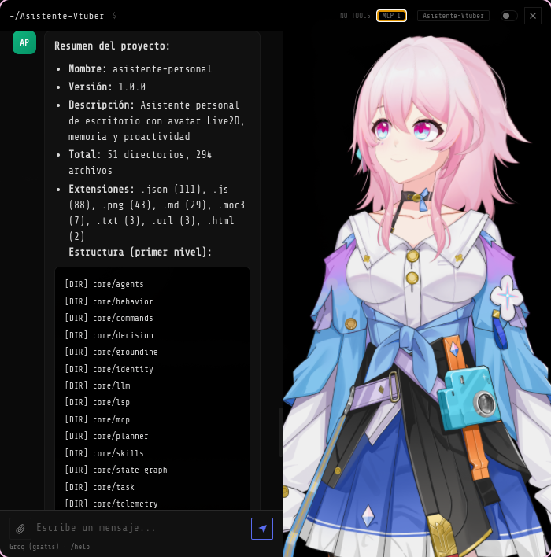
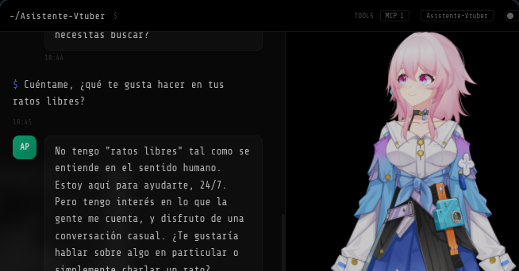

<div align="center">


# Kaoru

### Tu asistente personal de IA con capacidad de agente

**Conversa · recuerda · propone · actúa con tu permiso**

[](https://github.com/Dregxmoon/Kaoru-Agent/releases/latest)
[](https://github.com/Dregxmoon/Kaoru-Agent/actions/workflows/ci.yml)
[](https://www.electronjs.org/)
[](https://nodejs.org/)
[](./LICENSE)

**Español** · [日本語](./docs/i18n/ja/README.md) · [English](./docs/i18n/en/README.md)

[Descargar](#2-descarga-e-instalación) · [Manual de uso](./docs/manual-de-uso.md) · [Seguridad](#5-seguridad-y-privacidad) · [Privacidad](./docs/web/privacy.html) · [Arquitectura](#6-arquitectura) · [Documentación](#11-documentación)

</div>

---


Kaoru es un asistente personal de IA que vive en tu escritorio. Conversa, conserva contexto y te acompaña por texto, voz y presencia Live2D. Cuando necesitas pasar a la acción, trabaja como agente sobre tu proyecto y las herramientas que le permitas: planifica, ejecuta y presenta resultados para tu revisión.

> **Estado:** Kaoru está en **beta**. Funciona de forma usable, pero algunas áreas son experimentales y todavía falta validación externa. Consulta el [estado del proyecto](#9-estado-del-proyecto) antes de usarlo en trabajo importante.

## Índice

1. [Qué puedes hacer con Kaoru](#1-qué-puedes-hacer-con-kaoru)
2. [Descarga e instalación](#2-descarga-e-instalación)
3. [Requisitos](#3-requisitos)
4. [Capacidades técnicas](#4-capacidades-técnicas)
5. [Seguridad y privacidad](#5-seguridad-y-privacidad)
6. [Arquitectura](#6-arquitectura)
7. [Configuración y uso](#7-configuración-y-uso)
8. [Desarrollo](#8-desarrollo)
9. [Estado del proyecto](#9-estado-del-proyecto)
10. [Capturas](#10-capturas)
11. [Documentación](#11-documentación)
12. [Licencia y atribuciones](#12-licencia-y-atribuciones)

---

## 1. Qué puedes hacer con Kaoru

| Si eres… | Kaoru te ofrece |
| --- | --- |
| **Desarrollador** | Un asistente de código que explora tu repositorio, detecta errores del editor (LSP), propone parches con diff, ejecuta la verificación configurada y cuida la higiene del repo (`.env`, conflictos, commits sin push). Incluye un chat junto a la terminal de tu proyecto. |
| **Usuario de escritorio** | Un compañero con memoria que retoma hilos pendientes, recuerda lo que importa y ofrece ayuda contextual, con controles separados para aplicaciones, navegador, pantalla, puntero, teclado, procesos y cámara. |
| **Creador o streamer** | Un overlay Live2D en tiempo real con voz sintetizada (Edge TTS), gestos configurables y personalidad consistente. |

### Qué lo distingue

1. **Propone antes de actuar.** Cada mensaje proactivo pasa por un score de relevancia determinista y un gate de contexto (foco, inactividad, presupuesto diario). Se entrega como propuesta con consentimiento: Kaoru propone, tú decides.
2. **Decisión auditable.** Las señales de los sensores pasan por un núcleo determinista (`DecisionCore`) con *reason codes*: puedes rastrear por qué se admitió un mensaje hasta su puntuación, pesos y política. El LLM solo redacta el contenido una vez admitido.
3. **Memoria local con decaimiento temporal.** Hechos, preferencias y episodios se guardan en tu equipo; lo de ayer pesa más que lo de hace tres semanas, sin descartar lo importante.
4. **Permisos fuera del modelo.** Cada acción se clasifica fuera del LLM y pasa por reglas `allow`/`ask`/`deny`. El modelo propone, pero no puede concederse permisos.
5. **Tú eliges el modelo.** Proveedores configurables con fallback y reintentos, o un endpoint local.
6. **Autonomía ajustable.** Un control `observe | suggest | act` más un modelo de receptividad que adapta la frecuencia según tus respuestas reales.

---

## 2. Descarga e instalación

Descarga el instalador de tu sistema desde la [última versión publicada](https://github.com/Dregxmoon/Kaoru-Agent/releases/latest). Los instaladores se llaman **Asistente Personal** (nombre del paquete de la aplicación).

| Sistema | Archivo |
| --- | --- |
| **Windows** | `Asistente Personal Setup <versión>.exe` (instalador) o `Asistente Personal <versión>.exe` (portable) |
| **macOS (Apple Silicon: M1/M2/M3…)** | `Asistente Personal-<versión>-arm64.dmg` |
| **macOS (Intel)** | `Asistente Personal-<versión>.dmg` |
| **Linux** | `Asistente Personal-<versión>.AppImage` o `asistente-personal_<versión>_amd64.deb` |

### Aviso de firma digital

Los instaladores **todavía no están firmados ni notarizados** (firmar tiene un costo). Por eso tu sistema puede mostrar una advertencia. No significa que la aplicación sea peligrosa: el código es abierto y puedes revisarlo.

- **Windows:** si aparece «Windows protegió tu PC», haz clic en **Más información** y luego en **Ejecutar de todas formas**.
- **macOS:** haz clic derecho sobre la app, elige **Abrir** y confirma. En versiones recientes, si el sistema la bloquea, ve a **Ajustes del Sistema → Privacidad y seguridad** y elige **Abrir de todas formas**.
- **Linux:** para el AppImage, dale permiso de ejecución con `chmod +x "Asistente Personal-<versión>.AppImage"`. Para el `.deb`: `sudo apt install ./asistente-personal_<versión>_amd64.deb`.

### Verificar la integridad del archivo

Cada archivo del release muestra su hash **sha256** en GitHub. Para comprobar el tuyo:

```bash
# Linux / macOS
sha256sum "archivo-descargado"          # macOS: shasum -a 256 "archivo-descargado"

# Windows (PowerShell)
Get-FileHash "archivo-descargado" -Algorithm SHA256
```

### Primer arranque

Kaoru muestra una guía para conectar un modelo de IA, revisar permisos, elegir el navegador y probar una tarea. No hace falta editar archivos de configuración. Recomendación: empieza pidiendo un análisis de **solo lectura** de un proyecto antes de permitir cambios.

> ¿Prefieres instalar desde el código fuente? Consulta la sección de [Desarrollo](#8-desarrollo).

---

## 3. Requisitos

| Modo | RAM mínima | RAM recomendada |
| --- | --- | --- |
| Agente y chat por terminal, sin avatar (desde el código fuente) | 4 GB | 8 GB |
| Aplicación de escritorio con Live2D | 8 GB | 16 GB |

- No se exige GPU dedicada si usas un proveedor LLM remoto. Un modelo local puede necesitar hardware adicional.
- Estos valores son **provisionales**, medidos en una sola máquina Linux x64. Consulta [medición, CPU, disco y límites por modo](./docs/requisitos.md).
- **Voz:** la síntesis neuronal (Edge TTS) viene incluida y requiere conexión a internet. La **entrada por micrófono no está disponible** en la interfaz actual.
- **Sistemas operativos:** Windows (sensor nativo), Linux (sensor para Hyprland/Wayland) y macOS (experimental).
- **Sandbox de procesos:**
  - Windows usa AppContainer. Si no puede inicializarse, falla cerrado, salvo desactivación explícita con `OPENCLAW_SANDBOX=0`.
  - Linux usa `bwrap` (bubblewrap) cuando está disponible e informa la degradación si no lo está.
  - Ambos permiten red y escritura dentro del workspace. AppContainer concede solo lectura a los runtimes detectados.
  - macOS no tiene actualmente aislamiento adicional para el ejecutor.

---

## 4. Capacidades técnicas

Cada bloque está colapsado por defecto: haz clic en el título para expandirlo.

<details>
<summary><strong>Memoria semántica con decaimiento temporal</strong></summary>

Grafo de conocimiento en SQLite + `sqlite-vec`, embeddings locales (`all-MiniLM-L6-v2` vía ONNX), búsqueda por similitud coseno ponderada por recencia, decaimiento automático de nodos viejos y resolución de contradicciones (sobrescribir / acumular / archivar).

</details>

<details>
<summary><strong>Proactividad responsable</strong></summary>

Motor de iniciativa en dos niveles: pre-filtros baratos (cooldowns, gap global, chat reciente, AFK) y un **núcleo determinista de decisión** (`core/decision/`: score, gate de contexto, presupuesto dinámico, cola de diferidos, señal crítica *ESCALATE*), con el **LLM como generador de contenido**. Cada resultado (aceptar, descartar, ignorar) realimenta la receptividad, el presupuesto y, vía `core/learning`, los pesos de scoring: el asistente aprende cuándo y cuánto proponer.

</details>

<details>
<summary><strong>Agente de código</strong></summary>

Detección de errores del editor vía **LSP real** (typescript-language-server): sensor de errores, índice de símbolos, propuestas de parche con diff, verificación posterior con el LSP y `node --check`, y rollback automático si el parche rompe el archivo.

Antes de planificar, `RepositoryIntelligence` construye de forma asíncrona un mapa acotado de archivos y dependencias locales, identifica candidatos según la intención y los enriquece con símbolos LSP. Tras una mutación, el mismo índice calcula dependientes y pruebas relacionadas: en repositorios con `tests/run-all.sh`, esas suites focales corren antes de los sellos generales configurados. El caché persistido contiene metadatos estructurales, no contenido fuente, y se invalida al editar.

</details>

<details>
<summary><strong>Multi-proveedor de LLM</strong></summary>

Proveedores configurables con cadena de fallback, reintento exponencial con jitter, límite de fallas consecutivas y mensajes accionables ante límites de uso. El catálogo efectivo de modelos vive en `core/llm/catalog.js`.

</details>

<details>
<summary><strong>Automatización de navegador</strong></summary>

`open_website` abre por defecto el navegador personal/predeterminado, por lo que conserva tus sesiones, pero Kaoru solo solicita abrir la URL y no recibe acceso directo a tus cookies o contraseñas. Las tareas que necesitan inspeccionar el DOM, buscar, hacer clic y verificar usan Chromium administrado por Playwright con un perfil separado.

Para `play_media`, **Permisos → Navegador para multimedia** permite elegir entre el navegador personal y Chromium administrado. El personal es el valor predeterminado: Kaoru resuelve el video exacto, solicita abrirlo con autoplay y conserva tu sesión (YouTube todavía puede exigir un clic por sus políticas de reproducción). El modo administrado permite verificar la reproducción, aunque algunos sitios pueden limitar perfiles automatizados. La preferencia guardada prevalece sobre lo que proponga el modelo y se muestra antes de autorizar la acción.

</details>

<details>
<summary><strong>Automatización de escritorio</strong> (beta)</summary>

El motor intenta primero accesibilidad semántica: AT-SPI2 en Linux y UI Automation en Windows. Para canvas, juegos o controles sin árbol accesible existe un fallback visual acotado: cada clic debe referirse a una captura vigente, expira a los 30 segundos, se consume una sola vez y exige observar de nuevo. macOS conserva herramientas generales de aplicaciones, procesos y cámara, pero no implementa todavía la misma paridad semántica de UI.

Para una petición con varios resultados en el escritorio, `desktop_mission` crea una misión secuencial. Una revisión con el modelo comprueba que el plan cubra la petición original; la autorización inicial y los permisos de cada herramienta se resuelven fuera del modelo. Cada paso requiere una postcondición de accesibilidad o un título exacto de ventana: si el resultado no aparece, Kaoru pausa la misión y muestra el paso pendiente. La cobertura de accesibilidad depende de la aplicación y la revisión semántica puede equivocarse; estas misiones se han probado con escenarios simulados, no con una muestra de usuarios externos.

Las familias de capacidad (aplicaciones, navegador, pantalla, puntero, teclado, procesos y cámara) pueden activarse o desactivarse por separado. «Cámara» significa consultar el estado o abrir la aplicación de cámara; Kaoru no captura foto ni vídeo mediante esa herramienta.

</details>

<details>
<summary><strong>Herramientas de exploración y subagentes</strong></summary>

`grep` (búsqueda regex por contenido), `glob` (patrones de archivos) y `subagent` (subagente anidado) se suman a la whitelist de `AgentLoop`: el asistente explora el proyecto sin volcar todo al contexto, con límites de resultados y profundidad.

**Subagentes por perfil:** la herramienta `subagent` acepta un `agent` para elegir perfil: `general` (por defecto, herramientas completas), `explorador` (solo lectura) e `investigador` (búsqueda web + lectura). Cada perfil puede declarar en markdown (`description`, `mode: smart|fast`, `temperature`, `max_iterations`, `read_only`, `tools_allow`/`tools_deny`) qué puede hacer. Se cargan de `.kaoru/subagents/*.md` (proyecto) y `~/.config/vtuber-overlay/subagents/` (global). Los perfiles `fast` usan el modelo barato del mismo proveedor, y el gate de herramientas bloquea en tiempo de ejecución cualquier herramienta fuera de lo permitido. El trabajo delegado se ve en el chat como un bloque colapsable `subagent: <perfil>`. Se apaga con `agent.subagent.enabled: false` en `config.json`.

La investigación puede ejecutarse en paralelo únicamente con perfiles `read_only`. Las mutaciones se serializan en el workspace y comparten el checkpoint de la tarea. Kaoru no anuncia escritura paralela aislada porque todavía no integra worktrees independientes y fusión verificada; permitir varios escritores sobre el mismo árbol sería inseguro.

</details>

<details>
<summary><strong>Contexto largo con memoria</strong></summary>

Al compactar la historia, `AgentLoop` persiste el resumen como episodio en el grafo semántico y, al inicio de cada ejecución, inyecta el recall de episodios relevantes al objetivo actual: reconstruye contexto en tareas largas o retomadas.

</details>

<details>
<summary><strong>Streaming de respuesta</strong></summary>

El LLM responde con `stream: true`; cada fragmento viaja por IPC (`agent-token`) hasta la ventana de chat y se pinta **en vivo** con **render de Markdown incremental**. El HTML crudo se aísla en un frame `sandbox`. Cubre tool-calling nativo y fallback textual, en proveedores compatibles con OpenAI y en Gemini.

</details>

<details>
<summary><strong>Ejecución no bloqueante</strong></summary>

`exec`/`code_execution` usan `spawn` asíncrono (no `spawnSync`): un comando largo no congela el proceso main. Contrato de salida `{ stdout, stderr, exitCode, signal, error }`, `maxBuffer` y timeout por `SIGKILL`.

</details>

<details>
<summary><strong>Sesiones multi-turno</strong></summary>

Conversación persistente por sesión (hasta 40 turnos) con reanudación tras un crash. El contexto inyectado al LLM es **incremental**: presupuesto de 8000 caracteres, con turnos recientes completos y el excedente condensado en un resumen `system` al inicio.

</details>

<details>
<summary><strong>Gestos del modelo Live2D</strong></summary>

Muchos modelos traen carpetas con `*.exp3.json` / `*.motion3.json` que su `model3.json` **no referencia**, así que el SDK nunca las carga y el modelo se queda quieto. Kaoru los **descubre y los inyecta en memoria** al cargar (`core/behavior/ModelAugmenter.js`), sin tocar los archivos del modelo, y les asocia estados de ánimo mediante un léxico multilingüe (`GestureLexicon.js` + `GestureHeuristic.js`).

- **Automático (guiado por el LLM):** `GestureVocabulary.js` genera el vocabulario de gestos del modelo y lo inyecta en el prompt del sistema; el LLM responde con marcadores inline `(gesto: x)` que el chat interpreta y dispara **en vivo** en el mini-avatar y el overlay, tanto en modo chat como en modo agente (`gestures.llmDriven` en la configuración). También reaccionan al tono de voz, a tus mensajes y a eventos del flujo (iniciativa, propuestas, planes, agentes, comandos). Los cooldowns y el revertido automático los controla `GestureEngine.js`.
- **Manual:** `/gestos` lista los gestos reales del modelo activo y cuáles están mapeados a emociones; `/gestos test <gesto|emoción>` los previsualiza (por ejemplo, `/gestos test angry`).
- **Configuración:** el bloque `gestures` de `config.json` ajusta `enabled`, `cooldownMs`, `minIntervalMs`, `durationMs`, `ambient` (gestos aleatorios de fondo), `mappings` (emoción → gesto explícito por modelo) y `llmDriven`.

</details>

<details>
<summary><strong>Telemetría local</strong></summary>

`TelemetryStore` registra turnos, sesiones, silencios, tiempos de respuesta y genera un reporte mensual con deltas, para responder «¿estamos mejor que el mes pasado?» con datos locales.

</details>

<details>
<summary><strong>Model Context Protocol (MCP)</strong> (desactivado en <code>produccion</code>)</summary>

La interfaz y la conexión de servidores MCP están desactivadas en la rama `produccion`. La rama `testing` conserva esta experiencia para su desarrollo y validación.

</details>

---

## 5. Seguridad y privacidad

### Ejecución gobernada

El LLM no autoriza acciones. `ActionParser`, `PermissionManager` y las aprobaciones de sesión aplican permisos granulares `allow`/`ask`/`deny` por herramienta y por parámetros. Las operaciones marcadas como `ask` necesitan tu consentimiento; las permitidas o denegadas se resuelven sin convertir la salida del modelo en autoridad. `PathGuard` confina las rutas al workspace activo, resuelve ancestros reales para rutas nuevas y bloquea ubicaciones sensibles.

| Mecanismo | Qué hace | Dónde se ve |
| --- | --- | --- |
| **Sandbox de proceso** (`bwrap` / AppContainer) | En Linux con `bubblewrap`, cada comando aprobado corre en namespaces propios de mount/pid/ipc/uts: sistema de archivos de solo lectura salvo el workspace activo y `/tmp`, y `.ssh`/`$HOME` fuera de alcance. Sin `bwrap`, degrada de forma transparente sin romper el servidor. | `GET /health` y el canal IPC `openclaw-status` reportan si está activo y, si no, por qué. |
| **Verificación forzada tras mutaciones** | Después de editar archivos: `typecheck → lint → test → build` (autodetectado de `package.json` o configurable), por el mismo camino que cualquier `exec`, así que hereda sandbox y entorno saneado. Sin comando configurado pero con JS modificado: `node --check` como mínimo. | El resultado (`passed`/`failed`/`skipped`) siempre es visible en la respuesta. Un resultado omitido o fallido nunca equivale a una prueba pasada. |
| **Checkpoint y revert** | `WorkspaceCheckpoint` captura una línea base antes de la primera mutación de una tarea (diff + estado con git; snapshot de archivos sin git). | `/revertir-tarea [id]` deshace solo lo que hizo el agente y preserva tus cambios previos sin commitear. Las acciones remotas, los comandos arbitrarios y los efectos externos pueden no ser reversibles. |
| **Límite de confianza** (anti-prompt-injection) | Los resultados de web, navegador, GitHub, MCP y observaciones de UI se marcan como contenido no confiable en sus rutas de entrada. Reduce el riesgo, pero no garantiza inmunidad contra toda inyección. | Los adaptadores y serializers conservan la procedencia antes de incorporarla al contexto. |

### Aislamiento de las ventanas (Electron)

Las ventanas del overlay y del chat corren con `nodeIntegration: false`, `contextIsolation: true`, `webSecurity: true` y `sandbox: true` (renderer de Chromium sin Node). La página solo ve el puente `window.assistant` del preload, que es fino (solo `contextBridge` + `ipcRenderer` con allowlists). La lógica Node vive en el proceso main (`ipc/chat-handlers.js`: comandos, LLM con abort, fs, TTS, `FileResolver`, `AgentManager`). La página nunca recibe `fs`/`path`/`child_process` crudos; el render de Markdown (`marked`) y la sanitización (`DOMPurify`) corren en el renderer.

> `contextIsolation` separa el mundo del preload del mundo de la página; `sandbox` desactiva Node en el renderer. Son mecanismos distintos y ambos están habilitados.

### Qué datos se guardan y cuáles salen de tu equipo

- **Local:** memoria, embeddings, telemetría, sesiones y preferencias se guardan en tu equipo. El llavero del sistema se usa para las credenciales cuando está disponible.
- **Hacia el proveedor LLM que elijas:** el contenido necesario para responder. Capturas, contexto del sistema y resultados de herramientas pueden incluirse cuando la tarea lo requiere y el permiso lo permite. La salida de terminal que adjuntes también puede llegar al proveedor: revisa antes si contiene secretos.
- **Hacia Microsoft:** el texto de las respuestas con voz se sintetiza con Edge TTS.

Detalles completos en el [aviso de privacidad](./docs/web/privacy.html), la [política de seguridad](./SECURITY.md) y la [revisión interna de seguridad](./docs/security-review-2026-09-14.md).

### Control del usuario

- **Permisos por herramienta** (`allow`/`ask`/`deny`) y **capacidades de escritorio separadas**.
- **Credenciales:** puedes reemplazar o eliminar las API keys guardadas desde **Ajustes → Credenciales de modelos**, sin revelar el valor actual. Si una clave procede de `LLM_KEY_*` en `.env` o del entorno, la interfaz elimina cualquier copia guardada y avisa que esa variable debe retirarse en su origen.
- **Recuperación y datos locales:** en **Ajustes → Recuperación y datos locales** puedes reiniciar permisos, limpiar cachés y logs, o restablecer Kaoru por completo. El restablecimiento completo exige escribir `BORRAR TODO`, elimina configuración, memoria, sesiones, permisos, cachés y credenciales locales, y reinicia la aplicación. Nunca elimina tus proyectos, Documentos ni workspaces.
- **Desinstalación:** el desinstalador interactivo de Windows pregunta si también quieres borrar los datos locales; una desinstalación silenciosa los conserva. En macOS y Linux, usa primero el restablecimiento desde Ajustes si quieres una desinstalación limpia.

---

## 6. Arquitectura


```mermaid
flowchart TD
    subgraph UI["Capa UI (Electron)"]
        OVERLAY["Overlay Live2D<br/>src/index.html"]
        CHAT["Chat<br/>src/chat.html"]
        BUBBLE["Propuestas proactivas<br/>con consentimiento"]
    end

    subgraph IPC["Capa IPC — main.js"]
        ADD["addTurn()"]
        BUILD["buildContext()"]
        AGENT["runAgent()"]
        DECIDE["handleProposalDecision()"]
    end

    subgraph CORE["Core — orquestador"]
        subgraph CHAT_FLOW["Conversación"]
            GROUND["Grounding<br/>intención + memoria"]
            LOOP["AgentLoop<br/>LLM → tool → resultado"]
        end
        subgraph MEM["Memoria"]
            GRAPH["StateGraph<br/>SQLite + vectores"]
        end
        subgraph PROACT["Motor proactivo"]
            DECISION["Decisión determinista<br/>score + gate + SLO"]
            PROPOSAL["Propuesta + ejecución<br/>con permiso"]
        end
        GROUND --> LOOP
    end

    subgraph PERC["Percepción y acción"]
        SENSORS["Sensores<br/>SO · Git · LSP · título · eventos"]
        LLM["LLM Providers<br/>Groq / Gemini / OpenAI"]
        TOOLS["Herramientas locales · Browser · Desktop"]
    end

    OVERLAY --> CHAT
    CHAT --> ADD --> GROUND
    CHAT --> AGENT --> LOOP
    CHAT --> BUILD --> GROUND
    GRAPH --> GROUND
    SENSORS --> DECISION
    DECISION --> PROPOSAL --> BUBBLE
    BUBBLE --> DECIDE --> PROPOSAL
    LLM --> LOOP
    LOOP --> TOOLS
```

### Flujo conversacional

1. Escribes un mensaje → `Core.buildContext()` ensambla identidad, contexto del SO, memoria recuperada e intención.
2. `IntentDetector` (embeddings locales) y `TaskDetector` clasifican si hay intención de acción y en qué dominio.
3. `AgentLoop` (modo agente) ejecuta el bucle **LLM → herramienta → resultado → LLM** con un tope de iteraciones; o `complete()`/`completeWithTools()` para respuestas directas.
4. La respuesta se renderiza en el chat (Markdown sanitizado) y la sesión se persiste de forma incremental.

### Flujo proactivo


```mermaid
flowchart LR
    S["Sensor<br/>señal cruda"] --> N["Normalizador<br/>candidato"]
    N --> R["Score de relevancia"]
    R --> G["Gate de contexto<br/>foco / presupuesto / cola"]
    G --> P["Política<br/>ACT · QUEUE · DROP · ESCALATE"]
    P --> L["LLM genera CONTENIDO<br/>(nunca decide)"]
    L --> U["Propuesta con consentimiento"]
    U -->|"outcome"| REC["Receptividad"]
    REC -->|"ajusta"| G
```

Los mensajes proactivos pueden incluir una **propuesta** con botones de aceptar/descartar. Cuando la propuesta contiene una acción, sus parámetros se construyen en el backend y se ejecuta después del consentimiento; la vista previa, la verificación y la recuperación dependen del ejecutor y del tipo de acción.

---

## 7. Configuración y uso

La mayoría de los ajustes se hacen desde la interfaz. Para configuración manual, usa `config.json` (fuente de las claves) o un `.env` como alternativa.

- Linux: `~/.config/vtuber-overlay/config.json`
- Windows: `%APPDATA%/vtuber-overlay/config.json`

```json
{
  "activeModel": "March 7th",
  "activeWorkspace": "~/mis-proyectos/panel",
  "llm": {
    "primary": "groq",
    "apiKeys": { "groq": "", "gemini": "", "openai": "" },
    "fallback": ["gemini", "openai"]
  },
  "autonomy": "suggest",
  "sensors": {
    "git": true,
    "system": true,
    "title": true,
    "clipboard": false,
    "events": true,
    "lsp": true
  },
  "mcp": { "servers": [] }
}
```

| Clave | Descripción |
| --- | --- |
| `activeModel` | Modelo Live2D activo (carpeta dentro de `models/`). |
| `activeWorkspace` | Carpeta o proyecto activo sobre el que opera el asistente. |
| `llm.primary` | Proveedor principal (`groq` / `gemini` / `openai`). |
| `llm.apiKeys` | Claves API por proveedor (o `LLM_KEY_*` en `.env`). |
| `llm.fallback` | Cadena de fallback entre proveedores. |
| `browser.*` | Navegador personal o administrado para multimedia, y navegador personal preferido. |
| `autonomy` | `observe` (solo observa) · `suggest` (propone, por defecto) · `act` (actúa con regla `allow` explícita; si no existe, pide confirmación). |
| `sensors.*` | Activa o desactiva sensores de señales (git, sistema, título, portapapeles, eventos, LSP). |
| `mcp.servers` | Configuración conservada, sin conexión automática en `produccion`. |

### Workspace del proyecto

Cada chat queda asociado a una carpeta de trabajo, que Kaoru activa al abrir el chat.

- **Abrir una carpeta:** usa el botón de chats en la cabecera y «Abrir carpeta y crear chat». «Nuevo chat» crea otra conversación en la carpeta actual. Los chats anteriores se abren desde el mismo panel.
- **Arranque:** el ejecutable recupera el último chat cuya carpeta aún existe. En una instalación nueva pide seleccionar una carpeta antes de permitir mensajes. El comando `asistente`, ejecutado desde una terminal, usa la carpeta de esa terminal; `ASISTENTE_WORKSPACE` también permite indicar una ruta explícita.
- **Chats antiguos:** si una conversación se guardó antes de existir esta asociación, Kaoru pide elegir su carpeta al abrirla. Si una carpeta desaparece, el historial sigue disponible para volver a vincularlo.
- **`/init`:** analiza el proyecto activo (`package.json`, extensiones, estructura) y lo guarda en la memoria persistente.
- **`@archivo`:** al escribir `@` se listan los archivos del proyecto y se filtran mientras escribes (Tab/flechas/Enter para insertar). Los comandos de archivo (`/init`, `/open`, …) y las referencias `@` resuelven contra el workspace activo.
- Durante una respuesta o ejecución de herramientas, termina o cancela la tarea antes de cambiar de chat.

### Terminal y chat juntos

El botón `＋` permite crear un chat o una terminal en la carpeta actual. La terminal usa la shell del sistema y muestra el avatar sin requerir API key; sus comandos se ejecutan con tus permisos normales de usuario, **sin pasar por los permisos del agente**. No importa el tema ni el historial de Warp; la shell sí puede cargar sus archivos habituales de inicio.

- Desde una terminal, **Chat** abre un chat vinculado en un panel lateral del mismo workspace, sin cerrar el proceso de la shell.
- **Preguntar a Kaoru** adjunta la selección de la terminal (o, si no hay selección, un fragmento reciente) como tarjeta revisable. **Explicar error** prepara además una pregunta, pero no la envía automáticamente.
- **Ver terminal completa** regresa a la misma sesión. Los vínculos entre chats y terminales se recuerdan localmente; si eliminas una de las sesiones, su vínculo desaparece.
- La salida que no adjuntes no se añade al chat ni se envía al modelo. La salida adjunta sí puede llegar al proveedor elegido al enviar el mensaje: revisa antes si contiene secretos o datos privados.
- En las respuestas del chat, los bloques de un único comando etiquetados como `bash`, `sh`, `zsh`, `fish`, `shell`, `powershell`, `pwsh` o `cmd` ofrecen **Pegar en terminal** (sin ejecutar) y **Ejecutar…** (con confirmación explícita). Ambas acciones requieren una terminal vinculada y lista.
- La detección de errores es aproximada: sin integración con los límites de comandos de la shell, el fragmento reciente no garantiza contener solo un comando y su salida.
- Kaoru conserva las terminales abiertas mientras la ventana siga activa; al cerrarla, termina sus procesos. Al reabrir una sesión de terminal se inicia una shell nueva en la misma carpeta, sin restaurar procesos anteriores.

### Cambiar el modelo Live2D

El modelo se cambia en tiempo real, sin reiniciar:

- **Comando:** `/cambio-modelo` en el chat lista los modelos disponibles en `models/`; `/cambio-modelo <nombre>` activa uno (con autocompletado).
- **Arrastrar y soltar:** suelta la carpeta de un modelo sobre la ventana de chat para importarlo y activarlo automáticamente.

Cada modelo es una carpeta que contiene al menos un archivo `.model3.json` (Live2D Cubism). El cambio se propaga al instante al overlay y al chat, y queda guardado en `config.json` como `activeModel`. Los modelos que importas se guardan en el directorio de datos del usuario y no se suben a GitHub; solo el modelo por defecto forma parte del repositorio. Usa únicamente modelos cuyos derechos de uso tengas.

---

## 8. Desarrollo

Para una instalación normal usa los [instaladores](#2-descarga-e-instalación). Esta sección es para quien quiera ejecutar o modificar el código.

### Requisitos de desarrollo

- Node.js ≥ 18 y npm.

### Instalación desde el código fuente

```bash
npm install            # instala dependencias y electron (postinstall)
npm run rebuild        # opcional: fuerza de nuevo el rebuild de better-sqlite3
cp config.example.json ~/.config/vtuber-overlay/config.json   # Linux
# o: %APPDATA%/vtuber-overlay/config.json                      # Windows
```

`postinstall` instala el comando **`asistente`** en el PATH global (enlace simbólico `~/.local/bin/asistente` en Linux/macOS; shims en el prefix global de npm en Windows). El instalador NSIS de Windows crea además `%LOCALAPPDATA%\Microsoft\WindowsApps\asistente.cmd` y lo elimina al desinstalar. Ejecuta `asistente` desde cualquier carpeta para abrir Kaoru con esa carpeta como workspace; si Kaoru ya está abierto, la instancia existente muestra el chat más reciente de esa carpeta o crea uno. Si hay una tarea en curso, Kaoru pide terminarla o cancelarla antes de cambiar de chat.

Si el enlace falló por permisos, ejecuta `npm link` dentro del proyecto. En Windows, abre una terminal nueva después de instalar para que el PATH actualizado quede visible.

### Ejecutar

```bash
npm start
```

También se expone una **Control API** de diagnóstico en `http://localhost:3131` con token efímero por sesión. El token se mantiene en memoria y no se imprime en los logs; los clientes locales autorizados lo reciben por el canal correspondiente. Incluye `/help`, `/stats`, `/telemetry/report` y `/debug/lsp-scan`.

### Verificación post-instalación (recomendada)

Confirma que `onnxruntime-node` carga su binding nativo antes del primer arranque:

```bash
node scripts/electron-node.js \
  -e "require('onnxruntime-node'); console.log('onnxruntime-node OK')"
```

Si ves `Module did not self-register` u otro error de binding: es un módulo NAPI (ABI estable), así que **no uses `electron-rebuild`** (corrompería el prebuild). Repáralo reinstalando el paquete (`npm install onnxruntime-node` o `npm ci`).

### Redes sin acceso a GitHub releases

Si tu red bloquea o corta las descargas de `github.com/*/releases/*`, tanto el binario de Electron como los prebuilds de `better-sqlite3` pueden llegar corruptos o ausentes (síntomas: `tar` falla con «not in gzip format» o `prebuild-install || node-gyp rebuild` aborta el `npm install`). Ruta de recuperación:

```bash
npm install --ignore-scripts   # deja el árbol sin ejecutar gyp/descargas
node fix-electron.js           # Electron desde caché local + rebuild de módulos nativos
```

`~/.cache/electron/` conserva el zip íntegro de instalaciones previas y `fix-electron.js` lo usa si la descarga directa falla.

### Pruebas y calidad

```bash
# Regresión completa (todas las suites bajo el Node de Electron)
npm test

# Una suite individual (también requiere el ABI de Electron)
node scripts/electron-node.js tests/test_skills.js

# Cobertura del núcleo de agente (core/planner + core/decision) con c8
npm run coverage          # reporte text + lcov
npm run coverage:check    # además valida umbrales (guard de regresión)

# Calidad de código
npm run lint              # ESLint
npm run typecheck         # tsc sobre módulos con // @ts-check (strict)
npm run format:check      # Prettier
```

- `better-sqlite3` y `sqlite-vec` están compilados para el **ABI de Electron**, no para el Node del sistema: las suites que tocan memoria o persistencia corren mediante `scripts/electron-node.js`.
- `test_intent_detection` exige haber ejecutado antes `npm run init-db` para indexar las intenciones en `data/core.db`.
- **Cierra el asistente antes de correr las pruebas:** las suites de seguridad levantan su propio servidor en `:18789`, y si la app está abierta `test_server_security` y `test_integration_stress` fallan por conflicto de puerto.
- No se fija aquí una cifra de assertions: el resultado de `npm test` y el job de CI son la fuente actual. Los módulos nuevos no deben aumentar la deuda de tipos existente.

### CI y releases

GitHub Actions ejecuta jobs de **calidad** (ESLint + typecheck + Prettier), **tests** con Electron, **E2E de la UI** (Electron + Playwright) y **build multiplataforma** (Windows, macOS y Linux, con `continue-on-error`). Un tag `v*` dispara la **release automática** con los instaladores (`.exe`, `.dmg`, `.zip`, `.AppImage`, `.deb`). El postinstall `fix-electron.js` reconstruye los módulos nativos invocando el binario local de `@electron/rebuild`, sin depender de `npx` en el PATH. Localmente: `bash scripts/release.sh [patch|minor|major]`.

### Stack tecnológico

| Capa | Tecnología |
| --- | --- |
| Runtime de escritorio | Electron 28 |
| Modelo de personaje | Live2D Cubism 5 (Pixi.js + live2d-display) |
| Persistencia | SQLite (`better-sqlite3`) + `sqlite-vec` |
| Embeddings locales | `@xenova/transformers` (ONNX Runtime, `all-MiniLM-L6-v2`) |
| Síntesis de voz | Edge TTS desde Node, incluido en el instalador |
| Entrada por voz | No disponible en la interfaz actual |
| Automatización de navegador | Playwright |
| Modelos de lenguaje | Groq (Llama 3.3 70B / 3.1 8B) · Google Gemini (2.5 Flash) · OpenAI |
| Protocolo de herramientas | Model Context Protocol (`@modelcontextprotocol/sdk`), desactivado en `produccion` |
| Renderizado de chat | `marked` + `DOMPurify` |

### Estructura del proyecto

```
├── core/                  # Núcleo de inteligencia y orquestación
│   ├── Core.js            #   Orquestador central (init, sesiones, contexto)
│   ├── agents/            #   Definiciones de agentes especializados
│   ├── behavior/          #   Comportamiento + motor de proactividad (proactive/)
│   ├── commands/          #   Registro de comandos (/comando)
│   ├── config/            #   Carga y validación de config.json
│   ├── core/              #   Orquestación interna (misc, state, agent)
│   ├── decision/          #   Núcleo determinista de decisión proactiva
│   ├── git/               #   Wrapper nativo de Git (git_status, push, merge…)
│   ├── github/            #   Cliente REST de GitHub (issues, PRs, OAuth device flow)
│   ├── grounding/         #   Pipeline de contexto (intención, memoria, serializers)
│   ├── identity/          #   Personalidad del asistente (identity.json)
│   ├── learning/          #   Aprendizaje por feedback (pesos de proactividad, outcomes)
│   ├── llm/               #   Abstracción de proveedores de LLM
│   ├── lsp/               #   Cliente LSP + índice de símbolos
│   ├── mcp/               #   Cliente Model Context Protocol
│   ├── observability/     #   Logger centralizado y seguimiento de uso (tokens/costos)
│   ├── planner/           #   Agente: parsing, loop de ejecución, bridges
│   ├── plugins/           #   Plugins locales (VM aislada, firma Ed25519)
│   ├── rules/             #   Reglas de proyecto (AGENTS.md/CLAUDE.md → prompt)
│   ├── security/          #   Permisos granulares allow/ask/deny por tool y path
│   ├── skills/            #   Sistema de skills (inyección contextual)
│   ├── state-graph/       #   Grafo de conocimiento persistente
│   ├── task/              #   Detección de tareas + registro de herramientas
│   ├── telemetry/         #   Telemetría local (métricas de uso)
│   ├── trust/             #   Modelo de confianza (costo×éxito) para el modo del agente
│   └── utils/             #   Helpers compartidos (env de hijos, fs/JSON, ignore dirs)
├── ipc/                   # Capa IPC (puente renderer ↔ núcleo)
│   ├── state.js           #   Estado compartido del proceso principal
│   └── *-handlers.js      #   Handlers por dominio (openclaw, mcp, github, …)
├── infrastructure/        # Capa de bajo nivel
│   ├── database/          #   Inicialización de índices vectoriales
│   ├── event-bus/         #   Bus de eventos interno (pub/sub)
│   ├── keychain/          #   Llavero del SO (credenciales seguras)
│   └── sensors/           #   Sensores de señales (git, LSP, sistema, etc.)
├── src/                   # Interfaz (overlay Live2D + ventana de chat)
│   ├── preload.js         #   Preload del overlay (API sandboxed vía contextBridge)
│   └── chat/preload.js    #   Preload del chat (API sandboxed vía contextBridge)
├── models/                # Modelo Live2D por defecto ("March 7th")
├── skills/                # Skills del proyecto (code-review, git-workflow, testing)
├── tests/                 # Suite de pruebas (unitarias + integración)
└── docs/                  # Documentación técnica y de arquitectura
```

---

## 9. Estado del proyecto

| Área | Madurez | Límite principal |
| --- | --- | --- |
| Conversación, proveedores y streaming | Beta | La calidad, el coste y la privacidad dependen del proveedor elegido. |
| Agente de código, LSP y verificación | Beta | Falta validación externa en repositorios y equipos diversos. |
| Memoria local y proactividad | Beta | Necesita evaluación longitudinal con usuarios externos. |
| Respuesta por voz y Live2D | Experimental | Requiere dependencias y assets opcionales con derechos adecuados. |
| Entrada por micrófono | No disponible | Retirada de la interfaz actual. |
| Escritorio Linux y Windows | Beta | La cobertura depende de la accesibilidad de cada aplicación. |
| Escritorio macOS | Experimental | Sin paridad semántica ni sandbox adicional del ejecutor. |
| Plugins y skills | Experimental | Cada extensión añade superficie de confianza propia. |
| Instaladores y actualizaciones | Beta | Onboarding y limpieza local disponibles; faltan firma y notarización. |
| Permisos y sandbox | Beta | El control efectivo depende de la herramienta, la política y la plataforma. |

**Beta** indica un flujo utilizable, con pruebas automatizadas y límites conocidos. **Experimental** indica cobertura o contratos aún variables. Ningún componente se declara todavía listo para producción. Si encuentras un problema, [abre un issue](https://github.com/Dregxmoon/Kaoru-Agent/issues); para vulnerabilidades, sigue la [política de seguridad](./SECURITY.md).

---

## 10. Capturas

### El asistente en acción

El overlay Live2D con el modelo por defecto (**March 7th**) sobre el escritorio:

|  |  |
| --- | --- |
|  |  |

Una conversación real en el chat, una propuesta proactiva y el renderizado de Markdown:








> Los modelos mostrados en `12-modelos.png` son de terceros y de uso de fan: *hutao* y *huohuo* © HoYoverse, y un modelo de *Miku* de terceros. Solo **March 7th** se distribuye con el repositorio (ver [Licencia y atribuciones](#12-licencia-y-atribuciones)).

### Desarrollo y datos

La suite de pruebas y el comando `/init`, que analiza el proyecto desde el chat:





La Control API de diagnóstico (`http://localhost:3131`, token por sesión: `/help`, `/telemetry/stats`, `/telemetry/report`, `/debug/lsp-scan`, `/workspace` y `/chat`) y la telemetría local que compara el uso mes a mes con `/telemetria`:




---

## 11. Documentación

| Documento | Contenido |
| --- | --- |
| [`docs/manual-de-uso.md`](./docs/manual-de-uso.md) | Guía de funciones, flujos y atajos del producto |
| [`docs/README.md`](./docs/README.md) | Centro documental y selector de idioma |
| [`docs/requisitos.md`](./docs/requisitos.md) | RAM, CPU, disco y línea base por modo |
| [Aviso de privacidad](./docs/web/privacy.html) | Datos, transferencias, retención y derechos |
| [Términos de uso](./docs/web/terms.html) | Condiciones, riesgos y terceros |
| [`SECURITY.md`](./SECURITY.md) | Modelo de amenazas y divulgación responsable |
| [Revisión interna de seguridad](./docs/security-review-2026-09-14.md) | Hallazgos y pendientes para revisión externa |
| [`docs/arquitectura.md`](./docs/arquitectura.md) | Diagrama de arquitectura detallado |
| [`docs/agente-codigo.md`](./docs/agente-codigo.md) | Flujo de ingeniería, verificación y límites |
| [`CONTRIBUTING.md`](./CONTRIBUTING.md) | Desarrollo y pruebas externas |
| [`docs/i18n/README.md`](./docs/i18n/README.md) | Política de idiomas |
| [`core/`](./core/README.md) | Núcleo de inteligencia y orquestación |
| [`core/desktop/`](./core/desktop/README.md) | Automatización y permisos de escritorio |
| [`core/github/`](./core/github/README.md) | Cliente REST de GitHub y OAuth |
| [`infrastructure/`](./infrastructure/README.md) | Capa de bajo nivel |
| [`ipc/`](./ipc/README.md) | Capa IPC (renderer ↔ núcleo) |
| [`src/`](./src/README.md) | Interfaz de usuario |
| [`tests/`](./tests/README.md) | Estrategia de pruebas |

---

## 12. Licencia y atribuciones

El código fuente se distribuye bajo licencia **MIT**: ver [`LICENSE`](./LICENSE).

**Los assets del modelo Live2D de `models/March 7th/`** son propiedad de Cognosphere Pte. Ltd. / HoYoverse (personaje *March 7th* de *Honkai: Star Rail*). La licencia MIT del código no concede derechos sobre esos assets ni sobre otras marcas o personajes de terceros. Es el único modelo incluido en el repositorio; quien redistribuya el proyecto debe verificar que cuenta con autorización, sustituirlo por assets propios o excluir esa carpeta.

Este proyecto es un trabajo de fan **no oficial**, sin afiliación con Cognosphere Pte. Ltd. ni con HoYoverse.
