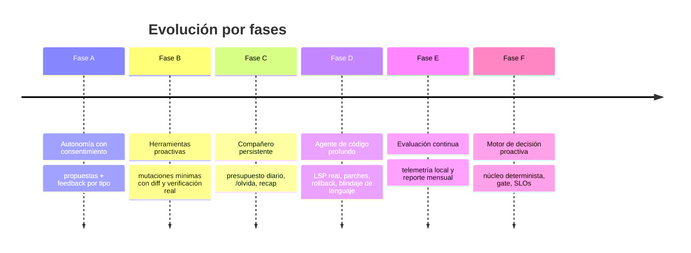

# Hoja de Ruta — Asistente-Vtuber (March 7th)

> Documento de visión y estrategia del producto. Describe hacia dónde evoluciona la
> plataforma, qué capacidades están en producción y qué se construirá a continuación.
> Para el detalle técnico de cada módulo ver [`README.md`](./README.md) y `docs/`.

---

## 1. Visión

Construir un **compañero de escritorio con IA que sea útil sin ser invasivo**:
una entidad persistente que observa el entorno, recuerda lo que importa, propone con
consentimiento y ejecuta con control — combinando la calidez de un personaje (Live2D)
con la utilidad de un agente de código y la privacidad de un sistema local.

### Principios rectores

1. **Observar siempre, actuar solo con consentimiento.** El slider de autonomía es un contrato con el usuario.
2. **Toda mutación es reversible, logueada y con preview.**
3. **El rechazo enseña.** Cada propuesta aceptada o descartada calibra la frecuencia futura.
4. **El silencio es una decisión válida.** No hablar cuando no aporta también es buen comportamiento.
5. **Nunca degradar el chat normal.** El pipeline proactivo es aditivo.

### Escalera de autonomía

| Nivel | Qué hace | ¿Necesita permiso? |
|---|---|---|
| 0. Observar | Sensores corriendo, sin ruido | No |
| 1. Informar | Avisa de lo que ve ("el `.env` no está en .gitignore") | No |
| 2. Proponer | "…¿quieres que lo añada?" (botón en el chat) | No actúa, solo ofrece |
| 3. Actuar | Ejecuta solo tras confirmación explícita | Sí, explícito |
| 4. Auto-actuar | Casos mínimos, reversibles y pre-anunciados | Excepciones, siempre con log |

---

## 2. Fases completadas (capacidades en producción)

### Fase A — Autonomía con consentimiento
Las iniciativas pasaron de ser comentarios a **propuestas** (`{texto, acción, preview}`) con botones
aceptar/descartar en el chat, feedback persistido por tipo y ajuste de frecuencia según las respuestas
del usuario. El slider de autonomía (`observe | suggest | act`) define el contrato de comportamiento.

**Verificación:** suite `test_proposals` (40/40).

### Fase B — Herramientas en el camino proactivo
El motor proactivo puede *comprobar* antes de hablar (git status, check-ignore) y *proponer* mutaciones
mínimas con diff, ejecutables solo tras confirmación. Toda mutación se verifica post-acción con
`git check-ignore` real e idempotencia por propuesta.

**Verificación:** suite `test_proposals_executor` (69/69).

### Fase C — Compañero persistente
Presupuesto diario de iniciativas, recap de pendientes al arrancar, heurística de genuinidad (memoria
real, nunca inventada) y comando `/olvida` para archivar recuerdos.

### Fase D — Agente de código profundo
Detección de errores del editor vía **LSP real**, índice de símbolos, propuestas de parche con diff,
verificación post-aplicación y **rollback automático**. Incluye blindaje de lenguaje: el sistema reporta
el idioma del archivo al modelo y valida la sintaxis real (`node --check`), garantizando que un parche
nunca rompa el archivo aunque el modelo se equivoque.

**Verificación:** suite `test_lsp_errors` (64/64) + E2E con LLM real.

### Fase E — Evaluación continua
Telemetría local (turnos, sesiones, silencios, tiempos de respuesta) con reporte mensual de deltas y
veredicto — el proyecto responde *"¿estamos mejor que el mes pasado?"* con datos locales.

**Verificación:** suite `test_telemetry` (47/47).

### Fase F — Motor de decisión proactiva
Núcleo determinista que reemplaza la decisión del LLM: normalización de señales, **scoring de
relevancia** ponderado, **gate de contexto** (foco, presupuesto dinámico, cola de diferidos), **política
de decisión** con histéresis (`ACT NOW │ QUEUE │ DROP │ ESCALATE`) y **SLOs por tipo de señal** con
degradación automática. El LLM pasa a **producir contenido, nunca decidir**. Cada decisión queda en un
audit log con *reason code* trazable.

Dos mejoras de generalidad lo cierran:
- **Señales nuevas sin perfil conocido** ya no se descartan: se deriva un perfil genérico del payload
  y entran al gate con score + audit; además `registerProfile()` enseña señales nuevas en caliente.
- **Triggers temporales** (long_silence, fechas especiales) obtienen candidato con score y pasan por el
  gate (presupuesto + SLO), sin duplicar la validación de momento.

**Verificación:** `test_decision_core` (44), `test_signal_normalizer` (52), `test_context_gate` (46),
`test_gate_integration` (32), `test_slo` (25).

---

## 3. Línea base de calidad

Regresión completa ejecutable por suite:

| Área | Suite | Tests |
|---|---|---|
| Núcleo de decisión | `test_decision_core` | 44 |
| Normalización de señales | `test_signal_normalizer` | 52 |
| Gate de contexto | `test_context_gate` | 46 |
| Integración gate + engine | `test_gate_integration` | 32 |
| SLOs y degradación | `test_slo` | 25 |
| Motor proactivo | `test_proactive` | 55 |
| Persistencia de feedback | `test_persistent` | 44 |
| Propuestas + consentimiento | `test_proposals` | 40 |
| Executor proactivo | `test_proposals_executor` | 69 |
| Sensores de señales | `test_signal_sensors` | 49 |
| Errores LSP + parches | `test_lsp_errors` | 64 |

Ejecución: `ELECTRON_RUN_AS_NODE=1 ./node_modules/electron/dist/electron tests/<suite>.js`

---

## 4. Siguientes entregas

### Fase G — Agente de código asistido (prioridad alta)
- **Loop de calidad de parches:** ante un fix parcial, el sistema relee el error del LSP y propone el
  siguiente paso hasta cerrar el conjunto de errores (o degradar el tipo).
- **Contexto de workspace:** índice de proyecto (archivos, módulos, dependencias) para sugerencias
  más precisas y preguntas sobre la base de código.
- **Acciones reversibles fuera del editor:** preview + rollback para cambios de configuración del repo.

### Fase H — Calibración y personalización (prioridad alta)
- **Política configurable sin código:** pesos del score, umbrales del gate y SLOs editables desde un
  JSON documentado (hoy viven en constantes con defaults).
- **Onboarding del slider de autonomía** en la UI de settings.
- **Batch de propuestas y modo "no molestar":** agrupar sugerencias en momentos clave en vez de 1 a 1.

### Fase I — Colaboración y producto (prioridad media)
- **Perfiles por usuario** dentro del grafo de memoria.
- **Modo multi-workspace** con memoria separada por proyecto.
- **Reporte empresarial:** consolidado mensual exportable (adopción, tasas de aceptación por tipo,
  impacto medido), pensado para medir valor de uso en equipos.

### Fase J — Robustez operativa (prioridad media)
- **Manejo de rate-limit con cola:** encolar solicitudes de LLM durante picos de consumo del proveedor
  en vez de fallar con mensaje al usuario.
- **Observabilidad:** exportar métricas a un endpoint seguro y monitoreo de salud del servicio.

---

## 5. Guía de contribución

1. Cada módulo tiene un `README.md` con responsabilidades y API — empezar ahí.
2. Toda funcionalidad nueva debe acompañarse de su suite de pruebas (ver `tests/README.md`).
3. El flujo de decisiones proactivas siempre agrega un *reason code* trazable al audit log.
4. `npm start` para desarrollo; la regresión completa debe quedar verde antes de un PR.
