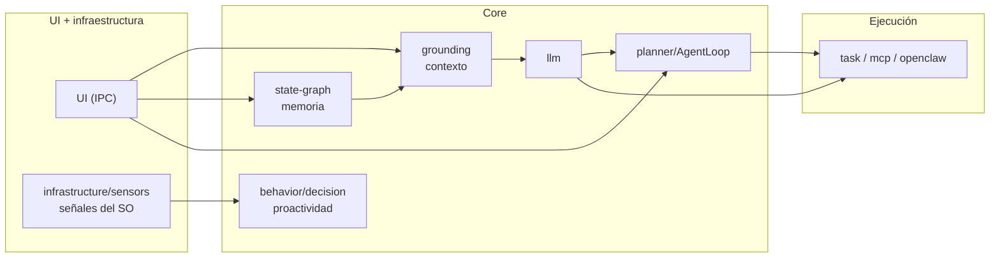

# Núcleo de inteligencia (`core/`)

Capa central del sistema: inicializa, conecta y orquesta todos los subsistemas de inteligencia, memoria,
percepción y ejecución. `Core` es el archivador que da vida al resto de los módulos.

---

## Orquestador: `Core.js`

Responsable del ciclo de vida completo de la aplicación:

- **Arranque:** inicializa `StateGraph`, `GroundingEngine`, `SessionManager`, `IntentDetector`,
  `BehaviorModel`, `ProactiveEngine`, sensores de señales y cliente MCP, y los conecta al `EventBus`.
- **Sensores de plataforma:** selecciona el sensor de SO según `process.platform` (Windows → `OSSensor`,
  Linux/Wayland → `LinuxOSSensor`).
- **Contexto:** `buildContext()` ensambla el paquete de contexto completo para el LLM (identidad, SO,
  memoria, intención, herramientas, skills).
- **Sesiones:** inicio/cierre de sesión, turnos, persistencia incremental y extracción de memoria.
- **Agente:** `runAgent()` ejecuta el bucle agente (LLM → herramienta → resultado) con aprobaciones y
  progreso.
- **Proactividad:** conecta sensores de señales al motor proactivo y enruta las decisiones de propuesta
  entre el chat y el executor.
- **Herramientas:** inyección del catálogo OpenClaw/MCP en el prompt y gestión del workspace activo.
- **Workspace:** `setActiveWorkspace()` cambia el proyecto sobre el que opera el asistente (reinicia LSP,
  reinicia OpenClaw con el path permitido, reconecta el MCP filesystem y lo persiste en `config.json`).
- **Cierre:** `shutdown()` mata también los procesos hijo que queden vivos (LSP, servidores MCP y sus
  descendientes vía `npx`) para no dejar huérfanos al cerrar la app.

### API pública principal

| Función | Propósito |
|---|---|
| `init(app)` | Inicializa todos los subsistemas y los conecta al bus |
| `shutdown()` | Cierre ordenado (desconecta MCP, navegador, sensores y mata procesos hijo) |
| `startSession() / closeSession()` | Ciclo de vida de la sesión de conversación |
| `addTurn(role, content)` | Registra un turno (alimenta historial, memoria y telemetría) |
| `buildContext(history, provider, opts)` | Ensambla el contexto del LLM (modos chat/plan/execute/agent) |
| `runAgent(message, opts)` | Ejecuta el bucle agente con herramientas |
| `handleProposalDecision(id, decision)` | Procesa aceptar/descartar de una propuesta proactiva |
| `setActiveWorkspace(path)` / `getWorkspace()` | Cambia/consulta el workspace activo (proyecto del usuario) |
| `getStats()` | Estado de sesión, sensores, motor proactivo, señales, telemetría |

---

## Módulos

| Carpeta | Responsabilidad |
|---|---|
| [`agents/`](./agents/README.md) | Definiciones de agentes especializados (modos de sistema) |
| [`behavior/`](./behavior/README.md) | Modelo de comportamiento y motor de proactividad + executor |
| [`commands/`](./commands/README.md) | Registro de comandos de chat (`/comando`) |
| [`decision/`](./decision/README.md) | Núcleo determinista de decisión proactiva (Fase F) |
| [`grounding/`](./grounding/README.md) | Pipeline de contexto: intención, memoria, serializadores |
| [`identity/`](./identity/README.md) | Personalidad del asistente |
| [`llm/`](./llm/README.md) | Abstracción multi-proveedor de LLM |
| [`lsp/`](./lsp/README.md) | Cliente LSP e índice de símbolos para el agente de código |
| [`mcp/`](./mcp/README.md) | Cliente Model Context Protocol |
| [`planner/`](./planner/README.md) | Agente: parsing, bucle de ejecución y bridges |
| [`skills/`](./skills/README.md) | Sistema de skills con inyección contextual |
| [`state-graph/`](./state-graph/README.md) | Grafo de conocimiento persistente (SQLite + vectores) |
| [`task/`](./task/README.md) | Detección de tareas, registro y resolución de herramientas |
| [`telemetry/`](./telemetry/README.md) | Telemetría local (métricas de uso) |

---

## Flujo de datos entre módulos

Cada módulo se comunica con el resto exclusivamente a través del `EventBus`
(`infrastructure/event-bus/`) o de la API pública de `Core` — no hay dependencias cruzadas directas.
