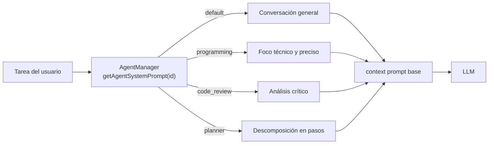

# Agentes (`core/agents/`)

Definiciones de **modos de agente**: distintos "sombreros" que March puede usar según la tarea, cada
uno con su propio system prompt y sesgo de comportamiento.

---

## `AgentManager.js`

Registra y resuelve agentes especializados:

| Agente | Enfoque |
|---|---|
| `default` | Conversación general, amigable y con personalidad |
| `programming` | Modo programación: foco técnico y preciso |
| `code_review` | Revisión de código: análisis crítico y sugerencias |
| `planner` | Planificación: descomposición de objetivos en pasos |

`getAgentSystemPrompt(id)` devuelve el prompt del agente, usado como base del context prompt cuando el
modo del asistente lo requiere.

---

## Verificación

`test_agent_manager` — cobertura de registro, resolución y system prompts por agente.
