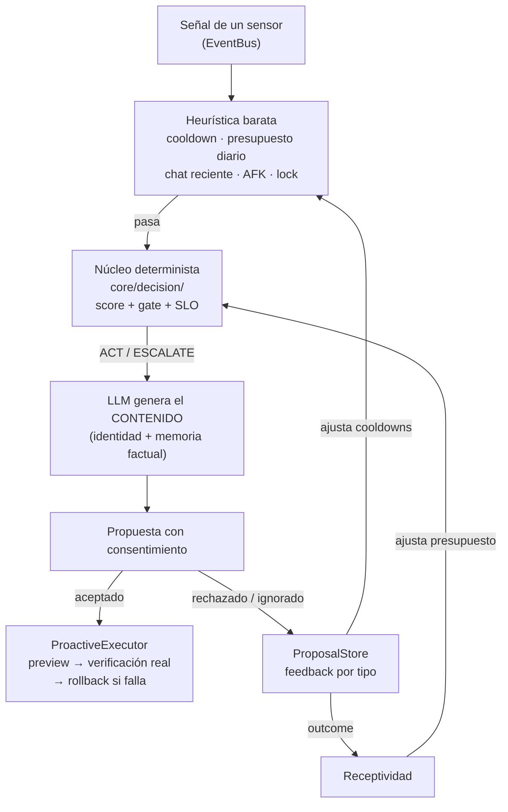

# Comportamiento y proactividad (`core/behavior/`)

Define **cómo** se comporta March y **cuándo** debe tomar la iniciativa, con una arquitectura de dos
niveles: heurística y núcleo determinista deciden, el LLM genera el contenido, y la ejecución siempre
pasa por consentimiento.

---

---

## `BehaviorModel.js` — modelado del comportamiento

No genera lenguaje: evalúa en cada turno el estado del usuario y produce un `BehaviorContext` que
describe cómo debe comportarse March.

| Campo | Valores | Descripción |
|---|---|---|
| `tone` | playful / curious / empathetic / dry / direct | Tono de la respuesta |
| `toolTendency` | none / low / medium / high | Inclinación a usar herramientas |
| `detailLevel` | concise / normal / thorough | Nivel de detalle |
| `proactiveScore` | 0.0 – 1.0 | Cuánto debería tomar la iniciativa |
| `initiativeReason` | string | Justificación de la iniciativa (o del silencio) |

Entradas: mensaje del usuario, contexto del SO, historial reciente y hora del día.

## `ProactiveEngine.js` — motor de proactividad autónoma

Se suscribe al `EventBus` y escucha los eventos de los sensores para detectar patrones.

**Patrones detectados:**
| Patrón | Gatillo |
|---|---|
| `sustained_focus` | Misma app > 15 min |
| `context_switch` | Cambio de categoría de app |
| `return_from_afk` | Vuelta de inactividad |
| `long_silence` | Sin hablar > umbral configurable |
| `lsp_error` | Errores del editor (verificación con el LSP real) |
| `pending_recap` | Pendientes de memoria al arrancar |
| …y todos los señalados por `infrastructure/sensors/` | |

**Flujo:** heurística barata (gates de cooldown, presupuesto, chat reciente, AFK) → núcleo determinista
de decisión (`core/decision/`) con score y *reason code* → el LLM **genera** el mensaje con identidad y
memoria factual → propuesta al chat con consentimiento.

### Características clave
- **Cooldowns por tipo** que crecen con los rechazos consecutivos (factor hasta ×3) y se resetean al aceptar.
- **Presupuesto diario** (tope duro) chequeado antes del LLM; persistido por día.
- **Lock `_deciding`** que no se sostiene mientras espera confirmación.
- **Triggers temporales** (long_silence, fechas especiales) con candidato `selfGated` que respeta el gate.
- **Anti-repetición y memoria factual** — el prompt proactivo prohíbe inventar recuerdos.
- **Prompt de parche con lenguaje:** al generar parches LSP, `_generatePatch` declara el idioma del
  archivo (`languageId`/`fileType`) y prohíbe sintaxis ajena (JS → JSDoc, nunca anotaciones TS).

## `ProactiveExecutor.js` — ejecución con permiso

Ejecuta las mutaciones que el usuario acepta, con **defensa en profundidad**:

- **Whitelist estricta de tools** (`git_status`, `gitignore_add`, `apply_patch`) con validación de args
  (sin path traversal, rutas seguras, sin archivos sensibles).
- **Solo lectura sin permiso:** `preview`/`diff`; las mutaciones solo via `execute()` tras `accepted`.
- **Verificación post-acción real** (`git check-ignore` tras escribir; LSP + `node --check` tras parches).
- **Rollback automático** si el parche deja el archivo en estado inválido o con errores nuevos.
- **Idempotencia** por `proposalId` y lock de una mutación a la vez.

## `ProposalStore.js` — feedback persistido

Persiste aceptaciones/descartes **por tipo de señal** (JSON en userData):

- Contadores por tipo y factor de cooldown por rechazos consecutivos.
- **Baseline de aceptación por tipo** consumida por el motor de decisión y la telemetría.
- Exposición de decisiones con timestamp (`getDecisions()`).

---

## Verificación

| Suite | Cobertura |
|---|---|
| `test_proactive` (55) | Contrato `_tryTrigger`, cooldowns, gates, patrones |
| `test_proposals` (40) | Payload de propuesta, decisiones, feedback, slider de autonomía |
| `test_proposals_executor` (69) | Executor: whitelist, preview, verificación, idempotencia |
| `test_persistent` (44) | Persistencia de feedback y estado entre reinicios |
| `test_gate_integration` (32) | Integración con el núcleo determinista |
