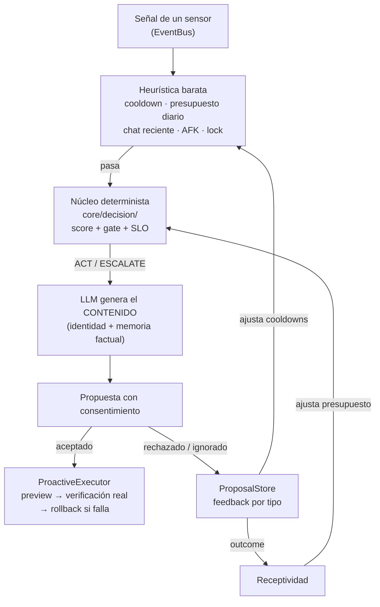

# Comportamiento y proactividad (`core/behavior/`)

Define **cómo** se comporta el asistente y **cuándo** debe tomar la iniciativa, con una arquitectura de dos
niveles: heurística y núcleo determinista deciden, el LLM genera el contenido, y la ejecución siempre
pasa por consentimiento.

---

---

## `BehaviorModel.js` — modelado del comportamiento

No genera lenguaje: evalúa en cada turno el estado del usuario y produce un `BehaviorContext` que
describe cómo debe comportarse el asistente.

| Campo | Valores | Descripción |
|---|---|---|
| `tone` | playful / curious / empathetic / dry / direct | Tono de la respuesta |
| `toolTendency` | none / low / medium / high | Inclinación a usar herramientas |
| `detailLevel` | concise / normal / thorough | Nivel de detalle |
| `proactiveScore` | 0.0 – 1.0 | Cuánto debería tomar la iniciativa |
| `initiativeReason` | string | Justificación de la iniciativa (o del silencio) |

Entradas: mensaje del usuario, contexto del SO, historial reciente y hora del día.

## `ProactiveEngine.js` — motor de proactividad autónoma

Se suscribe al `EventBus` y escucha los eventos de los sensores para detectar patrones.

**Patrones detectados:**
| Patrón | Gatillo |
|---|---|
| `sustained_focus` | Misma app > 15 min |
| `context_switch` | Cambio de categoría de app |
| `return_from_afk` | Vuelta de inactividad |
| `long_silence` | Sin hablar > umbral configurable |
| `lsp_error` | Errores del editor (verificación con el LSP real) |
| `pending_recap` | Pendientes de memoria al arrancar |
| …y todos los señalados por `infrastructure/sensors/` | |

**Flujo:** heurística barata (gates de cooldown, presupuesto, chat reciente, AFK) → núcleo determinista
de decisión (`core/decision/`) con score y *reason code* → el LLM **genera** el mensaje con identidad y
memoria factual → propuesta al chat con consentimiento.

### Características clave
- **Cooldowns por tipo** que crecen con los rechazos consecutivos (factor hasta ×3) y se resetean al aceptar.
- **Presupuesto diario** (tope duro) chequeado antes del LLM; persistido por día.
- **Lock `_deciding`** que no se sostiene mientras espera confirmación.
- **Triggers temporales** (long_silence, fechas especiales) con candidato `selfGated` que respeta el gate.
- **Anti-repetición y memoria factual** — el prompt proactivo prohíbe inventar recuerdos.
- **Prompt de parche con lenguaje:** al generar parches LSP, `_generatePatch` declara el idioma del
  archivo (`languageId`/`fileType`) y prohíbe sintaxis ajena (JS → JSDoc, nunca anotaciones TS).

## `ProactiveExecutor.js` — ejecución con permiso

Ejecuta las mutaciones que el usuario acepta, con **defensa en profundidad**:

- **Whitelist estricta de tools** (`git_status`, `gitignore_add`, `apply_patch`) con validación de args
  (sin path traversal, rutas seguras, sin archivos sensibles).
- **Solo lectura sin permiso:** `preview`/`diff`; las mutaciones solo via `execute()` tras `accepted`.
- **Verificación post-acción real** (`git check-ignore` tras escribir; LSP + `node --check` tras parches).
- **Rollback automático** si el parche deja el archivo en estado inválido o con errores nuevos.
- **Idempotencia** por `proposalId` y lock de una mutación a la vez.

## `ProposalStore.js` — feedback persistido

Persiste aceptaciones/descartes **por tipo de señal** (JSON en userData):

- Contadores por tipo y factor de cooldown por rechazos consecutivos.
- **Baseline de aceptación por tipo** consumida por el motor de decisión y la telemetría.
- Exposición de decisiones con timestamp (`getDecisions()`).

## Módulo de gestos — animar el modelo Live2D

El overlay y el mini-avatar del chat muestran el modelo, pero muchos `model3.json` no referencian
las expresiones (`*.exp3.json`) y animaciones (`*.motion3.json`) que traen en disco. Cuatro módulos
resuelven eso **sin escribir en disco** y conectándolo al flujo del asistente:

### `ModelAugmenter.js` — descubrir e inyectar

- Escanea la carpeta del modelo (hasta profundidad 4) buscando `*.exp3.json` / `*.motion3.json`.
- Clona el `model3.json` y le añade `FileReferences.Expressions`/`Motions` (relativos a la ruta real
  del `model3.json`, que se pasa como `url` al settings). `Live2DModel.from` acepta el JSON como
  objeto; los paths resuelven vía `settings.resolveURL` (verificado contra el dist 0.4.0).
- Deduplica: expresiones ya referenciadas (con su `Name` original, que es la fuente de la semántica —
  p. ej. los `1.exp3.json` de March 7th se llaman 捂脸/比耶/…) y por basename (evita duplicados en
  subcarpetas tipo `exp/1.exp3.json`).
- Las motions **referenciadas** en el `model3.json` preservan su grupo original (una bajo
  `Motions.Idle` con archivo `mtn_00.motion3.json` sigue en `Idle` aunque el nombre no diga idle);
  si el grupo original es una cadena vacía (quirk de 免费模型艾莲) se cae a clasificación por nombre.
- Las motions **descubiertas en disco** (sin referencia) se clasifican por nombre: las que
  contienen `idle` van al grupo `Idle` (el SDK las reproduce en bucle) y el resto a `motions` a
  demanda. Las referenciadas ya no se descartan (antes 免费模型艾莲 quedaba sin motions).
- `augmentModel(model3Path)` → `{ settings, gestures }`; `listGestures(model3Path)` → solo el listado.

### `GestureLexicon.js` — vocabulario multilingüe

- `MOODS` canónicos: 6 emociones TTS + `angry/surprised/shy/think` + acciones (wave/nod/shake/
  dance/sing/photo/wink/sleep/cry/laugh/blush/panic).
- `ALIASES[mood]` → sinónimos en ES/EN/中文/日本語 (+romaji).
- `NOISE` (tokens estructurales: idle/animation/exp/…) e `isActionMood` (desempate hacia motion).

### `GestureHeuristic.js` — de mood a gesto

- `resolveMood(mood, gestures, { mappings })` → orden: mappings explícitos de config → `default`
  → animación del grupo `Idle` → scoring léxico (exacto 100, substring 70, contenido 50, umbral 60;
  los tokens latin < 3 letras no hacen substring para evitar falsos positivos tipo "hi").
- `resolveAll(gestures)` → mapa mood→gesto + `unmapped` (para `/gestos`).
- Caché por ruta de `model3.json`.

### `GestureEngine.js` — reproducción con prioridades

- `play(mood, { priority })`: `auto` → MotionPriority.NORMAL(2), `force` → FORCE(3) (usado por
  `/gestos test`). Cooldown de mismo mood (15 s) e intervalo mínimo (2,5 s), ambos saltables con `force`.
- Aplica con `model.expression(name)` o `model.motion(group, index, priority)`. Tras `durationMs`,
  `_resetPose()` revierte a neutro **expresiones y motions por igual**: corta la motion en curso
  (`motionManager.stopAllMotions`), resetea la expresión y restaura TODOS los parámetros a su valor
  por defecto del moc3 (vía `im.coreModel.getParameterCount/getParameterDefaultValue/setParameterValueByIndex`,
  la API de params vive en `coreModel`, no en `internalModel`). Esto es imprescindible porque muchos
  motion3 traen `"Loop": true` (p. ej. `zhaoxiang`/`zhaiyan` de March 7th) y nunca terminan; sin el
  reset la pose del último frame quedaría fija para siempre (la "cámara alzada" permanente).
- `setEmotion(mood)`, `onEvent(type, payload)` (initiative/plan/proposal/agent/comando), `onChat(...)`,
  `startAmbient()` (gestos aleatorios opcionales) y `flush()`.
- Config por defecto en el constructor; el bloque `gestures` de `config.json` lo sobrescribe.

### Cableado

- `main.js`: `sendOverlayGesture()` traduce eventos globales (iniciativa → `excited`, propuestas →
  `happy`/`sad`, plan → `think`/`happy`) y los reenvía al overlay por IPC `gesture`; expone
  `gesture-config` para el bloque de configuración.
- `src/index.html` (overlay): `speak()` → `setEmotion(emotion)`; listener `gesture`; ambient idle.
- `src/chat.html` (mini-avatar): hooks locales (initiative/proposal/plan/agent-progress/comandos),
  emoción del mensaje del usuario y del TTS; expone el motor al `/gestos` vía `cmdCtx.gestureEngine`.
- `triggerMotion()` (overlay y chat) ahora solo reproduce del grupo `Idle`; así las motions de gesto
  (tipo `zhaoxiang`) solo aparecen vía test o emoción y no al azar en cada click/intervalo.
- `core/commands/CommandRegistry.js`: comando `/gestos` (categoría `Modelo`).

---

## Verificación

| Suite | Cobertura |
|---|---|
| `test_proactive` (55) | Contrato `_tryTrigger`, cooldowns, gates, patrones |
| `test_proposals` (40) | Payload de propuesta, decisiones, feedback, slider de autonomía |
| `test_proposals_executor` (69) | Executor: whitelist, preview, verificación, idempotencia |
| `test_persistent` (44) | Persistencia de feedback y estado entre reinicios |
| `test_gate_integration` (32) | Integración con el núcleo determinista |
| `test_gesture_lexicon` | Vocabulario, normalización, ruido, índices inversos |
| `test_gesture_heuristic` | Scoring, dedupe de gestos, resolveAll, mappings |
| `test_gesture_engine` | Prioridades, cooldowns, revert, fallback, attach |
