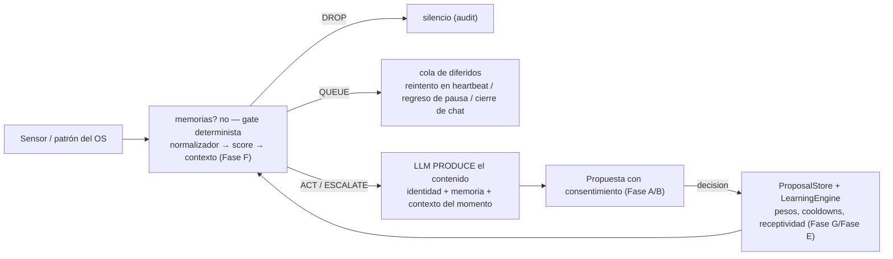

# Motor de proactividad (`core/behavior/proactive/`)

Motor **v2** de proactividad autónoma: se suscribe a los eventos reales del OS y de los sensores
(`infrastructure/sensors/`), analiza patrones de uso en vivo y decide _cuándo_ hablar con un
**gate de contexto determinista** (Fase F) — el LLM solo **produce el contenido**, nunca decide si
intervenir.

La entrada es `core/behavior/ProactiveEngine.js`, que **compone** esta carpeta: los mixins se montan
sobre el prototipo vía `Object.assign`, más `config.js` (constantes/mapas) y `helpers.js`
(funciones puras).

---

## Arquitectura

| Archivo                         | Responsabilidad                                                                                                                                                        |
| ------------------------------- | ---------------------------------------------------------------------------------------------------------------------------------------------------------------------- |
| `ProactiveEngine.js` (en `../`) | Punto de entrada y composición de los mixins                                                                                                                           |
| `config.js`                     | Constantes y mapas: umbrales, cooldowns, `PROPOSAL_HINTS`, `FOCUS_RULES`, modos de autonomía                                                                           |
| `helpers.js`                    | Funciones puras: descripción de triggers, filtro de relleno, extracción de parches `_extractPatch`, detección de media `_detectMediaTitle`/`_matchMediaTaste`, memoria |
| `mixins/lifecycle.js`           | Arranque/parada, setters (`setChatOpen`, `setAutonomyMode`, `setShadowMode`) y todos los listeners del bus                                                             |
| `mixins/os-events.js`           | Análisis en vivo: `sustained_focus`, `context_switch_thrash`, `session_end`, `return_from_break`, `media_watching` + cola QUEUE (`_replayQueued`)                      |
| `mixins/sensor-events.js`       | Señales puntuales de sensores → triggers (`git_redflag`, `system_warning`, `error_title`, `clipboard_context`, `upcoming_event`, `lsp_error`)                          |
| `mixins/time-based.js`          | Triggers de tiempo (`special_date`, `late_night`, `long_silence`, `pending_recap`) + heartbeat que **drena la cola** y marca `ignored`                                 |
| `mixins/gate.js`                | Árbitro central: gate de contexto + cooldowns + consulta al LLM                                                                                                        |
| `mixins/proposals.js`           | Propuestas con consentimiento: payload `proposal`, decisión del usuario, ejecución                                                                                     |
| `mixins/message-gen.js`         | Generación del mensaje con el LLM (identidad + memoria, anti-repetición, curiosidad, contexto de código)                                                               |
| `mixins/testing.js`             | Evaluación forzada (salta cooldowns) + `getStats()` para `/proactive`                                                                                                  |

**Eventos del bus que escucha:** `memory:turn-added`, `os:app-changed`, `os:app-tick`,
`os:idle-changed`, `behavior:evaluated`, `git:redflag`, `system:warning`, `os:error-title`,
`clipboard:copied`, `memory:upcoming-event`, `lsp:error`, `initiative:decision`.

**Eventos que emite:** `initiative:trigger` (mensaje + propuesta) y `proposal:executed`
(resultado real de la mutación). Ambos los consume `core/core/init.js`.

---

## Pipeline de decisión (Fases A–G)

1. **Fase F — gate determinista:** cada señal se normaliza (`SignalNormalizer`) → se puntúa
   (`scoreRelevancia`, con pesos aprendidos por `LearningEngine`) → `ContextGate` valida el momento
   (presencia, flow, presupuesto dinámico por receptividad, SLO por tipo) y devuelve
   `ACT | QUEUE | DROP | ESCALATE` con _reason code_ trazable en el audit log.
2. **Pre-filtros baratos** del engine: cooldowns por tipo (×3 con rechazos en fila), gap global
   entre mensajes autónomos (ajustado por `proactiveScore`), chat reciente (< 2 min), AFK largo,
   lock `_deciding`. **ESCALATE** (señal crítica, R ≥ 0.8) **salta** el gap global, el cooldown del
   tipo y el guard de AFK — un secreto a punto de commitearse no espera 6 h; sigue respetando el
   chat reciente.
3. **Generación:** el LLM **escribe** el mensaje (en modo producción el gate ya admitió; el modelo
   no puede responder "no"). Incluye memoria factual, anti-repetición (últimos 5), curiosidad
   genuina (gaps + tensiones) en momentos de baja fricción, contexto de código (archivo enfocado +
   símbolos LSP) y filtro de relleno (`LOW_VALUE_MSGS`).
4. **Entrega:** `initiative:trigger` → `main.js` abre el chat (si hace falta) y muestra el bubble;
   si la propuesta trae `proposal`, el usuario decide → `handleDecision` → feedback + ejecución.

---

## Catálogo de triggers

| Trigger                 | Fuente                                            | Cooldown | Propuesta                                  |
| ----------------------- | ------------------------------------------------- | -------- | ------------------------------------------ |
| `special_date`          | fecha del calendario                              | 20 h     | info                                       |
| `late_night`            | madrugada (0–5 h)                                 | 2 h      | info                                       |
| `long_silence`          | sin hablar > 3 h                                  | 3 h      | info                                       |
| `sustained_focus`       | foco > 5–40 min según categoría                   | 45 min   | —                                          |
| `context_switch_thrash` | ≥ 6 cambios de app / 10 min                       | 1 h      | info                                       |
| `return_from_break`     | pausa de 15 min–3 h                               | 45 min   | info                                       |
| `session_end`           | racha de trabajo ≥ 20 min → pausa                 | 1 h      | —                                          |
| `media_watching`        | mismo título ≥ 2 min (YT/Twitch/Netflix/Spotify…) | 2 h      | —                                          |
| `git_redflag`           | `.env` sin ignorar, conflictos, sin commitear     | 6 h      | **acción** (`gitignore_add`, `git_status`) |
| `system_warning`        | CPU/RAM/disco/batería al límite                   | 1 h      | info                                       |
| `error_title`           | título de ventana con error                       | 30 min   | info                                       |
| `clipboard_context`     | portapapeles con stacktrace/URL                   | 30 min   | info                                       |
| `upcoming_event`        | recordatorio próximo (< 45 min)                   | 30 min   | info                                       |
| `pending_recap`         | pendientes al arrancar                            | 1 h      | info                                       |
| `lsp_error`             | error de código (verificado con el LSP)           | 45 min   | **acción** (`apply_patch`)                 |

`PROPOSAL_HINTS` (en `config.js`) define para cada trigger el título/preview/acción de la propuesta:
bloque **determinista**, nunca lo inventa el LLM. Sin hint, la iniciativa es solo informativa
(`proposal: null`).

---

## Cola de diferidos (QUEUE)

Las señales buenas en mal momento van a `QueueStore` (dedupe por tipo+kind, máx. 20, TTL 1 h). Se
reintentan con el contexto actual desde **tres puntos**:

- el **heartbeat** (cada 5 min, `_evaluateTimeBased`);
- al **volver de una pausa** real (`os:idle-changed` → `return_from_break`);
- al **cerrar el chat** (`setChatOpen(false)` → `_replayQueued`) — el usuario deja de estar "en
  presencia" y las señales que el gate apartó por chat abierto se entregan.

`_replayQueued` solo re-evalúa con el gate (barato); los admitidos entran al pipeline normal.

---

## Modos y control

- **Autonomía:** `observe` → solo sensores corren; `suggest` (default) → informa + propone;
  `act` → habilita ejecutar tras confirmación. Slider vía `/proactive` (IPC `proactive:set-autonomy`).
- **Shadow mode:** el gate y el audit corren completos pero **nada se envía** (dry-run para
  calibrar) — `proactive:set-shadow-mode`.
- **`/proactive` estats:** `mixins/testing.js` expone cooldowns, presupuesto, audit y estado de la
  cola.

El feedback de aceptación/descartes persiste en `core/behavior/ProposalStore.js` y recalibra los
pesos de scoring vía `core/learning/LearningEngine.js` (Fase G).

---

## Verificación

| Suite                              | Cobertura                                                                             |
| ---------------------------------- | ------------------------------------------------------------------------------------- |
| `test_proactive` (112)             | Patrones, cooldowns, gates, curiosidad, media, cola                                   |
| `test_gate_integration` (34)       | Gate antes del LLM, shadow, outcome → receptividad, drenado de cola al cerrar el chat |
| `test_proposals` (40)              | Payload de propuesta, decisiones, feedback                                            |
| `test_proposals_executor`          | Executor: whitelist, preview, verificación, idempotencia                              |
| `test_persistent`                  | Persistencia de feedback y estado entre reinicios                                     |
| `test_learning`                    | Recalibrado de pesos por feedback                                                     |
| `test_signal_sensors` / `test_slo` | Señales de sensores y resolúmenes por tipo                                            |

Enlaces: [patch behavior](../README.md) · [decisión determinista](../../decision/README.md) ·
[sensores](../../../infrastructure/sensors/README.md).
