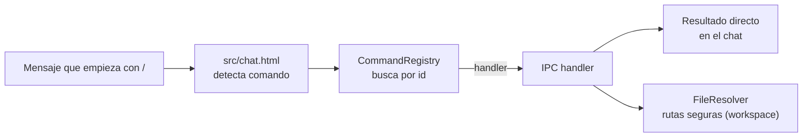

# Comandos (`core/commands/`)

Registro de comandos de chat al estilo `/comando` — el mecanismo para operar al asistente sin depender del
procesamiento de lenguaje natural.

---

## `CommandRegistry.js`

Centraliza el registro, búsqueda y ejecución de comandos. Cada comando tiene:

| Campo | Descripción |
|---|---|
| `id` | Identificador único |
| `category` | Agrupación en la UI (General, Memoria, Sistema, …) |
| `usage` | Sintaxis de uso mostrada al usuario |
| `description` | Qué hace el comando |
| `handler` | Función ejecutora (IPC + lógica) |

Comandos incluidos:

| Comando | Propósito |
|---|---|
| `/help` | Lista de comandos y sintaxis |
| `/init` | Analiza el **workspace activo** (package.json, extensiones, estructura) y lo guarda en memoria |
| `/model` | Cambia el proveedor de LLM (Groq / Gemini / OpenAI) |
| `/cambio-modelo` | Cambia el modelo Live2D (lista los disponibles como botones; matching difuso al escribir) |
| `/provider` | Gestión de proveedores (`set` / `add` / `remove`) |
| `/agent` | Ejecuta el bucle agente sobre un mensaje |
| `/plan` | Crea/ejecuta un plan de pasos |
| `/code` | Acción de edición de código |
| `/review` | Revisión de cambios del workspace |
| `/fix` | Corrige un error señalado (LSP) |
| `/undo` | Deshace la última mutación |
| `/memory` | Estado y operaciones de memoria |
| `/olvida` | Olvida hechos/nodos de memoria |
| `/stats` | Estado de sesión, sensores y motor proactivo |
| `/telemetria` | Reporte de métricas de uso |
| `/export` | Exporta la conversación |
| `/retry` | Reintenta la última respuesta |
| `/credenciales` | Gestión de credenciales (keychain) |
| `/skill` | Lista/carga skills |
| `/clear` | Limpia el historial visual |

## `FileResolver.js`

Resuelve rutas de archivo referidas en comandos y mensajes, con normalización segura (relativas al
**workspace activo**, sin escapes de directorio). Provee `listProjectFiles()` para el autocompletado
de `@archivo` en el chat (al escribir `@` se listan los archivos del proyecto y se filtran al escribir).

---

## Integración

`Core` registra los comandos durante `init()`; la UI (`src/chat.html`) detecta mensajes que
empiezan con `/`, los resuelve en `CommandRegistry` y renderiza el resultado directamente.

Los comandos reciben un contexto con `process.cwd()` apuntando al **workspace activo**
(`Core.getWorkspace()`), de modo que `/init`, `/open` y las referencias `@` operan sobre el
proyecto real del usuario y no sobre la carpeta donde corre la app.

## Verificación

`test_commands` (98 tests) — registro, ejecución, resolución de archivos y contratos IPC.
