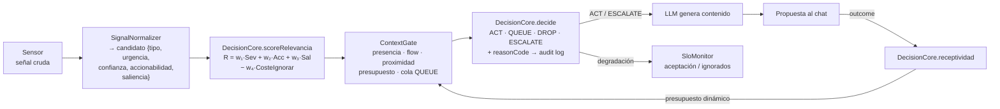

# Núcleo determinista de decisión proactiva (`core/decision/`)

Implementa la **Fase F** del motor proactivo: un núcleo de funciones puras, determinista y auditable que
decide _cuándo_ el asistente debe hablar o callar. El LLM ya no decide — solo genera contenido. Cada decisión
queda registrada en un audit log con un _reason code_ trazable.

---

## Por qué existe

Los asistentes reactivos solo hablan cuando el usuario escribe. Un asistente proactivo debe decidir
cuándo interrumpir, y esa decisión no puede ser un "sorteo" del modelo de lenguaje: debe ser
**determinista, explicable y calibrable con datos**. Este módulo provee ese núcleo.

## Módulos

### `DecisionCore.js` — funciones puras de decisión

- `scoreRelevancia(señal, pesos)` — relevancia ponderada
  `R = w₁·Severidad + w₂·Accionabilidad + w₃·Saliencia + w₄·CosteDeIgnorar`, con clamp a `[0, 1]` y
  override de política (`policy.weights` + pesos aprendidos).
- `receptividad(prev, outcome, hoursSincePrev, policy)` — EMA exponencial
  `Rec(t) = Rec(t−1) + α·(Δ − Rec(t−1))` con decaimiento temporal hacia el neutro.
- `presupuesto(rec, policy)` — presupuesto diario dinámico con clamp `[min, max]` según la receptividad.
- `decide(ctx, policy)` — política con histéresis: `ACT NOW │ QUEUE │ DROP │ ESCALATE`, cada una con
  _reason code_ y `decisionId`.
- `ajustarScorePorAprendizaje(R, stats, policy)` — **Fase G**: ajusta la relevancia con el historial de
  aceptación/rechazo **por tipo** (sesgo ±`maxBias` + penalidad por rechazos en fila). Sin muestras
  suficientes (≥ 3) es identidad.
- `deriveWeights(stats, policy)` — recalcula los **pesos de scoring** desde el feedback del
  `ProposalStore`; el `LearningEngine` los escribe de vuelta y el gate los aplica.
- `AuditLog` / `AuditEntry` — registro trazable de cada decisión (score, veredicto, motivo, flow).
- `receptividad`/`presupuesto`/`scoreRelevancia`/`decide` permanecen puros y unit-testables.
- **Contratos JSDoc en toda la superficie exportada** (`@ts-check` estricto, sin `@ts-nocheck`):
  los overrides de política viajan como `ProactivePolicy` (parcial — cada campo opcional — y se
  fusiona sobre `DEFAULT_POLICY` en runtime); `decide` devuelve `Decision`
  (`verdict` | `reason` | `relevance` | `decisionId`); las configs se tipan por familia
  (`WeightsConfig`/`ThresholdsConfig`/`ReceptivityConfig`/`BudgetConfig`/`LearningConfig`).

Todo es determinista y testable en aislamiento (`test_decision_core`, 55 tests).

### `SignalNormalizer.js` — normalización de señales

Convierte el payload crudo de cada sensor en un **candidato** homogéneo:

```
{tipo, urgencia, confianza, accionabilidad, saliencia, payload, ts}
```

- **Perfiles por señal conocida** (git, lsp, system, os, clipboard, eventos).
- **Generalidad (Gap 1):** las señales sin perfil conocido **ya no se descartan**. Se deriva un perfil
  genérico del payload (palabras críticas → `isCritical`, error/fallo → severidad, file/command →
  accionabilidad) y la señal entra al gate con score + audit.
- **`registerProfile()`** permite enseñar señales nuevas en caliente, sin tocar código.

Verificación: `test_signal_normalizer` (52 tests).

### `ContextGate.js` — gate de contexto

Valida si el momento actual es adecuado para hablar:

- **Presencia** — el usuario está delante y activo.
- **Flow de trabajo** — no interrumpir en rachas de foco (idle/thrashing/DEEP).
- **Proximidad conversacional** — no saturar si hubo chat reciente.
- **Presupuesto dinámico** — gasto diario del motor, ajustado por receptividad.
- **Cola QUEUE** — las señales buenas en mal momento se **difieren** hasta el próximo momento bueno;
  el engine las reintenta en el **heartbeat**, al **volver de una pausa** y al **cerrar el chat**.

Los **triggers temporales** (long_silence, fechas especiales) también pasan por el gate con score
(`selfGated`) y respetan presupuesto y SLO, sin re-validar el momento que su condición ya validó. Los
pesos del scoring pueden venir recalculados por feedback (`LearningEngine` → `setLearnedWeights`).

> **ESCALATE:** el núcleo admite la señal crítica (salta presupuesto y SLO), y el engine además salta
> sus guardas temporales (gap global, cooldown del tipo, AFK). Solo la conversación reciente lo frena.

Verificación: `test_context_gate` (46 tests).

### `SloMonitor.js` — SLOs por tipo de señal

Define objetivos de servicio por tipo (aceptación mínima, ignorados máximos) y aplica
**degradación automática**: si un tipo no cumple su SLO, deja de proponerse hasta re-promocionarse
(histéresis: volver exige superar un umbral más alto).

Verificación: `test_slo` (25 tests).

---

## Pipeline de decisión



---

## Cómo se integra

1. Un sensor emite una señal por el `EventBus` (p. ej. `git:redflag`, `lsp:error`).
2. `ProactiveEngine._tryTrigger()` pide candidato a `SignalNormalizer`.
3. `DecisionCore.scoreRelevancia()` puntúa (con pesos estáticos o aprendidos); `ContextGate` valida el momento.
4. `DecisionCore.decide()` emite la política y registra el `reasonCode` en el audit log.
5. Si toca actuar, el LLM **genera el contenido**; el motor arma la propuesta y la envía al chat.
6. El outcome (aceptado/descartado/ignorado) actualiza la receptividad, el presupuesto, los cooldowns
   por tipo y — vía `LearningEngine` → `deriveWeights`/`ajustarScorePorAprendizaje` — los pesos del gate.

> **Shadow mode:** con `{ shadowMode: true }` el gate corre en modo observación (dry-run con audit,
> sin enviar) — útil para calibrar la política sin molestar al usuario.
