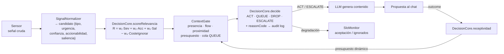

# Núcleo determinista de decisión proactiva (`core/decision/`)

Implementa la **Fase F** del motor proactivo: un núcleo de funciones puras, determinista y auditable que
decide *cuándo* March debe hablar o callar. El LLM ya no decide — solo genera contenido. Cada decisión
queda registrada en un audit log con un *reason code* trazable.

---

## Por qué existe

Los asistentes reactivos solo hablan cuando el usuario escribe. Un asistente proactivo debe decidir
cuándo interrumpir, y esa decisión no puede ser un "sorteo" del modelo de lenguaje: debe ser
**determinista, explicable y calibrable con datos**. Este módulo provee ese núcleo.

## Módulos

### `DecisionCore.js` — funciones puras de decisión

- `scoreRelevancia(señal, pesos)` — relevancia ponderada `R = w₁·Severidad + w₂·Accionabilidad + w₃·Saliencia − w₄·CosteDeIgnorar`, con clamp a `[0, 1]` y override de política.
- `receptividad(outcome, prev)` — modelo exponencial `Rec(t) = α·outcome + (1−α)·Rec(t−1)`.
- `presupuesto(rec, cfg)` — presupuesto diario dinámico con clamp `[min, max]` según la receptividad.
- `decide(score, state, policy)` — política con histéresis: `ACT NOW │ QUEUE │ DROP │ ESCALATE`, cada una con `reasonCode`.

Todo es determinista y testable en aislamiento (`test_decision_core`, 44 tests).

### `SignalNormalizer.js` — normalización de señales

Convierte el payload crudo de cada sensor en un **candidato** homogéneo:

```
{tipo, urgencia, confianza, accionabilidad, saliencia, payload, ts}
```

- **Perfiles por señal conocida** (git, lsp, system, os, clipboard, eventos).
- **Generalidad (Gap 1):** las señales sin perfil conocido **ya no se descartan**. Se deriva un perfil
  genérico del payload (palabras críticas → `isCritical`, error/fallo → severidad, file/command →
  accionabilidad) y la señal entra al gate con score + audit.
- **`registerProfile()`** permite enseñar señales nuevas en caliente, sin tocar código.

Verificación: `test_signal_normalizer` (52 tests).

### `ContextGate.js` — gate de contexto

Valida si el momento actual es adecuado para hablar:

- **Presencia** — el usuario está delante y activo.
- **Flow de trabajo** — no interrumpir en rachas de foco (idle/thrashing/DEEP).
- **Proximidad conversacional** — no saturar si hubo chat reciente.
- **Presupuesto dinámico** — gasto diario del motor, ajustado por receptividad.
- **Cola QUEUE** — las señales buenas en mal momento se **difieren** hasta el próximo momento bueno.

Los **triggers temporales** (long_silence, fechas especiales) también pasan por el gate con score
(`selfGated`) y respetan presupuesto y SLO, sin re-validar el momento que su condición ya validó.

Verificación: `test_context_gate` (46 tests).

### `SloMonitor.js` — SLOs por tipo de señal

Define objetivos de servicio por tipo (aceptación mínima, ignorados máximos) y aplica
**degradación automática**: si un tipo no cumple su SLO, deja de proponerse hasta re-promocionarse
(histéresis: volver exige superar un umbral más alto).

Verificación: `test_slo` (25 tests).

---

## Pipeline de decisión



---

## Cómo se integra

1. Un sensor emite una señal por el `EventBus` (p. ej. `git:redflag`, `lsp:error`).
2. `ProactiveEngine._tryTrigger()` pide candidato a `SignalNormalizer`.
3. `DecisionCore.scoreRelevancia()` puntúa; `ContextGate` valida el momento.
4. `DecisionCore.decide()` emite la política y registra el `reasonCode` en el audit log.
5. Si toca actuar, el LLM **genera el contenido**; el motor arma la propuesta y la envía al chat.
6. El outcome (aceptado/descartado/ignorado) actualiza la receptividad y el presupuesto.

> **Shadow mode:** con `{ shadowMode: true }` el gate corre en modo observación (dry-run con audit,
> sin enviar) — útil para calibrar la política sin molestar al usuario.
