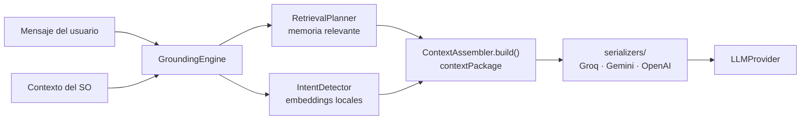

# Pipeline de contexto (`core/grounding/`)

Ensambla **todo** el contexto que recibe el LLM antes de generar una respuesta: memoria persistente,
estado del sistema operativo, intención del usuario y herramientas disponibles.

---

## `GroundingEngine.js` — orquestador del pipeline

1. Toma el mensaje del usuario + contexto del sensor de SO.
2. `RetrievalPlanner.plan()` → recupera los nodos relevantes del grafo de memoria.
3. `IntentDetector.detect()` → detecta si hay intención de usar herramientas.
4. `ContextAssembler.build()` → arma el paquete de contexto.
5. Serializador → convierte el paquete al formato del proveedor (system prompt + messages).

## `ContextAssembler.js` — paquete de contexto

El `contextPackage` contiene:

| Bloque | Contenido |
|---|---|
| `identity` | Personalidad del asistente (`core/identity/identity.json`) |
| `osContext` | App activa, ventanas, tiempo de uso, hora/día |
| `persistentMemory` | Nodos y episodios recuperados del `StateGraph` |
| `sessionHistory` | Historial de la sesión actual |
| `currentMessage` | Último mensaje del usuario |
| `toolIntent` | Resultado de la detección semántica de intención |

## `IntentDetector.js` — detección semántica de intención

Detecta si el usuario quiere ejecutar una acción, con embeddings locales (`all-MiniLM-L6-v2`) y
búsqueda coseno en `sqlite-vec`. **Pre-filtro barato**: evita pedirle al LLM que decida cada vez si hay
acción que ejecutar.

| Nivel | Significado |
|---|---|
| `high` | El LLM responde con bloque de acción estructurado |
| `medium` | Sugerencia suave |
| `low / none` | Conversación normal |

## `RetrievalPlanner.js` — recuperación de memoria

Planifica qué nodos del grafo recuperar según el mensaje + contexto del SO, con búsqueda por similitud
coseno **ponderada por recencia**: lo reciente pesa más, sin descartar lo importante.

## `serializers/` — formateo del system prompt

| Archivo | Propósito |
|---|---|
| `GroqSerializer.js` | System prompt en secciones (identidad → contexto SO → memoria → intención de herramienta). Serializer único del pipeline para todos los providers. |

La selección ocurre en `ContextAssembler.build()` según el proveedor activo, con fallback a Groq.
`GeminiOpenAISerializer.js` fue eliminado: sus clases eran no-ops y las diferencias reales de
transporte por proveedor viven en `LLMProvider`.

---

## Pipeline

---

## Verificación

`test_intent_detection` (pipeline de intención + fallback), `test_prompt_composer` (construcción del
prompt por proveedor, presupuestos y drop de secciones no críticas), `test_no_fabrication`
(anti-alucinación en la composición) y `test_grounding` — ver `tests/README.md`.
