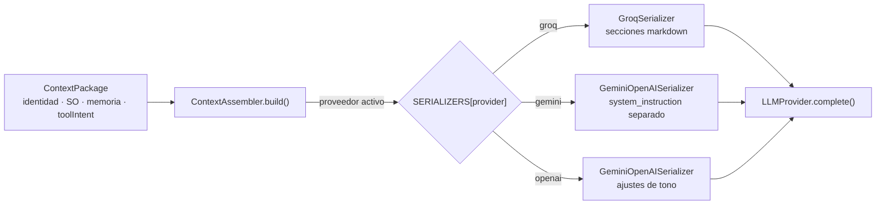

# Serializadores de contexto (`core/grounding/serializers/`)

Convierten el paquete de contexto (`ContextPackage`) en el formato exacto que cada proveedor de LLM
espera. Mantienen la responsabilidad del *formato* separada del *contenido*.

---

## `GroqSerializer.js`

Construye el system prompt en secciones separadas por `---`:

1. **Identidad** — quién es el asistente (desde `identity.json`).
2. **Contexto del SO** (`## Contexto actual`) — app activa, ventanas, tiempo de uso, actividad de hoy.
3. **Memoria persistente** — nodos y episodios relevantes del `StateGraph`.
4. **Intención de herramienta** — instrucciones de formato estructurado si el `IntentDetector` encontró
   `toolIntent`.

Detalles de implementación relevantes:
- `_buildOSSection()` — renderiza el contexto del SO en texto legible e instruye al modelo a no usar
  herramientas para responder qué apps están abiertas (esa info ya viene en el contexto).
- `_buildMemorySection()` — renderiza nodos y episodios de memoria persistente.
- `_buildToolIntentSection()` — inyecta las instrucciones de parseo para acciones estructuradas
  (`ACCIÓN: ... | ARCHIVO/COMANDO: ...`).

## `GeminiOpenAISerializer.js`

Extiende `GroqSerializer` con los ajustes de cada proveedor:
- **Gemini** — `system_instruction` va separado de `messages[]`.
- **OpenAI** — mismo formato que Groq con ajustes menores de tono.

## Selección automática

En `ContextAssembler.build()`:

```js
const serializer = SERIALIZERS[activeProvider] ?? SERIALIZERS.groq;
```



---

## Verificación

`test_prompt_composer` (38 tests aprox.) cubre: presupuesto de contexto con drop de secciones no
críticas (la identidad es *critical* y nunca se recorta), orden de secciones, formato por proveedor
(markdown / XML / JSON-sections / provider-native) y compatibilidad con `LLMProvider.complete()`.
