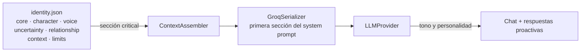

# Identidad del asistente (`core/identity/`)

Define quién es el asistente, cómo habla, cómo se comporta y cuáles son sus límites. La identidad es
la primera sección de **todo** system prompt — es el ancla de personalidad del asistente.

---

## `identity.json`

Identidad completa de la asistente personal (sin nombre propio): vive en el escritorio del usuario
y tiene voz, humor y criterio propios.

| Sección | Contenido |
|---|---|
| `core` | Declaración principal de identidad ("soy tu asistente personal…") |
| `character` | Resumen y rasgos: curiosidad genuina, humor seco, lealtad tranquila, honestidad suave |
| `voice` | Estilo de habla y frases prohibidas ("¡Claro!", "¡Por supuesto!", "Como asistente de IA…") |
| `uncertainty_behaviors` | Cómo actuar cuando no sabe, no está segura, se equivocó o le sorprenden |
| `relationship` | Cómo trata a la persona con la que habla |
| `context_awareness` | Conciencia de hora, sesión y entorno de escritorio |
| `limits` | Qué NO es el asistente y la estabilidad de su identidad |

---

## Cómo se usa

- Se inyecta como la primera sección del system prompt en cada llamada al LLM (`GroqSerializer` /
  `ContextAssembler`).
- Su bloque es **critical** en el presupuesto de contexto: nunca se recorta, aunque el resto del
  prompt se comprima.
- Es fuente de verdad para el tono de las respuestas conversacionales y proactivas.

> Para modificar la personalidad sin tocar código, editar `identity.json` — los cambios se aplican en
> el siguiente arranque o llamada.

---

## Verificación
