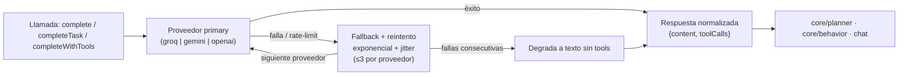

# Abstracción de proveedores de LLM (`core/llm/`)

Capa única de acceso a los proveedores de modelos de lenguaje, con fallback automático, reintentos
inteligentes y tool-calling nativo. **Todo** el proyecto — chat, agente, motor proactivo — habla con el
LLM a través de aquí.

---

## `LLMProvider.js`

**Proveedores soportados:**

| Proveedor | Tipo | Modelo (tareas / conversación) |
|---|---|---|
| Groq | tier free + API | `llama-3.3-70b-versatile` |
| Google Gemini | tier free + API | `gemini-2.0-flash-exp` |
| OpenAI | API | `gpt-4o-mini` |

**API pública:**

| Función | Propósito |
|---|---|
| `configure(config)` | Configura proveedores, claves y modo desde `config.json` |
| `complete(messages, systemPrompt)` | Conversación (modo `fast`) |
| `completeTask(messages, systemPrompt)` | Tareas (modo `smart`) |
| `completeWithTools(messages, systemPrompt, tools, mode)` | Tool-calling nativo con fallback textual |
| `getActiveProvider()` | Proveedor activo según orden primary → fallback |
| `getActiveModel(mode)` | Modelo activo para un modo |
| `getAvailableProviders()` | Proveedores disponibles con estado de clave |
| `addCustomProvider(def)` / `removeCustomProvider(id)` | Registro de proveedores personalizados |

**Robustez:**
- **Cadena de fallback** primary → fallback con reintento exponencial + jitter (hasta 3 intentos por proveedor).
- **Límite de fallas consecutivas** antes de degradar a texto sin tools.
- **Manejo de rate-limit** con mensajes accionables ("vuelve a intentar en ~X min o cambia de proveedor con `/model`").
- **Normalización de respuestas** por proveedor (OpenAI y Gemini unificados a `{content, toolCalls}`).
- Claves leídas de `config.json` o `LLM_KEY_*` del `.env`; el llavero del SO (`infrastructure/keychain/`)
  es la fuente preferida.

## `GroundingMinimo.js` — fallback de contexto

Ensamblador de contexto mínimo usado solo si `GroundingEngine` no está disponible: identidad básica,
últimos N mensajes y contexto temporal simple (hora, fecha, plataforma). Garantiza que el chat nunca
se rompa aunque el pipeline principal falle.

---

## Verificación

Cobertura en `test_tool_calling` (schemas y normalización), `test_prompt_composer` (formatos por
proveedor) y las suites de integración (`test_agent_loop`, `test_gate_integration`).
