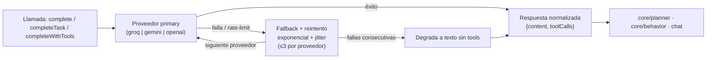

# Abstracción de proveedores de LLM (`core/llm/`)

Capa única de acceso a los proveedores de modelos de lenguaje, con fallback automático, reintentos
inteligentes y tool-calling nativo. **Todo** el proyecto — chat, agente, motor proactivo — habla con el
LLM a través de aquí.

---

## `LLMProvider.js`

**Proveedores soportados:** catálogo **data-driven** (`catalog.js`): cada provider declara modelos
fast/smart, contexto, herramientas, visión, coste y roles. El catálogo remoto (`models.dev`) lo
enriquece en runtime (configurable con `remoteCatalog.enabled`).

| Proveedor     | Tipo            | fast (chat)            | smart (tareas)            |
| ------------- | --------------- | ---------------------- | ------------------------- |
| Groq          | tier free + API | `llama-3.1-8b-instant` | `llama-3.3-70b-versatile` |
| Google Gemini | tier free + API | `gemini-2.5-flash`     | `gemini-2.5-flash`        |
| OpenAI        | API             | `gpt-4o-mini`          | `gpt-4o`                  |

> Nota: `gemini-2.5-flash` puede devolver 404 en cuentas nuevas (Google lo deprecó para nuevos
> usuarios). Si el fallback de tool-calling a Gemini falla, cambiá el default a `gemini-2.0-flash`.

**API pública:**

| Función                                                         | Propósito                                                                             |
| --------------------------------------------------------------- | ------------------------------------------------------------------------------------- |
| `configure(config)`                                             | Configura proveedores, claves y modo desde `config.json`                              |
| `complete(messages, systemPrompt)`                              | Conversación (modo `fast`)                                                            |
| `completeTask(messages, systemPrompt)`                          | Tareas (modo `smart`)                                                                 |
| `completeWithTools(messages, systemPrompt, tools, mode)`        | Tool-calling nativo con fallback textual                                              |
| `getActiveProvider()`                                           | Proveedor activo según orden primary → fallback                                       |
| `getActiveModel(mode)`                                          | Modelo activo para un modo                                                            |
| `getAvailableProviders()`                                       | Proveedores disponibles con estado de clave                                           |
| `getAvailableModels()`                                          | Modelos del catálogo con contexto/visión/tools                                        |
| `addCustomProvider(def)` / `removeCustomProvider(id)`           | Registro de proveedores personalizados                                                |
| `_debug_setCaller(caller)` / `_debug_setToolCaller(toolCaller)` | Inyecta implementaciones de `caller`/`toolCaller` para tests (respeta `_rebuildMaps`) |
| `_debug_callWithFallbackTools(...)`                             | Fuerza el path de tool-calling con fallback en tests                                  |

**Robustez:**

- **Cadena de fallback** primary → fallback con reintento exponencial + jitter (hasta 3 intentos por proveedor).
- **Límite de fallas consecutivas** antes de degradar a texto sin tools.
- **Reintento 413 TPM → modo smart:** si el tool-calling falla con HTTP 413/"Request too large"
  (el fast `llama-3.1-8b-instant` de Groq excede su cuota gratuita de 6K TPM con prompts grandes),
  se reintenta **el mismo proveedor con el modelo smart** antes de caer al fallback textual.
- **`_stripCot`:** elimina bloques `<thinking>...</thinking>` y la prosa de CoT de Qwen3/DeepSeek de las
  respuestas; además `chat_template_kwargs.enable_thinking=false` se pasa a Qwen3/DeepSeek para pedir
  razonamiento con tokens aparte y respuestas limpias (tabla `CHAT_TEMPLATE_KWARGS_PROVIDERS`).
- **Manejo de rate-limit** con mensajes accionables ("vuelve a intentar en ~X min o cambia de proveedor con `/model`").
- **Normalización de respuestas** por proveedor (OpenAI y Gemini unificados a `{content, toolCalls}`).
- Claves leídas de `config.json` o `LLM_KEY_*` del `.env`; el llavero del SO (`infrastructure/keychain/`)
  es la fuente preferida.

## `GroundingMinimo.js` — fallback de contexto

Ensamblador de contexto mínimo usado solo si `GroundingEngine` no está disponible: identidad básica,
últimos N mensajes y contexto temporal simple (hora, fecha, plataforma). Garantiza que el chat nunca
se rompa aunque el pipeline principal falle.

---

## Verificación

Cobertura en `test_tool_calling` (schemas, normalización y **reintento 413→smart** — Test 6), `test_prompt_composer`
(formatos por proveedor) y las suites de integración (`test_agent_loop`, `test_gate_integration`).
