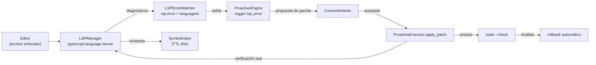

# Cliente LSP (`core/lsp/`)

Conexión con servidores de lenguaje (Language Server Protocol) para dotar al asistente de **contexto de
código real**: errores del editor, símbolos del proyecto y verificación de parches.

---

## `LSPManager.js`

Cliente LSP sobre `typescript-language-server` (stdio).

**Responsabilidades:**
- Arrancar el servidor de lenguaje del workspace con idioma auto-detectado (`detectLanguageForWorkspace`).
- Declarar la capability `publishDiagnostics` (sin esto el servidor no envía errores).
- Mantener archivos abiertos (`didOpen` / `didChange` / `didClose`).
- Servir **diagnósticos** (errores/avisos) y consultas de símbolos al motor proactivo.
- Timeout en peticiones (nunca se cuelga) y reinicio limpio al cambiar de workspace.

## `SymbolIndex.js`

Índice de símbolos del workspace construido desde `getDocumentSymbols` del LSP:

- Aplana el árbol de símbolos (children recursivos, `kindName` real, línea).
- Cache con TTL de 60 s e `invalidate(file)` — no vuelve a molestar al servidor innecesariamente.
- Nunca lanza: si el LSP no está disponible, devuelve vacío.

---

## Cómo se usa

El sensor `LSPErrorWatcher` (`infrastructure/sensors/`) escucha los diagnósticos del archivo enfocado,
emite la señal `lsp:error` (con `languageId`/`fileType` detectados por extensión) y alimenta el trigger
`lsp_error` del motor proactivo. Cuando una propuesta de parche se acepta, `ProactiveExecutor` verifica
el resultado contra `getDiagnostics()` real y revierte si algo falla.

Verificación: `test_lsp_errors` (64 tests) y `test_lsp` — ver `tests/README.md`.
