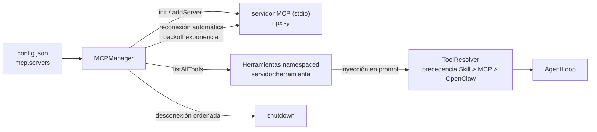

# Cliente Model Context Protocol (`core/mcp/`)

Conecta March con el ecosistema de **servidores de herramientas MCP** (Model Context Protocol) sin
acoplarse a ninguna herramienta específica. La funcionalidad se amplía agregando servidores, no código.

---

## `MCPManager.js`

Gestiona el ciclo de vida completo de los servidores MCP conectados vía `npx -y <paquete>` (stdio).

**Responsabilidades:**
- Conectar servidores por nombre (registro oficial) o configuración manual.
- **Reconexión automática** con backoff exponencial si un servidor cae a mitad de sesión.
- **Namespacing** de herramientas por servidor (`filesystem:list_directory`).
- Listar herramientas de todos los servidores conectados (`listAllTools`).
- Búsqueda en el registro oficial de servidores MCP.
- Desconexión ordenada al cerrar la app.

**API pública:**

| Función | Propósito |
|---|---|
| `init(servers)` | Inicializa servidores desde `config.json` |
| `addServer(cfg)` | Agrega y conecta un nuevo servidor |
| `removeServer(id)` | Desconecta y elimina un servidor |
| `toggleServer(id, enabled)` | Activa/desactiva sin eliminar |
| `listServers()` | Lista servidores con estado |
| `listAllTools()` | Lista herramientas de todos los servidores |
| `hasConnectedServers()` | ¿Hay algún servidor conectado? |
| `searchRegistry(query)` | Busca en el registro oficial |
| `disconnectAll()` | Desconecta todos |

---

## Integración

- Si no hay servidores configurados, March funciona **exactamente igual** (dependencia cero).
- Las herramientas MCP se inyectan como un bloque separado en el system prompt, después del contexto
  del SO y antes de las instrucciones finales.
- En el `ToolResolver`, el dominio MCP excluye las herramientas OpenClaw superpuestas (precedencia
  Skill > MCP > OpenClaw), evitando herramientas duplicadas para la misma tarea.
- La UI expone un modal de administración: biblioteca oficial + configuración JSON manual.

## Verificación

`test_mcp` y las suites de integración de tool precedence/visibility (`test_tool_precedence`,
`test_tool_visibility`). Ver `tests/README.md`.
