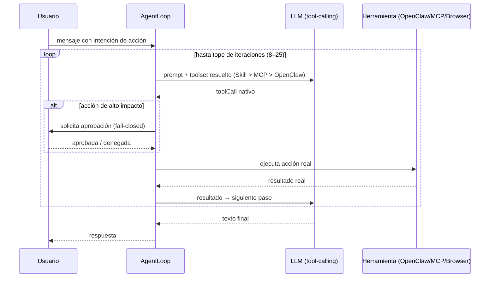

# Ejecución de acciones y agente (`core/planner/`)

Interpreta las intenciones del LLM y las ejecuta como acciones reales en el sistema del usuario — con
control de impacto, confinamiento de rutas y aprobación explícita para lo que toca el disco o la red.

---

## `Planner.js` — orquestador de ejecución

Analiza la respuesta del LLM en busca de bloques de acción (`action ... `) y decide qué ejecutar:

1. Parseo de intenciones (`ActionParser`).
2. Clasificación de impacto (bajo → automático, alto → requiere aprobación).
3. Sanitización de rutas y comandos.
4. Bloqueo de rutas sensibles (`~/.ssh`, credenciales, cookies de navegador).
5. Ejecución a través de `OpenClawBridge` o `BrowserBridge`.

## `AgentLoop.js` — bucle agente (LLM → herramienta → resultado)

El modo `task`/`agent` ejecuta un bucle cerrado:



- **Tool-calling nativo primero** (`completeWithTools`), con fallback textual si falla el parseo o el
  proveedor.
- **Aprobación** para acciones de alto impacto (con handler y timeout _fail-closed_).
- **Límite de iteraciones** configurable (8–25) y resultado truncado para el contexto.
- **Resolución de herramientas** (Skill > MCP > OpenClaw) inyectada en el prompt.
- **Regla 9 de edición:** para modificar un archivo existente usa `edit` con `old_text` exacto y
  coincidencia única (si no coincide, no toca nada); solo usa `write` para crear archivos nuevos.
  Implica determinismo en la edición.
- **Fin de cuota:** cuando se agota la cuota de tokens, el loop corta y responde con un mensaje
  accionable ("me quedé sin cuota…") en vez de fallar en silencio.
- **Propagación de `meta`:** los resultados de las tools propagan `meta` (p. ej. `addedLines`/
  `removedLines` del diff) para que el contexto distinga lo nuevo de lo actualizado.

## `StructuredActionParser.js`

Parser determinista para bloques de acción estructurados:

```
ACCIÓN: create_file | ARCHIVO: main.js
```

Con fallback al parser regex del `Planner` si el modelo no usa el formato estructurado.

## `OpenClawBridge.js` — puente de ejecución

- `exec` / `read` / `write` / `edit` / `list_directory` → servicio OpenClaw (localhost) o mock local.
- `browser` / `web_search` → `BrowserBridge` (Playwright, navegador propio del asistente).
- `apply_patch` / `code_execution` → OpenClaw.
- Las respuestas de `edit` / `apply_patch` incluyen **marcadores de diff** (`addedLines` /
  `removedLines`) para colorear en la UI y alimentar el `meta` del loop.
- Verifica disponibilidad del servicio cada 30 s y reporta disponibilidad al motor proactivo.

## `BrowserBridge.js` — navegador headless propio

Navegador Chromium headless mantenido con Playwright, **separado del navegador personal del usuario**:
navegación, lectura de páginas, capturas de pantalla y búsqueda web sin API key.

---

## Matriz de acciones e impacto

| Acción                           | Requiere aprobación |
| -------------------------------- | ------------------- |
| `read` / `read_file`             | No                  |
| `list_directory`                 | No                  |
| `edit` / `write` / `create_file` | Sí                  |
| `exec` / `run_command`           | Sí                  |
| `browser` / `web_search`         | Sí                  |
| `apply_patch`                    | Sí                  |
| `code_execution`                 | Sí                  |

---

## Verificación

`test_agent_loop` (38) y `test_agent_loop_mode` (14): loop, adaptación a resultados reales, límite de
iteraciones, aprobaciones, _fail-closed_ y tool-calling nativo. `test_tools_e2e`, `test_openclaw_*` y
`test_server_security`: puentes y seguridad. Ver `tests/README.md`.
