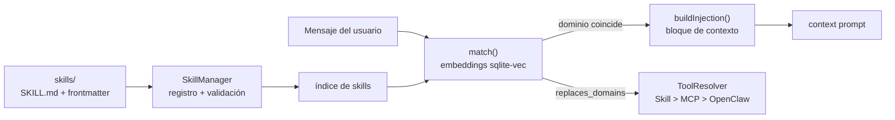

# Skills (`core/skills/`)

Sistema de **skills**: conocimiento procedural inyectable que se activa cuando la tarea del usuario
coincide con el dominio de la skill. Extiende las capacidades del asistente sin tocar el núcleo.

---

## `SkillManager.js`

- **Registro:** escanea directorios de skills (`skills/`) y valida su formato (`SKILL.md` + frontmatter).
- **Indexación:** mantiene un índice de skills disponibles con sus metadatos y dominios.
- **Match:** `match(userMessage, db)` selecciona las skills relevantes al mensaje usando embeddings
  locales (sqlite-vec).
- **Inyección:** `buildInjection(userMessage, db)` genera el bloque de contexto que se agrega al
  system prompt cuando la skill aplica.
- **`replaces_domains`:** una skill puede declarar que reemplaza herramientas genéricas de un dominio
  (respetado por `ToolResolver` en la precedencia Skill > MCP > OpenClaw).

## Skills del proyecto

| Skill | Dominio | Uso |
|---|---|---|
| `code-review` | code | Revisión estructurada de cambios |
| `git-workflow` | git | Flujo de trabajo git seguro |
| `testing-patterns` | testing | Patrones de pruebas y verificación |

---

## Verificación

`test_skills` y `test_skills_edge` — registro, match, inyección y casos límite. Ver `tests/README.md`.
