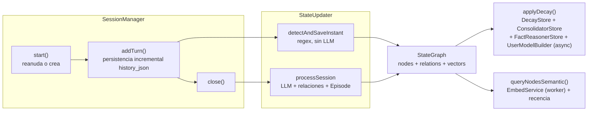

# Memoria persistente (`core/state-graph/`)

Grafo de conocimiento semántico sobre SQLite: hechos sobre el usuario, episodios de conversación,
relaciones entre conceptos, historial de apps y una pila de intenciones — con búsqueda vectorial y
decaimiento temporal. Es la base de la memoria a largo plazo del asistente.

`StateGraph` es una **fachada** que posee el ciclo de vida (init, schema, migraciones, fallback),
la cola de embeddings y delega el resto en `stores/` (ver [`stores/README.md`](./stores/README.md)).

---

## Esquema

| Tabla            | Propósito                                                                                                                 |
| ---------------- | ------------------------------------------------------------------------------------------------------------------------- |
| `nodes`          | Hechos sobre el usuario (`User`, `Project`, `Preference`, `Belief`, `Episode`) con `importance`, `decay_rate`, `archived` |
| `node_relations` | Relaciones semánticas `(source_id, target_id, type, created_at)` — `ON DELETE CASCADE`                                    |
| `node_vectors`   | Embeddings 384d para búsqueda semántica — **tabla virtual `vec0`, creada de forma diferida** por `enableVectorSearch()`   |
| `sessions`       | Metadatos de sesiones (inicio, fin, resumen, turnos) + columna `history_json` para persistencia incremental               |
| `app_history`    | Historial de aplicaciones usadas (por día, con duración)                                                                  |
| `intentions`     | Pila de objetivos/planes persistentes (`active` / `done` / `dropped`)                                                     |

**Migración universal:** si la base viene con el esquema legacy de `node_relations`
(`from_id/to_id/rel_type`), se renombra a `node_relations_legacy` y se reinserta con el esquema nuevo
(`source_id/target_id/type`) **antes** de crear índices — sin esto el `CREATE INDEX` fallaba y el
arranque caía a memoria.

---

## Características

- **Decaimiento temporal** — `applyDecay()` (en `DecayStore`): `importance × (1 − decay_rate)^days`,
  archiva nodos con `importance < 0.05` y purga sus vectores. Se ejecuta con un throttle de ~20 h
  (marker `decay_marker.json` en `userData`) desde `SessionManager`.
- **Búsqueda semántica** — `queryNodesSemantic()` (en `VectorIndex`): embeddings en **worker thread**
  (`core/grounding/embedWorker.js` + fachada `EmbedService`, modelo `Xenova/all-MiniLM-L6-v2`, 384d),
  scoring `distanceToSimilarity × importance × recencyBoost` (semivida 21 días). Cae a `queryNodes`
  si el vector no está listo.
- **Fallback a memoria en RAM** si `better-sqlite3` no pudo cargar — el sistema sigue funcionando
  (`usingFallback`, con `fallbackReason`).
- **Acceso diferido a recencia** — `getWorldModel()` **no** toca `last_accessed_at` (se lee en cada
  turno; tocarlo destruiría el decay). `queryNodes`, `getRecentEpisodes` y `queryNodesSemantic` sí
  refrescan recencia.
- **Reconciliación** de información nueva vs. existente (`ContradictionResolver`) con políticas por
  label: `overwrite` · `archive_and_replace` · `append` (máx. 3 segmentos) · `tension` (ambas viven,
  unidas por `CONTRADICES`).
- **Consolidación** — `ConsolidatorStore`: episodios viejos → `Belief`s deterministas
  (`consolidacion_*`, enlace `CONSOLIDA`), piggybacked en `applyDecay()`.
- **Vigencia de hechos fijos (F3.1)** — `FactReasonerStore`: los `FIXED_LABELS` ganan una noción de
  vigencia (`nodes.verified_at`, migración idempotente + backfill `verified_at = created_at`).
  `STALENESS_DAYS` marca `stale` los hechos pasado su umbral (w trabajo 150d, proyecto 90d,
  ubicación 180d — los permanentes nunca entran). `CASCADE_STALENESS` (w `trabajo_usuario →
proyecto_principal`): un overwrite re-confirma el label y deja `verified_at=NULL` en sus
  dependientes para revalidar. También soporta `inferred`/`confidence` por nodo y la edad calculada
  desde `cumpleanos_usuario` se expone en `getWorldModel()` (la calculada gana sobre la manual).
- **Modelo del usuario inferido (F3.3)** — `UserModelBuilder`: sobre episodios viejos que el
  consolidator dejó libres, agrupa por tema (embeddings + coseno, umbral de cluster 0.5) y, por cada
  cluster con ≥ 4 episodios, pide UNA inferencia al LLM (modo smart) con anti-fabricación estricta
  (respuesta `null` si no hay patrón claro; JSON validado antes de escribir). Crea nodos `Belief`
  con `inferred=1`, `tags ['inferred', kind]`, `decay_rate` alto (0.06) y relaciones `EVIDENCIA_DE`
  hacia los episodios que la sustentan. `reconcileInferred()` es reconciliación PROPIA (nunca toca
  `ContradictionResolver`): si ya existe un nodo inferido semánticamente similar (≥ 0.75) refuerza su
  confidence (`conf + 0.15·(1−conf)`) en vez de duplicar. `confirmInferred(nodeId, 'accepted'|'rejected')`
  es el gancho de la Fase 5: aceptar lleva la confidence a 0.9+, rechazar archiva. Corre piggyback en
  `applyDecay()` después de la consolidación (async, no bloquea); evidencia ya modelada se saltea sin
  re-pagar el LLM.

## API pública principal (fachada)

| Función                                                                                                         | Propósito                                                      |
| --------------------------------------------------------------------------------------------------------------- | -------------------------------------------------------------- |
| `init()` / `enableVectorSearch()`                                                                               | Abre la BD (o cae a RAM) y activa la tabla vectorial           |
| `createNode(opts)` / `upsertNode(opts)`                                                                         | Guarda un nodo (upsert por tipo+label) y agenda su embedding   |
| `updateNode(id, patch)` / `getNode(id)` / `forget(text)`                                                        | Actualiza / lee / archiva (soft-delete) nodos                  |
| `queryNodes(opts)`                                                                                              | Búsqueda por texto (LIKE), toca recencia                       |
| `queryNodesSemantic(text, opts)`                                                                                | Búsqueda vectorial ponderada por recencia                      |
| `getWorldModel()`                                                                                               | Los 30 nodos de identidad por importancia (sin tocar recencia) |
| `getRecentEpisodes(limit)` / `getLastSessions(limit)`                                                           | Episodios y sesiones recientes                                 |
| `getTensions()`                                                                                                 | Contradicciones vivas (para la curiosidad del motor proactivo) |
| `createRelation({source, target, type})`                                                                        | Relación semántica idempotente                                 |
| `startSession()` / `endSession(id, opts)` / `updateSessionHistory(id, history)` / `findResumableSession(hours)` | Ciclo de vida de sesiones (con `history_json`)                 |
| `saveAppHistory(...)` / `getTodayAppHistory()` / `getAppUsageSummary(days)` / `pruneAppHistory(days)`           | Historial de apps (poda 30 días)                               |
| `applyDecay()`                                                                                                  | Decay + purga de vectores + consolidación + fact-reasoner + user-model (async) |
| `runFactReasoner()`                                                                                             | Pasada de vigencia de hechos fijos (devuelve `{checked, stale}`)               |
| `runUserModel(opts)`                                                                                            | Pasada de inferencia del modelo de usuario (devuelve `{clusters, inferred, merged, rejected, skipped}`) |
| `confirmInferred(nodeId, outcome)`                                                                              | Acepta (`confidence` → 0.9+) o rechaza (archiva) un nodo inferido             |
| `createIntention(...)` / `listActiveIntentions()` / `completeIntention()` / `dropIntention()`                   | Pila de intenciones persistentes                               |
| `getStats()` / `close()`                                                                                        | Estado (incluye `usingFallback`) y cierre                      |

## `SessionManager.js` — ciclo de vida de sesión

- `start()` — reanuda una sesión interrumpida (< **48 h**) reusando `sessionId`/historia, o crea una
  nueva; en ambos caminos corre `deduplicateNodes()`, `cleanupMemoryArtifacts()` y el decay si toca.
- `addTurn(role, content)` — agrega turno y persiste incrementalmente (sobrevive a cortes).
- `close()` — procesa la sesión con `StateUpdater` y la cierra; si el procesamiento falla, cierra con
  `summary: null`.
- `restore(history, sessionId)` — soporte de checkpoints (CLI).
- `getActiveIntentions()` — pila de intenciones para re-planeación al reanudar.

## `StateUpdater.js` — extracción de memoria

- `detectAndSaveInstant(userMessage)` — hechos inmediatos **sin LLM** (regex por label: nombre, edad,
  cumpleaños, color, trabajo, proyecto, ubicación, `recordar_…`, `estado_usuario`).
- `processSession(sessionId, history, turnCount)` — extracción con el LLM al cerrar la sesión.
  **Segmentación temática:** la sesión se divide por tema (`_segmentByTopic`, embeddings de
  `EmbedService` + similitud coseno, umbral `SEGMENT_COSINE_THRESHOLD=0.4`, mín. 6 turnos para
  segmentar y 3 turnos por segmento) y el LLM se llama **una vez por segmento** con su
  sub-historial. Cada segmento crea su **propio nodo `Episode`**; `sessions.summary` (para
  `getLastSessions`) se compone de los resúmenes de todos los segmentos. Sesiones cortas o
  monotemáticas → 1 solo segmento/`Episode`, igual que antes. El modo `smart` (>20 turnos) se
  decide **por segmento**, no por sesión completa. Validación de labels, relaciones
  `RELATED_TO | IMPLIES | PART_OF | CONTRADICES | USES`.
- Valida labels contra `FIXED_LABELS` + prefijos dinámicos `proyecto_* / preferencia_* / recordar_*`;
  descarta plantillas con `[`/`]`. Exporta `isValidLabel`/`migrateLabel`.
- `cleanupMemoryArtifacts()` — archiva nodos contaminados con salida de comandos.
- `runDecay()` — envuelve `graph.applyDecay()`.

## `ContradictionResolver.js` — reconciliación

| Política              | Comportamiento                                           | Labels típicos                                                 |
| --------------------- | -------------------------------------------------------- | -------------------------------------------------------------- |
| `overwrite`           | Reemplaza el valor anterior                              | nombre, edad, cumpleaños, ubicación, trabajo, proyecto, estado |
| `archive_and_replace` | El viejo se archiva, el nuevo es activo                  | color, música, comida favorita                                 |
| `append`              | Acumula (máx. 3 segmentos, `                             | Actualizado: `)                                                | no reconocidos |
| `tension`             | Contradicción sin resolver → ambas viven + `CONTRADICES` | `observaciones_usuario`                                        |

También: `deduplicateNodes()` (conserva el más reciente por label, respetando tensiones) y
`getTensions()`. Contenido tipo comando se descarta (nunca se guarda). Exporta `COMMAND_PATTERNS`
(compartido con `UserModelBuilder` para rechazar contenido técnico).

Está tipado (`@ts-check` estricto, sin `@ts-nocheck`): declara la superficie mínima de grafo que
usa (`StateGraphApi` — `_findActiveNodeByLabel`, `createNode`, `updateNode`, `_archiveNode`,
`createRelation`, `upsertNode`, `_findNodesByLabel`, `_findDuplicateLabels`, `_db`) y tipa
entradas/salidas de `resolve`/`_applyPolicy`/`deduplicateNodes`/`getTensions`. La compatibilidad
estructural con los callers tipados se mantiene por cast interno en el constructor.

**Invariante de reconciliación (Fase 3):** un hecho declarado (nodo con `inferred=0` o ausente)
**siempre** gana sobre una inferencia (`inferred=1`). Un nodo inferido jamás sobreescribe, archiva ni
entra en política overwrite/archive_and_replace/tension contra un `FIXED_LABEL`; si chocan, la
inferencia se descarta en silencio (solo log en debug). `getWorldModel()` — el prompt "quién es el
usuario" — devuelve **solo hechos**, nunca nodos inferidos.

---

## Ciclo de vida de la memoria

---

## Verificación

`test_state_graph` (schema, CRUD, reconciliación, decay, sesiones con resume tras crash, guardado
inmediato, recall semántico, limpieza y modo memoria/fallback), `test_persistent`,
`test_memory_f2`, `test_intentions`, `test_sessions_ui`, `test_cli_checkpoint` y
`test_user_model_builder` (modelo del usuario inferido: creación, validación anti-fabricación,
fusión, confirmación y piggyback). Ver
[`tests/README.md`](../../tests/README.md).

Enlaces: [`stores/`](./stores/README.md) (fachadas de BD repartidas por tabla) ·
[`core/core/misc.js`](../core/misc.js) (`getMemoryGaps`, `storeFact`, `isRealIdentityNode`) ·
[`core/grounding/EmbedService.js`](../grounding/EmbedService.js) (embeddings en worker).
