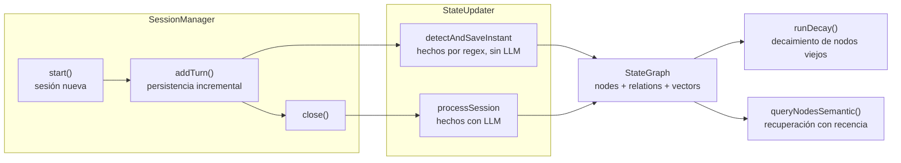

# Memoria persistente (`core/state-graph/`)

Grafo de conocimiento semántico sobre SQLite: hechos sobre el usuario, episodios de conversación y
relaciones entre conceptos, con búsqueda vectorial y decaimiento temporal. Es la base de la memoria
a largo plazo de March.

---

## `StateGraph.js` — núcleo de la base de datos

Usa `better-sqlite3` + `sqlite-vec`.

**Tablas principales:**

| Tabla | Propósito |
|---|---|
| `nodes` | Hechos sobre el usuario (proyectos, preferencias, datos personales) |
| `node_relations` | Relaciones semánticas entre nodos |
| `node_vectors` | Embeddings 384d para búsqueda semántica (tabla virtual `vec0`) |
| `sessions` | Metadatos de sesiones (inicio, fin, resumen, turnos) |
| `app_history` | Historial de aplicaciones usadas |

**Características:**
- **Decaimiento temporal** — los nodos viejos se archivan automáticamente (`runDecay`).
- **Búsqueda semántica** por similitud coseno con ponderación por recencia.
- **Fallback a memoria en RAM** si `better-sqlite3` no pudo cargar — el sistema sigue funcionando.
- **Lazy access-time** — leer un nodo no lo marca como viejo.
- **Reconciliación** de información nueva vs. existente (sobrescribir/acumular/archivar) vía
  `ContradictionResolver`.

**API pública:**

| Función | Propósito |
|---|---|
| `startSession()` | Crea una sesión nueva |
| `endSession(id, data)` | Cierra sesión con resumen |
| `updateSessionHistory(id, history)` | Persiste el historial incrementalmente |
| `findResumableSession(hours)` | Busca sesiones interrumpidas recientes |
| `saveNode(node)` | Guarda un nodo de conocimiento |
| `queryNodesSemantic(text, limit)` | Búsqueda semántica por embeddings |
| `forget(text)` | Archiva un recuerdo (soft-delete) |
| `enableVectorSearch()` | Activa la búsqueda vectorial |
| `backfillEmbeddings()` | Genera embeddings para nodos sin ellos |
| `runDecay()` | Archiva nodos viejos |

## `SessionManager.js` — ciclo de vida de sesión

- `start()` — crea sesión nueva y limpia duplicados acumulados.
- `addTurn(role, content)` — agrega turno y persiste incrementalmente (sobrevive a cortes).
- `close()` — procesa la sesión con `StateUpdater` y la cierra.
- `getHistory()` — copia del historial actual.

## `StateUpdater.js` — extracción de memoria

Al cerrar una sesión, extrae hechos memorables de la conversación (con el LLM) y los guarda como nodos:

- `processSession(sessionId, history, turnCount)` — procesa la sesión completa.
- `detectAndSaveInstant(userMessage)` — guarda hechos inmediatos sin LLM (patrones por regex).
- `runDecay()` — decaimiento de nodos viejos.
- Valida labels contra un conjunto fijo + labels dinámicos de proyectos/preferencias.

## `ContradictionResolver.js` — reconciliación de información

| Política | Comportamiento | Ejemplos |
|---|---|---|
| `OVERWRITE` | Reemplaza el valor anterior | `age`, `name`, `hometown` |
| `APPEND` | Acumula (con límite) | `likes`, `favorite_games` |
| `ARCHIVE` | El viejo se archiva, el nuevo es activo | `project`, `working_on` |
| `TENSION` | Contradicción sin resolver | Datos irreconciliables |

La política se determina por el label del nodo; los no reconocidos van a `APPEND`.

---

## Ciclo de vida de la memoria

---

## Verificación

`test_state_graph` (schema, CRUD, reconciliación, decay, sesiones con resume tras crash, guardado
inmediato, recall semántico, limpieza y modo memoria/fallback) y `test_persistent`. Ver `tests/README.md`.
