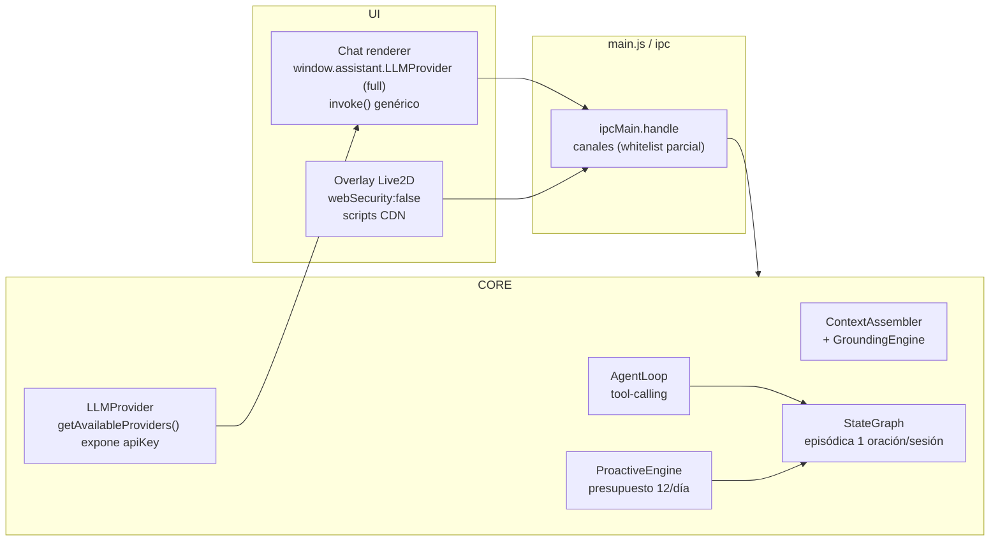
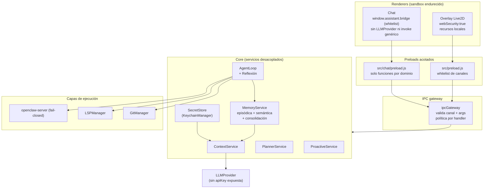

# Auditoría Técnica — Asistente-Vtuber

Fecha: 2026-08-05 · Autor: agente auditor (basado en inspección de código real + subagentes de exploración)

Puntuación global: **69/100** (arquitectura sólida, ingeniería excelente; cuello de botella en seguridad del sandbox y en el ciclo de memoria/reflexión del agente).

---

## 1. Rúbrica de puntuación

| Área | Peso | Nota | Justificación corta |
|---|---|---|---|
| Arquitectura | 15 | 12 | Capas claras (core/grounding/planners/ipc), pipeline determinista; pero main process monolítico y módulos grandes acoplados (Core 1767 LOC). |
| Agente IA | 15 | 9 | Tool-calling con bucle cerrado; faltan reflexión y ciclo completo percepción→decisión→acción→memoria→reflexión. |
| Memoria | 10 | 6 | Episódica + embeddings offline sólidas; pero comprime la sesión a 1 oración y no consolida episodio→semántica. |
| Proactividad | 10 | 9 | De lo mejor del proyecto: presupuesto 12/día, 10 frenos, cooldown adaptativo, política configurable. |
| Seguridad | 15 | 6 | Modelo de permisos honesto y server fail-closed; pero API keys en claro en el renderer y expo del módulo LLMProvider completo. |
| Coding agent | 10 | 7 | LSP, Git, tools y openclaw-server funcionales; sin benchmark de regresión. |
| UX | 10 | 8 | Live2D + TTS + gestos de calidad inusual; personalidad frágil (prompts + regex heurísticas). |
| Ingeniería | 10 | 9 | 1694 tests en verde, typecheck/lint/prettier, JSDoc estricto, CommonJS puro. |
| Escalabilidad | 5 | 2.5 | Embeddings CPU por turno, sin consolidación de memoria, main process monolítico. |
| **Total** | **100** | **68.5** | |

---

## 2. Hallazgos clave verificados (con cita)

### Seguridad
- **CRÍTICO — API keys en claro en el renderer.** `LLMProvider.getAvailableProviders()` incluye `apiKey: _config.providers[p.id]?.apiKey || ''` (core/llm/LLMProvider.js:1133), y el preload del chat expone el módulo entero vía `contextBridge` como `window.assistant.LLMProvider` (src/chat/preload.js:131). Un XSS en el chat — o cualquier script remoto — puede enumerar y leer todas las claves.
- **CRÍTICO — `git branch -d/-D` sin aprobación.** El patrón `/^git\s+(status|log|diff|branch|remote\s+-v|show|blame)...$/` en `SAFE_READONLY_PATTERNS` (core/planner/ActionParser.js:65) considera `git branch -D rama` como comando de solo lectura y lo ejecuta sin pedir permiso.
- **ALTO — overlay con `webSecurity:false`.** La ventana Live2D (main.js:445) desactiva la seguridad web "intencional: Live2D/pixi.js cargan recursos por CDN" y `sandbox:false` en ambas ventanas. Los scripts remotos del overlay corren sin Node (bien) pero sin CORS ni policy de contenido.
- **MEDIO — `invoke` genérico expuesto.** Ambos preloads exponen `invoke: (channel, ...args) => ipcRenderer.invoke(...)` (src/chat/preload.js:98), lo que deja la puerta abierta a cualquier canal IPC sin whitelist de canales.

### Proactividad (lo mejor del sistema)
- Presupuesto duro `DAILY_BUDGET = 12` (core/behavior/ProactiveEngine.js:78); el LLM solo genera el mensaje, nunca decide (gates deterministas antes).
- Política configurable `DEFAULT_POLICY` con pesos y umbrales (core/decision/DecisionCore.js:37-62); floor de relevancia `0.4` (core/decision/ContextGate.js:50).
- Cooldown por tipo que crece con los rechazos del usuario (core/behavior/ProactiveEngine.js:1032-1035): "el rechazo enseña".

### Memoria
- `processSession` comprime **toda la sesión a 1 oración** (`episode_summary`, core/state-graph/StateUpdater.js:371-384) y la descarta si no hay LLM (líneas 300-332).
- Embeddings offline `all-MiniLM-L6-v2` (384 dims) vía `@xenova/transformers` (core/grounding/IntentDetector.js:64-72); ~2-3 cálculos CPU por turno, primera descarga ~23MB.
- `getRecentEpisodes` ordena por `importance DESC, created_at DESC` (core/state-graph/stores/NodeStore.js:101) — no pondera recencia para el recall.
- **Sin consolidación** episodio→semántica (no hay nada que suba episodios a hechos/relaciones).

### Arquitectura del agente
- Veredicto de exploración: "tool-calling con bucle cerrado, no agente con ciclo completo". Reflexión no existe como paso del loop.
- Presentes y bien hechos: planificación, ejecución, tool registry, Git, LSP, contexto grounding, skills/MCP/OpenClaw catálogo.

### Ingeniería (fortaleza clara)
- 1694 tests / 0 fallos en la suite completa; E2E UI 18/18; `npm run typecheck` limpio; ESLint 0 errores en archivos tocados; Prettier aplicado.
- ~23.585 LOC en core; archivos mayores: ProactiveEngine 1804, Core 1767, AgentLoop 1218, LLMProvider 1184, LSPManager 1162.

---

## 3. A) Diez fortalezas

1. **Motor de proactividad** maduro: presupuesto, frenos, cooldown adaptativo y política configurable. Rarísimo en proyectos de este tamaño.
2. **Modelo de permisos honesto** (allow/ask/deny, `isHighImpact`, fail-closed) — el servidor de tools niega por defecto (openclaw-server.js:25-28).
3. **Calidad de ingeniería**: suite de 1694 tests verdes, JSDoc estricto con `@ts-check`, typecheck limpio, CommonJS puro, Prettier/ESLint aplicados.
4. **Capa de memoria real**: estado-graph persistente, embeddings offline sin depender de la nube, decay y relaciones.
5. **Capa UI/Live2D** de nivel alto: modelo 3D, TTS streaming, gestos, renderer aislado por `contextIsolation`.
6. **Diseño por capas limpio**: core (contexto, planner, agent loop, memoria) separado de ipc y de los renderers.
7. **Coding agent funcional**: LSP con detección de errores, herramientas de archivo, Git, y el servidor local de tools.
8. **Manejo de errores y cancelación** cuidadoso: `AbortController` propagado por todo el pipeline hasta el provider.
9. **Configuración declarativa**: política de decisión, presupuestos y umbrales viven en JSON/config, no en el código.
10. **Documentación viva**: `docs/arquitectura.md`, `AGENTS.md` con reglas de agente, ROADMAP y CHANGELOG.

---

## 4. B) Diez debilidades y riesgos

1. **CRÍTICO** — API keys alcanzables desde el renderer (LLMProvider.js:1133 + preload.js:131).
2. **CRÍTICO** — `git branch -d/-D` tratado como comando seguro (ActionParser.js:65).
3. **ALTO** — overlay con `webSecurity:false` y scripts de CDN (main.js:445); `sandbox:false` en ambas ventanas.
4. **ALTO** — `invoke` genérico sin whitelist de canales (preload.js:98).
5. **ALTO** — no hay paso de **reflexión** en el loop del agente; sin ella no hay aprendizaje ni corrección de curso.
6. **MEDIO** — la memoria episódica comprime sesiones enteras a una oración; se pierde detalle accionable (StateUpdater.js:371).
7. **MEDIO** — sin consolidación episodio→semántica; la memoria no "destila" conocimiento durable.
8. **MEDIO** — recall por importancia sin ponderar recencia (NodeStore.js:101); información reciente puede quedar fuera.
9. **MEDIO** — main process monolítico (Core 1767 LOC) que mezcla contexto, planners y memoria; difícil de escalar y probar de forma aislada.
10. **MEDIO** — personalidad y proactividad dependen de prompts frágiles + heurísticas regex; cambios pequeños pueden degradar la coherencia.

---

## 5. C) Roadmap

### Fase 1 — Alto impacto / bajo esfuerzo (2-4 semanas)
1. **Sellar la fuga de API keys**: quitar `apiKey` de `getAvailableProviders()`; el renderer solo ve `hasKey`.
2. **No exponer módulos completos en el preload**: crear un bridge acotado de funciones por dominio en lugar de `window.assistant.LLMProvider`.
3. **Whitelist de canales IPC** (`invoke` permitido solo por lista).
4. **Endurecer `SAFE_READONLY_PATTERNS`**: permitir `git branch` solo con `-a`/`-r`/`--list`; prohibir `-d`/`-D`.
5. **Subir `webSecurity:true` en el overlay** y servir Live2D/pixi desde `node_modules` local (no CDN).
6. **Benchmark mínimo** del coding agent (rename, refactor pequeño) con una key de prueba, para dar regresión base.

### Fase 2 — Producto serio (2-3 meses)
1. **Añadir paso de reflexión** al loop: cada N iteraciones (o tras errores) el agente resume logros/fracasos y ajusta el plan.
2. **Consolidación episodio→semántica**: job que convierte episodios relevantes en hechos/relaciones del estado-graph.
3. **Recall ponderado por recencia + importancia** y resumen de sesión multioración por segmentos de la conversación.
4. **Cache de embeddings** para no recalcular por turno; mover a worker/thread para no bloquear.
5. **Desacoplar Core**: separar contexto/planner/memoria en servicios con interfaces y tests propios.
6. **Aislamiento de renderers**: `sandbox:true` donde se pueda; mover lógica de Node a IPC handlers con validación.

### Fase 3 — Investigación (3+ meses)
1. Agente con memoria de trabajo explícita (scratchpad) y planificación jerárquica.
2. Personalidad aprendida a partir de interacciones (no solo prompts + regex).
3. Evaluación de embeddings/procesamiento en GPU o búsqueda vectorial local escalable.
4. Multi-agente (planner + ejecutor + memorizador) sobre el mismo estado-graph.

---

## 6. D) Arquitectura actual vs propuesta

### Estado actual (resumen del flujo)

### Arquitectura propuesta

---

## 7. E) Veredicto

- **¿Agente autónomo?** No todavía: es un **tool-calling con bucle cerrado** y un excelente motor de proactividad desacoplado. Le falta el eslabón de **reflexión** para pasar de "ejecutor que encadena herramientas" a "agente que aprende y corrige su propio plan".
- **Distancia a JARVIS (asistente que decide, recuerda y anticipa):** corta en proactividad (ya anticipa con presupuesto y aprendizaje por rechazo), media en memoria (falta consolidación y recall por recencia), larga en agencia (falta reflexión y planificación jerárquica).
- **Cuello de botella principal:** la **seguridad del sandbox** — si se quiere un producto que ejecute tools y toque el sistema, la fuga de claves y el `webSecurity:false` son inaceptables. Segundo cuello: **memoria sin consolidar**, que limita el valor a largo plazo.
- **¿Convertible en startup/producto?** Sí, con Fase 1 + 2. El diferencial es la **proactividad + memoria + UI Live2D** combinadas (pocos asistentes de escritorio lo hacen). La barrera no es la idea sino cerrar los riesgos de seguridad y añadir reflexión.
- **¿Seguir desarrollando?** Sí. El código es limpio, testeado y bien documentado; el riesgo técnico más alto está en un par de decisiones de seguridad que son fáciles de revertir.
