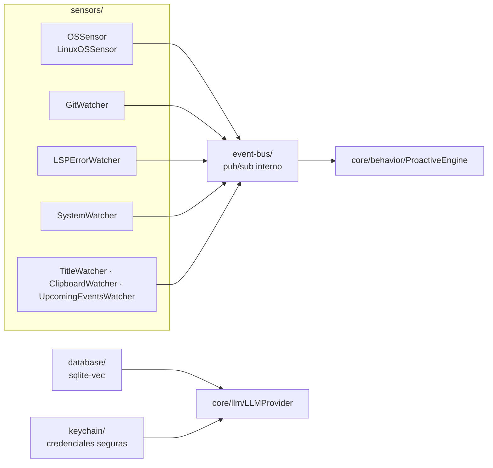

# Infraestructura del sistema (`infrastructure/`)

Capas de bajo nivel que soportan al núcleo: percepción del sistema operativo, comunicación interna,
almacenamiento vectorial y seguridad de credenciales.

---

## Módulos

| Carpeta | Responsabilidad |
|---|---|
| [`sensors/`](./sensors/README.md) | Sensores de señales y percepción del SO (ventana activa, inactividad, git, LSP, sistema, clipboard, eventos) |
| [`event-bus/`](./event-bus/README.md) | Bus de eventos interno pub/sub — único canal de comunicación entre módulos |
| [`database/`](./database/README.md) | Inicialización de índices vectoriales (`sqlite-vec`) para intención y memoria |
| [`keychain/`](./keychain/README.md) | Llavero del sistema operativo para credenciales seguras |

---

## Flujo

---

## Principios

- **Bajo nivel sin lógica de negocio:** los módulos de infraestructura no deciden, solo perciben,
  comunican, persisten o protegen.
- **Sustituibles:** cada capa expone una interfaz pequeña; el núcleo no conoce detalles de
  implementación (p. ej. `OSSensor` vs `LinuxOSSensor`).
- **Silenciosos ante fallo:** la infraestructura nunca derriba al asistente (sensor caído ≠ app caída).
