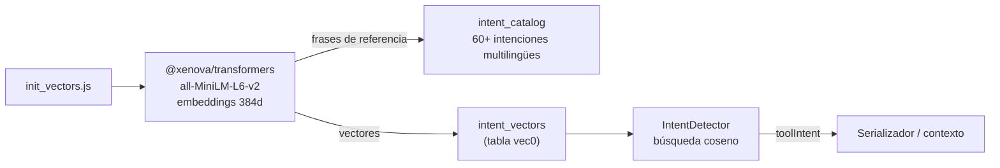

# Inicialización de base de datos vectorial (`infrastructure/database/`)

Prepara las tablas de índices vectoriales en `core.db` para la **detección semántica de intenciones**
y el **recall de memoria** — embeddings locales, sin dependencia de servicios externos.

---

## `init_vectors.js`

Inicializa y puebla las tablas vectoriales:

| Tabla | Propósito |
|---|---|
| `intent_catalog` | Catálogo de frases de referencia para la detección de intenciones |
| `intent_vectors` | Embeddings 384d (`all-MiniLM-L6-v2`) de cada frase |

**Intenciones soportadas (60+ frases):** `read_file`, `edit_file`, `run_command`, `web_search`,
`browser`, `create_file`, `apply_patch`, `list_directory`, `code_execution` y más — con variantes
multilingües y narrativas.

**Uso:**

```bash
node infrastructure/database/init_vectors.js          # inicialización normal
node infrastructure/database/init_vectors.js --force  # reindexado forzado
```

Dependencia: `@xenova/transformers` (misma BD del asistente, misma sesión de embeddings que el `StateGraph`).



---

## Verificación

`test_intent_detection` cubre el pipeline completo con la BD vectorial poblada, incluido el fallback
a LLM cuando los embeddings no son suficientes.
