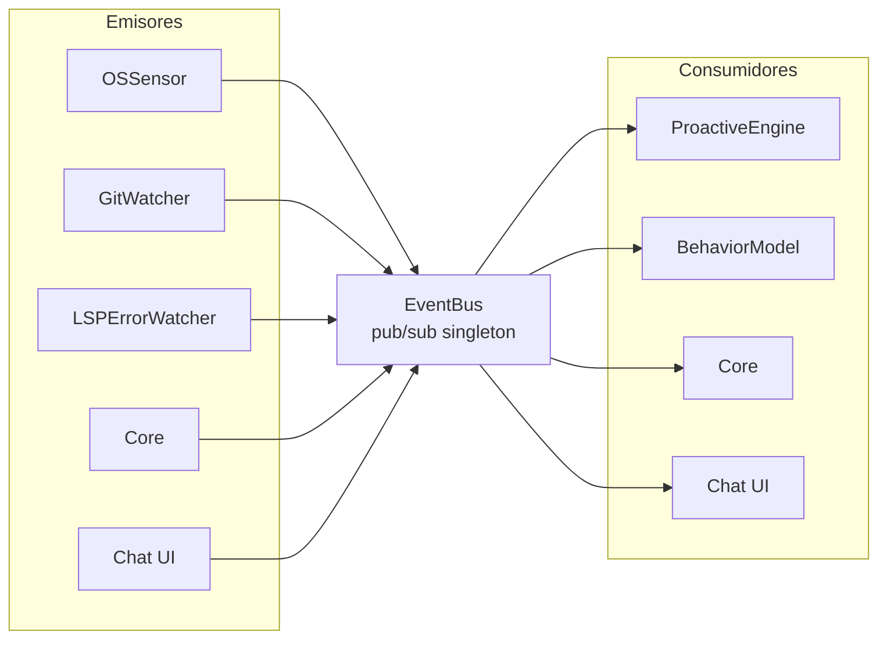

# Bus de eventos interno (`infrastructure/event-bus/`)

Único canal de comunicación entre componentes del sistema. Implementación **pub/sub singleton**:
desacopla emisores de consumidores — un módulo nunca conoce la identidad de quien consume sus eventos.

---

## `EventBus.js`

API: `on()`, `once()`, `off()`, `emit()` (con utilidades de inspección para diagnóstico).

**Eventos definidos:**

| Evento | Emisor | Consumidores |
|---|---|---|
| `os:app-changed` | OSSensor | ProactiveEngine, BehaviorModel |
| `os:app-tick` | OSSensor | ProactiveEngine |
| `os:idle-changed` | OSSensor | ProactiveEngine |
| `os:windows-updated` | OSSensor | — |
| `os:history-updated` | OSSensor | — |
| `os:error-title` | TitleWatcher | ProactiveEngine |
| `git:redflag` | GitWatcher | ProactiveEngine |
| `git:branch-changed` | GitWatcher | — |
| `system:warning` | SystemWatcher | ProactiveEngine |
| `clipboard:copied` | ClipboardWatcher | ProactiveEngine |
| `memory:upcoming-event` | UpcomingEventsWatcher | ProactiveEngine |
| `lsp:error` | LSPErrorWatcher | ProactiveEngine |
| `memory:turn-added` | Core | ProactiveEngine |
| `memory:node-saved` | StateUpdater | — |
| `session:started` / `session:closed` | Core | — |
| `workspace:changed` | Core | — |
| `initiative:trigger` | ProactiveEngine | Core → Chat UI |
| `initiative:dismiss` | ProactiveEngine | Chat UI |
| `initiative:decision` | Chat UI | Core |
| `proposal:executed` | ProactiveExecutor | Core → Chat UI |
| `agent:completed` | Core | — |
| `plan:started` / `plan:step-start` / `plan:step-done` / `plan:finished` | Planner | Chat UI |
| `plan:generated` | Core (Planner) | — |
| `behavior:evaluated` | Core (BehaviorModel) | ProactiveEngine |
| `openclaw:available` | Core | Chat UI |
| `memory-status` | Core | Chat UI |

> Los eventos marcados con "—" en Consumidores se emiten como **hooks reservados**: pueden no tener
> suscriptor hoy (pub/sub lo permite) y sirven de punto de enganche para funcionalidad futura. No son
> errores, pero antes de usarlos en features nuevas conviene que tengan consumidor y test.


**Patrón de uso:**

```js
const { getEventBus } = require('../event-bus/EventBus.js');
const bus = getEventBus();

bus.on('os:app-changed', (data) => { /* reaccionar */ });
bus.emit('os:app-changed', { app: 'firefox', friendlyName: 'Firefox' });
```

---

## Flujo



---

## Por qué un bus

- **Desacoplamiento total:** agregar un sensor o un consumidor no toca al resto.
- **Escalabilidad proactiva:** el motor proactivo se suscribe a cualquier señal nueva sin cambios en
  los emisores (complementa `registerProfile()` de `SignalNormalizer`).
- **Diagnóstico:** permite inspeccionar eventos activos (`getActiveEvents`/`eventNames`) para auditoría.
