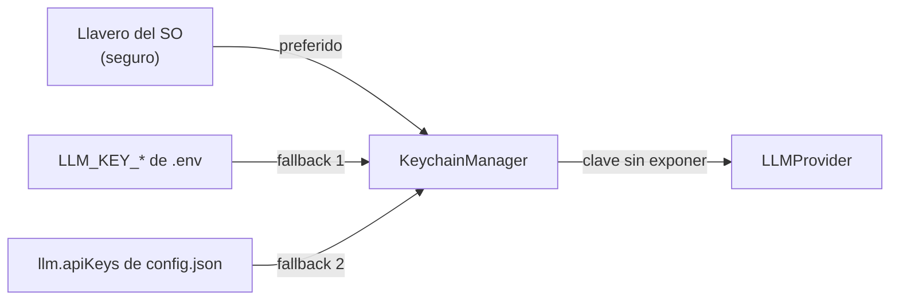

# Llavero del sistema operativo (`infrastructure/keychain/`)

Custodia de credenciales (API keys de LLM) usando el llavero seguro del sistema operativo — las
llaves no viven en texto plano en el disco.

---

## `KeychainManager.js`

**Responsabilidades:**
- Almacenar y recuperar API keys por proveedor (Groq, Gemini, OpenAI, proveedores personalizados).
- Detectar y usar el llavero disponible según plataforma.
- Fallback a configuración local (`config.json` / `.env`) cuando el llavero no está disponible.
- Nunca expone las llaves en logs ni en la API.

**Fuentes de claves (en orden de preferencia):**
1. Llavero del SO (seguro).
2. `LLM_KEY_*` del `.env` del usuario.
3. `llm.apiKeys` del `config.json` del usuario.

---

## Seguridad

- Los archivos de configuración con llaves (`config.json`) están en `.gitignore` — nunca se suben.
- La Control API redacta las claves en cualquier respuesta.
- `test_server_security` verifica que los endpoints no filtren credenciales.

## Verificación

`test_server_security` (44 tests) — cubre redacción de secretos y seguridad del servidor de control.
