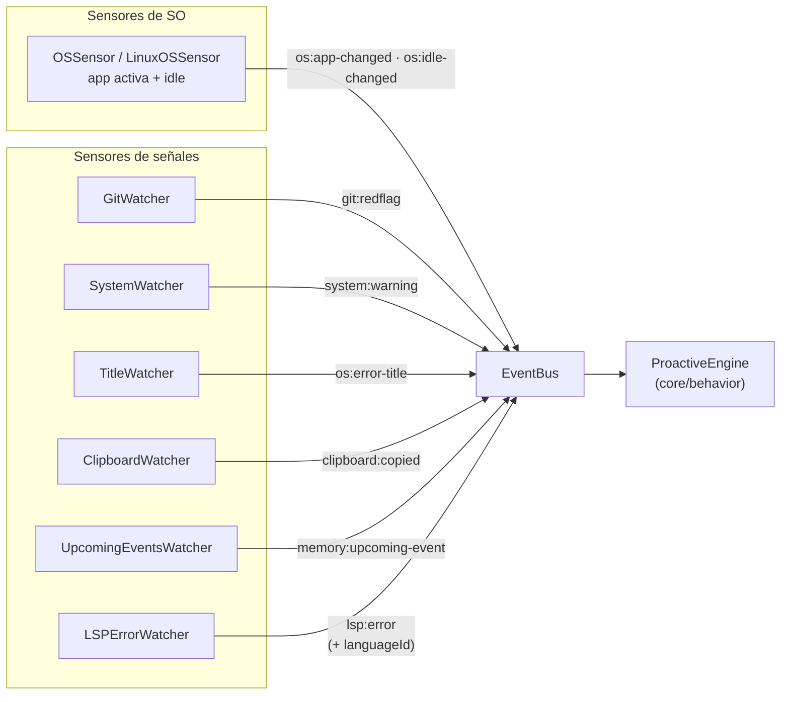

# Percepción y sensores de señales (`infrastructure/sensors/`)

Dos familias de sensores que alimentan a March:

1. **Sensores de SO** — percepción del escritorio: aplicación activa, ventanas, inactividad.
2. **Sensores de señales** — eventos de valor para el motor proactivo: riesgos git, errores del
   editor, advertencias del sistema, títulos con errores, portapapeles y eventos próximos.

---

## Sensores de sistema operativo

MarchCore selecciona el sensor según `process.platform`:

- `win32` → `OSSensor` (PowerShell + Win32 API: `GetForegroundWindow`, `GetLastInputInfo`, `EnumWindows`).
- `linux` → `LinuxOSSensor` (Hyprland/Wayland: `hyprctl`, `loginctl`).

Ambos exponen la misma interfaz: `start()`, `stop()`, `getCurrentContext()`, `getOpenWindows()`,
`getTodayHistory()`, `getTodaySummary()` — y emiten `os:app-changed`, `os:app-tick`,
`os:idle-changed`, `os:windows-updated`. Clasifican apps por categoría (code, terminal, browser,
design, docs, chat, media, api, files, system, game).

`getCurrentContext()` devuelve: `app`, `friendlyName`, `title`, `category`, `elapsed`, `elapsedFormatted`,
`idleSecs`, `idleFormatted`, `isIdle`, `openWindows`, `openWindowsSummary`, `history`.

## Sensores de señales (camino proactivo)

Cada sensor emite eventos por el `EventBus` que `ProactiveEngine` consume:

| Sensor | Señal | Detecta |
|---|---|---|
| `GitWatcher` | `git:redflag` | `.env` sin ignorar, conflictos de merge, muchos cambios sin commitear, commits sin push, cambio de rama |
| `SystemWatcher` | `system:warning` | Umbrales de CPU / RAM / disco / batería (re-emite mientras la condición persista) |
| `TitleWatcher` | `os:error-title` | Títulos de ventana con señales de error (dedup) |
| `ClipboardWatcher` | `clipboard:copied` | (opt-in) stacktraces o URLs copiados; texto normal ignorado |
| `UpcomingEventsWatcher` | `memory:upcoming-event` | Recordatorios próximos desde memoria (nodos `recordar_*`), con resolución de horas ambiguas |
| `LSPErrorWatcher` | `lsp:error` | Errores del editor (severidad 1) en el archivo enfocado, con `languageId`/`fileType` |

### `LSPErrorWatcher` en detalle

- Detecta el archivo enfocado desde el título de la ventana y mantiene un editor tracker (`getOpenFiles`).
- Dedup por flanco (hash del conjunto de errores por archivo) — no re-emite lo mismo.
- **Scope por workspace:** sin workspace activo no emite nada; `resetWorkspace()` limpia al cambiar de proyecto.
- `getErrorsFor(absPath)` sirve la verificación post-parche del executor.

---

## Flujo sensor → motor proactivo

---

## Verificación

`test_signal_sensors` (49) — todos los watchers con ejecución hermetizada y/o repos git reales;
`test_proactive` — integración señal → engine → propuesta. Ver `tests/README.md`.
