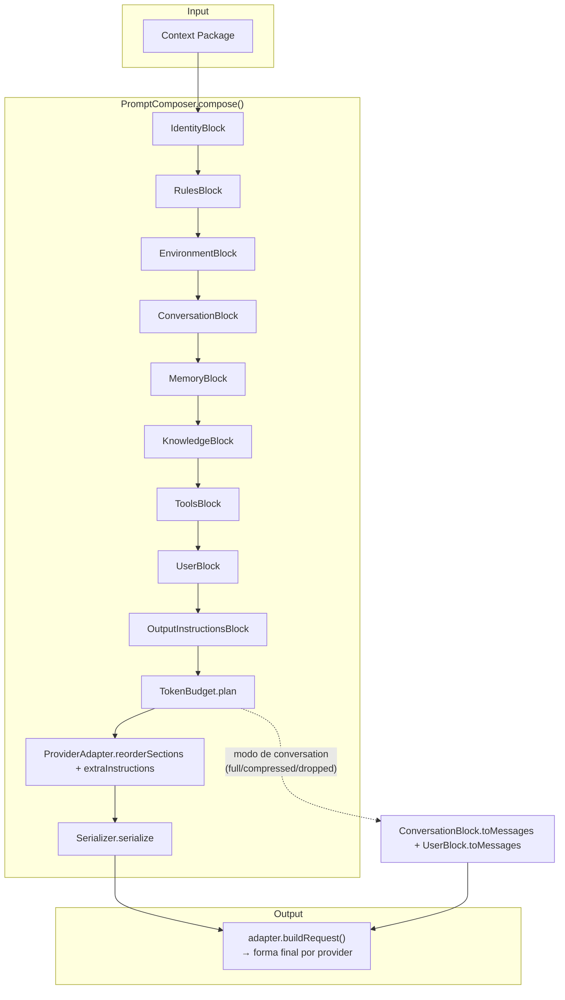
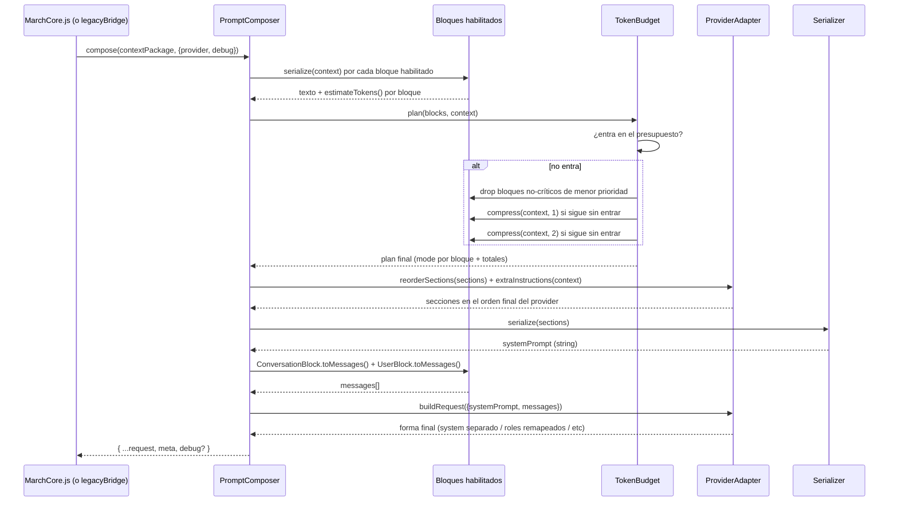

# Prompt Composer — Arquitectura 

Subsistema independiente de composición de prompts para March 7th. No
retrieva memoria, no busca embeddings, no ejecuta herramientas, no toca
bases de datos, no decide relevancia — todo eso lo resuelven otros
módulos (RetrievalPlanner, GroundingEngine, IntentDetector, MCPManager,
OpenClawBridge) **antes** de llamar al Composer. El Composer solo sabe
convertir un Context Package ya armado en un prompt final, con
presupuesto de tokens y forma específica del provider.

## Por qué existía este problema

Antes de esto, la construcción del prompt estaba repartida en tres
lugares distintos, sin relación explícita entre sí:

1. `GroqSerializer.js` armaba identidad + contexto de SO + memoria +
   formato de `toolIntent`, y truncaba a `MAX_SYSTEM_CHARS` (14.000
   caracteres) — pero...
2. ...`MarchCore.buildContext()` le pegaba TRES secciones más DESPUÉS de
   ese truncado (`BehaviorModel.serialize()`, las reglas de OpenClaw, el
   catálogo de tools MCP), con `result.systemPrompt += '...'` — o sea que
   el límite de tokens del paso 1 nunca contaba lo que se agregaba en el
   paso 2. El presupuesto de tokens estaba roto en la práctica.
3. `identity.json` tiene una estructura rica (`character.summary`,
   `character.traits`, `voice.forbidden_phrases`,
   `uncertainty_behaviors.*` con ejemplos, `relationship`,
   `context_awareness`, `limits`) pero `GroqSerializer._buildIdentitySection`
   leía campos que no existen en el archivo real
   (`identity.personality`, `identity.uncertainty_voice`) — la mayor
   parte de la identidad escrita para March **nunca llegaba al LLM**.

Este subsistema resuelve los tres problemas de raíz: un solo pipeline, un
solo presupuesto de tokens aplicado una sola vez sobre el conjunto
completo, y un `IdentityBlock` que sí usa la forma real del archivo.

## Diagrama de arquitectura



## Diagrama de secuencia



## Responsabilidades — qué SÍ y qué NO hace cada pieza

| Pieza | Hace | NO hace |
|---|---|---|
| `PromptBlock` (y subclases) | Formatea el fragmento de contexto que ya le llegó | Decidir qué contenido es relevante, ir a buscarlo |
| `TokenBudget` | Decide qué recortar/comprimir para entrar en el presupuesto | Elegir contenido, hablarle a un LLM |
| `ProviderAdapter` | Orden y forma final específica del provider | Cambiar el contenido semántico de un bloque |
| `Serializer` | Convertir secciones en un string final | Saber de providers ni de presupuesto |
| `PromptComposer` | Orquestar el pipeline completo | Memoria, embeddings, DB, ejecución de tools |
| `legacyBridge` | Traducir la forma vieja de Context Package a la nueva | Nada de lógica de negocio — es una función pura |

## Puntos de extensión

- **Bloque nuevo**: extender `PromptBlock`, implementar `serialize()`, y
  `composer.registerBlock(new MiBloque())`. No hace falta tocar
  `PromptComposer.js` ni ningún bloque existente.
- **Provider nuevo**: extender `ProviderAdapter` y
  `adapters.registerAdapter('mi-provider', () => new MiAdapter())`.
- **Formato de serialización nuevo**: implementar `{name, serialize(sections)}`
  y `serializers.registerSerializer('mi-formato', () => new MiSerializer())`.
- **Fuente de conocimiento nueva** (RAG sobre documentos, por ejemplo):
  ya existe `KnowledgeBlock` esperando `context.retrievedKnowledge` — solo
  hace falta que algo (un futuro `DocumentRetriever`) llene ese campo del
  Context Package antes de llamar a `compose()`.

## Forma del Context Package

```ts
{
  identity: object,              // core/identity/identity.json tal cual
  environment: object | null,    // lo que devuelve OSSensor.getCurrentContext() + platform
  conversation: {
    history: Array<{role, content}>,
    userMessage: {role, content} | null,
  },
  memories: { nodes: [], episodes: [] },
  projects: [],                  // reservado, no usado todavía
  goals: [],                     // reservado, no usado todavía
  retrievedKnowledge: [],        // reservado — ver KnowledgeBlock
  availableTools: {
    openclaw: { available: boolean },
    mcp: Array<{server, tool, description}>,
  },
  currentIntent: object | null,  // resultado de IntentDetector
  userMessage: {role, content},  // mismo objeto que conversation.userMessage
  behaviorInstructions: string | null,
  tokenBudget: number,           // opcional, sobreescribe el default del Composer
}
```

`legacyBridge.contextPackageFromLegacy()` arma esto a partir de lo que
`ContextAssembler.js`/`MarchCore.js` ya calculan hoy — ver ese archivo
para el mapeo exacto.

## Ejemplo de uso

```js
const { PromptComposer, legacyBridge } = require('./core/prompt-composer');

const composer = new PromptComposer(); // maxTokens default: 6000 (~24k chars)

const contextPackage = legacyBridge.contextPackageFromLegacy({
  identity, osContext, persistentMemory, sessionHistory,
  currentMessage, toolIntent,
  openclawAvailable: bridge.getStats()?.available,
  mcpTools: mcp.hasConnectedServers() ? mcp.listAllTools() : [],
  behaviorInstructions: behaviorCtx ? BehaviorModel.serialize(behaviorCtx) : null,
});

const { systemPrompt, messages, meta } = composer.compose(contextPackage, {
  provider: 'groq',
});

// meta.totalTokens, meta.overBudget, meta.droppedBlocks, meta.compressedBlocks
// están disponibles para logging — reemplaza al console.log manual que
// tenía ContextAssembler.js.
```

Con `debug: true`, el resultado trae además `result.debug` — el export
completo pensado para depurar alucinaciones (lista de bloques con su modo
final, tokens estimados, provider, timestamp, tamaño, y el prompt
completo tal cual se mandaría).

## Ejemplo de prompt real generado (formato markdown, provider groq)

Con un Context Package típico (identidad completa, environment con VS
Code en foco, 2 nodos de memoria, sin toolIntent), el `systemPrompt`
generado luce así (recortado):

```
# Identidad
Soy March 7th. Vivo en este escritorio.

## Personalidad
Curiosa, empática, humor seco.

### Rasgos
- Curiosidad genuina
- Memoria de las cosas que importan

### Nunca digo cosas como
- "¡Claro!"
- "¡Por supuesto!"

---

## Contexto actual
Son las 3:00 PM del martes por la tarde.
Sistema operativo: Linux — si vas a sugerir o ejecutar comandos de terminal, usá la sintaxis de Linux.
El usuario está usando **Visual Studio Code** (hace 10m) — ventana: "main.js — march7th".
Otras ventanas abiertas: Discord, Chrome.

---

## Lo que sé del usuario y sus proyectos
- **Nodo 0** (project): {"detalle":"..."}
```
