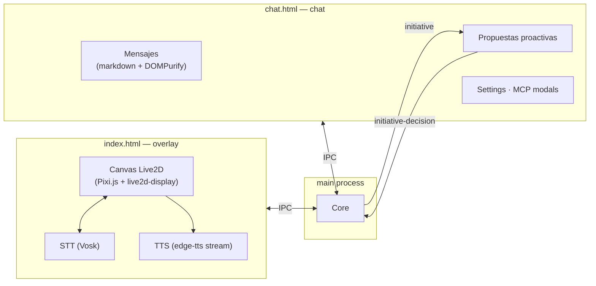

# Interfaz de usuario (`src/`)

Dos ventanas Electron que renderizan el avatar Live2D y la interfaz de chat — la cara visible del asistente.

---

## `index.html` — overlay del avatar Live2D

Ventana overlay que renderiza el modelo Cubism usando **Pixi.js + live2d-display**.

- Canvas Live2D con animaciones y físicas.
- Siempre al frente (`alwaysOnTop`), fondo transparente con *click-through*.
- Indicadores de estado: despierto / escuchando / procesando.
- Burbuja de texto temporal para comandos de voz.
- Comunicación con el main process vía IPC (TTS, STT, estado).
- Carga el modelo Live2D activo (`models/`); se recarga en caliente al recibir `model-changed`.
- **Auto-fit por contenido + "piso"**: el tamaño de cada vista (full / half / head) se calcula de los
  límites reales del mesh (`coreModel.getDrawableVertexPositions`), no del canvas del modelo, para que
  cualquier modelo importado entre en pantalla. El borde inferior de la ventana es el "piso": en `full`
  los pies tocan el piso, en `half` la cintura, en `head` el cuello — la cabeza siempre arriba. Así un
  modelo pequeño queda anclado abajo (no flota en el medio). Solo rota entre las vistas que estén
  activas (`views-changed`); con una sola vista el modelo queda fijo.

## `chat.html` — ventana de chat

Interfaz completa de conversación con el asistente.

**Componentes:**

| Sección | Propósito |
|---|---|
| Header | Indicador de estado, selector de modo, badge OpenClaw/MCP, tema |
| Messages | Burbujas con markdown (sanitizado con DOMPurify), typewriter, divisores de sesión |
| Input area | Texto con autocompletado de `/comando` y de `@archivo` (filtra mientras escribes), adjuntar, STT, enviar |
| Model panel | Canvas Live2D integrado (vistas full / half / head) |
| Settings modal | Configuración de API keys (Groq, Gemini, OpenAI) |
| MCP modal | Administración de servidores MCP (biblioteca + JSON manual) |
| Propuestas proactivas | Burbujas de iniciativa con botones aceptar / descartar + resultado de ejecución |

**Eventos IPC principales:**

| Evento | Propósito |
|---|---|
| `init-theme` | Tema inicial (dark/sakura) |
| `chat-message` | Mensaje entrante desde el main process |
| `chat-speak` | Texto a sintetizar por TTS |
| `memory-status` | Estado del banner de memoria |
| `openclaw-status` | Disponibilidad de OpenClaw |
| `initiative` | Mensaje iniciado proactivamente por el asistente |
| `initiative-decision` | Respuesta del usuario a una propuesta |
| `agent-approval-needed` / `agent-progress` | Aprobaciones y progreso del bucle agente |
| `plan-*` | Eventos del plan de ejecución |
| `stt-*` | Eventos de reconocimiento de voz |
| `telemetry-report` | Reporte `/telemetria` |
| `model-changed` | Cambio de modelo Live2D (recarga del canvas) |
| `views-changed` | Cambio del modo de vista del modelo (`full`/`half`/`head`/`random`, del comando `/modelo-vistas`) |
| `resumed-session` | Sesión anterior retomada en silencio (repuebla el historial sin mensaje de sistema) |
| `workspace-changed` | Cambio del workspace activo (actualiza UI y resetea la caché de archivos) |

**Tecnologías:** HTML + CSS (variables, temas, animaciones) + Vanilla JS con `require()` de Electron
(`marked`, `DOMPurify`, Pixi.js, Live2D). TTS por streaming: spawn de `tts_stream.py` (edge-tts) y
reproducción con Web Audio API sin archivos temporales.

---

## Arquitectura de las ventanas

---

## Verificación

Cobertura del contrato IPC en `test_commands`, `test_server_security` y las suites E2E
(`tests/e2e/test_chat_to_agent_loop.js`). Ver `tests/README.md`.
