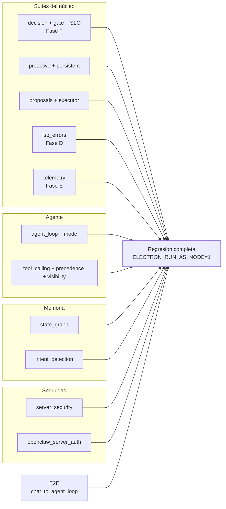

# Estrategia de pruebas — Asistente Personal

Documento de referencia del sistema de pruebas: cómo se ejecuta, qué cubre cada suite y las
convenciones para contribuir. El proyecto prioriza **verificación real** sobre mocks: donde la
persistencia, el git o el LSP son parte del contrato, la prueba usa la pieza de producción.



---

## 1. Cómo ejecutar

Cada archivo de `tests/` es una suite ejecutable de forma independiente:

```bash
ELECTRON_RUN_AS_NODE=1 ./node_modules/electron/dist/electron tests/<suite>.js
```

> **Importante (ABI de Electron):** `better-sqlite3` y `sqlite-vec` están compilados para el ABI de
> Electron, no para el Node del sistema. Bajo `node` del sistema, `StateGraph` cae a memoria en RAM y
> la persistencia real no se verifica. Las suites de memoria, estado, sensores y motor proactivo
> **deben** correr con el Node de Electron (`ELECTRON_RUN_AS_NODE=1`).

### Regresión completa (línea base)

| Área | Suite | Tests |
|---|---|---|
| Núcleo de decisión (Fase F-1) | `test_decision_core` | 44 |
| Normalización de señales (F-2) | `test_signal_normalizer` | 52 |
| Gate de contexto (F-3) | `test_context_gate` | 46 |
| Integración gate + engine (F-4) | `test_gate_integration` | 32 |
| SLOs por tipo (F-5) | `test_slo` | 25 |
| Motor proactivo | `test_proactive` | 55 |
| Feedback persistente / presupuesto / `/olvida` | `test_persistent` | 44 |
| Propuestas + consentimiento (Fase A) | `test_proposals` | 40 |
| Executor proactivo (Fase B) | `test_proposals_executor` | 69 |
| E2E sensor → propuesta → mutación real | `test_proposals_e2e` | — |
| Sensores de señales | `test_signal_sensors` | 49 |
| Errores LSP + parches (Fase D) | `test_lsp_errors` | 64 |
| Telemetría local (Fase E) | `test_telemetry` | 47 |

## 2. Mapa de suites

### Agente y ejecución
| Suite | Cobertura |
|---|---|
| `test_agent_loop` | Bucle agente: iteraciones, adaptación a resultados reales, límites, aprobaciones, *fail-closed*, tool-calling nativo con content vacío |
| `test_agent_loop_mode` | Modos del loop (smart/fast/task/conversational) |
| `test_agent_manager` | Definiciones de agentes y system prompts |
| `test_tool_calling` | Schemas nativos y normalización de respuestas de tool-calling |
| `test_tool_precedence` | Resolución de toolset: Skill > MCP > OpenClaw, exclusiones por dominio |
| `test_tool_visibility` | Visibilidad de herramientas según toolIntent |
| `test_tools_e2e` | Puentes de herramientas y aprobación de alto impacto |
| `test_openclaw_bridge_timing` | Timing y robustez del puente OpenClaw |
| `test_openclaw_server_auth` | Autenticación del servidor de control |
| `test_integration_stress` | Estrés del flujo integrado |

### Memoria y estado
| Suite | Cobertura |
|---|---|
| `test_state_graph` | Schema, CRUD de nodos, reconciliación, decay, sesiones con resume tras crash, recall semántico, modo memoria/fallback |
| `test_persistent` | Presupuesto diario, `StateGraph.forget` (/olvida), `pendingRecap` |

### Contexto y lenguaje
| Suite | Cobertura |
|---|---|
| `test_intent_detection` | Detección semántica de intención + fallback a LLM |
| `test_no_fabrication` | Anti-alucinación en la composición del contexto |
| `test_lsp` | Cliente LSP (typescript-language-server) |
| `test_lsp_errors` | Sensor LSP → señal → parche → verificación + rollback + blindaje de lenguaje |
| `test_skills` / `test_skills_edge` | Sistema de skills: registro, match, inyección y casos límite |
| `test_commands` | Comandos `/…`, contratos IPC y resolución de archivos |
| `test_file_resolver` | Resolución segura de rutas |

### Decisión proactiva (Fase F)
| Suite | Cobertura |
|---|---|
| `test_decision_core` | Score de relevancia, receptividad, presupuesto dinámico, política con histéresis, audit log |
| `test_signal_normalizer` | Candidatos desde payloads reales; perfiles genéricos para señales desconocidas; `registerProfile` |
| `test_context_gate` | Flow detection, presupuesto, cola QUEUE, triggers temporales `selfGated` |
| `test_gate_integration` | El gate decide antes del LLM; shadow mode; outcome → receptividad |
| `test_slo` | SLOs por tipo, tasa de no-molestia, degradación automática |
| `test_telemetry` | Métricas de uso, reporte mensual con deltas y veredicto |

### Seguridad
| Suite | Cobertura |
|---|---|
| `test_server_security` | Redacción de secretos, seguridad de endpoints, bloqueo de rutas sensibles |

### E2E
| Suite | Cobertura |
|---|---|
| `tests/e2e/test_chat_to_agent_loop.js` | Chat → bucle agente con piezas de producción |

---

## 3. Convenciones de contribución

1. **Toda funcionalidad nueva debe acompañar su suite** en `tests/` (misma carpeta, prefijo `test_`).
2. **Verificación real donde el contrato lo exige:** git real (`check-ignore`), LSP real, SQLite real
   — no mocks de humo.
3. **El LLM es el único permitido como stub** en las pruebas de integración (el texto de las
   propuestas es lo único que el modelo inventa); el resto son piezas de producción.
4. **Cada suite es ejecutable en solitario** y termina con `process.exit(failed ? 1 : 0)`.
5. **Regresión completa en verde antes de cualquier PR** (ver tabla de la sección 1).
